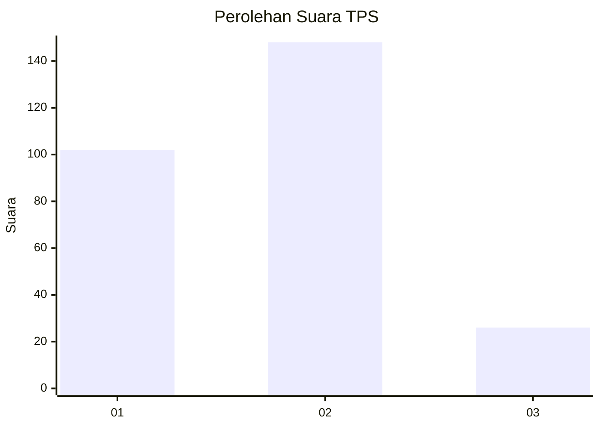

# Hasil

## Grafik

## Tabel

| No. | Nama Paslon    | Suara | Suara (raw) | Persentase |
|:--- |:-------------- | -----:| -----------:| ----------:|
| 1   | ANIES MUHAIMIN | 102   | [102][p-1]  | 36,96      |
| 2   | PRABOWO GIBRAN | 148   | [148][p-2]  | 53,62      |
| 3   | GANJAR MAHFUD  | 26    | [26][p-3]   | 9,42       |

[p-1]: https://github.com/gigit-pemilu/pemilu-2024/blob/main/pilpres/hitung-suara/sub/36-banten/sub/02-lebak/sub/19-cibeber/sub/2018-cihambali/sub/003-tps/sub/paslon-1.txt
[p-2]: https://github.com/gigit-pemilu/pemilu-2024/blob/main/pilpres/hitung-suara/sub/36-banten/sub/02-lebak/sub/19-cibeber/sub/2018-cihambali/sub/003-tps/sub/paslon-2.txt
[p-3]: https://github.com/gigit-pemilu/pemilu-2024/blob/main/pilpres/hitung-suara/sub/36-banten/sub/02-lebak/sub/19-cibeber/sub/2018-cihambali/sub/003-tps/sub/paslon-3.txt

## Foto C Plano

https://sirekap-obj-formc.kpu.go.id/6b61/pemilu/ppwp/36/02/19/20/18/3602192018003-20240215-153238--d0b7c0f8-b83c-4076-ba16-afecca54cb85.jpg

https://sirekap-obj-formc.kpu.go.id/6b61/pemilu/ppwp/36/02/19/20/18/3602192018003-20240215-153523--37512086-12b8-43eb-b9a4-e5c12598fbf2.jpg

https://sirekap-obj-formc.kpu.go.id/6b61/pemilu/ppwp/36/02/19/20/18/3602192018003-20240215-153730--5fda4450-be71-492a-bdda-e811005506ef.jpg

## Metadata

| Key        | Value               |
| ---------- | ------------------- |
| Time Stamp | 2024-02-16 21:01:00 |

