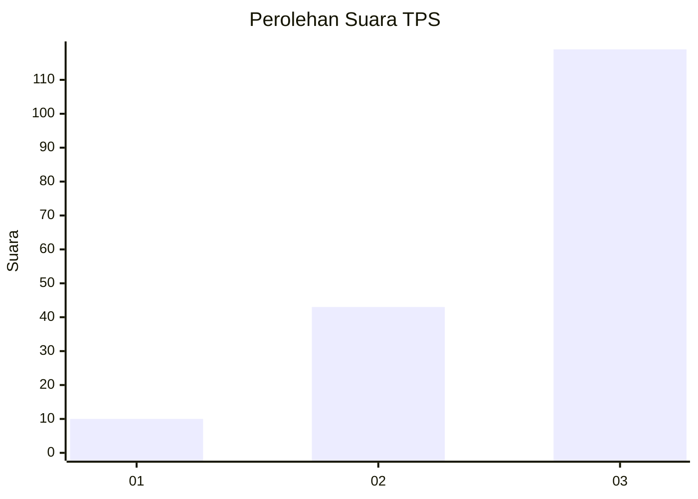
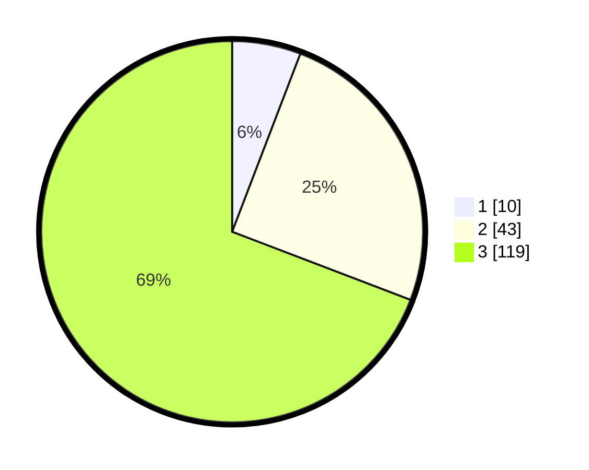

# Hasil

## Grafik

## Tabel

| No. | Nama Paslon    | Suara | Suara (raw) | Persentase |
|:--- |:-------------- | -----:| -----------:| ----------:|
| 1   | ANIES MUHAIMIN | 10    | [10][p-1]   | 5,81       |
| 2   | PRABOWO GIBRAN | 43    | [43][p-2]   | 25,00      |
| 3   | GANJAR MAHFUD  | 119   | [119][p-3]  | 69,19      |

[p-1]: https://github.com/gigit-pemilu/pemilu-2024-36-banten/blob/main/pilpres/hitung-suara/sub/36-banten/sub/02-lebak/sub/19-cibeber/sub/2019-citorek-barat/sub/008-tps/sub/paslon-1.txt
[p-2]: https://github.com/gigit-pemilu/pemilu-2024-36-banten/blob/main/pilpres/hitung-suara/sub/36-banten/sub/02-lebak/sub/19-cibeber/sub/2019-citorek-barat/sub/008-tps/sub/paslon-2.txt
[p-3]: https://github.com/gigit-pemilu/pemilu-2024-36-banten/blob/main/pilpres/hitung-suara/sub/36-banten/sub/02-lebak/sub/19-cibeber/sub/2019-citorek-barat/sub/008-tps/sub/paslon-3.txt

## Foto C Plano

https://sirekap-obj-formc.kpu.go.id/87fc/pemilu/ppwp/36/02/19/20/19/3602192019008-20240215-021448--6fd99fdc-5f27-4219-8cce-dbf20fe36bd6.jpg

https://sirekap-obj-formc.kpu.go.id/87fc/pemilu/ppwp/36/02/19/20/19/3602192019008-20240215-115722--ff0aee29-3b46-4aa0-8bd8-c0c3a3f6ba2d.jpg

https://sirekap-obj-formc.kpu.go.id/87fc/pemilu/ppwp/36/02/19/20/19/3602192019008-20240215-110614--815c8b08-7e5e-49ac-b95e-ee343084b1fc.jpg

## Metadata

| Key        | Value               |
| ---------- | ------------------- |
| Time Stamp | 2024-02-15 16:00:26 |

