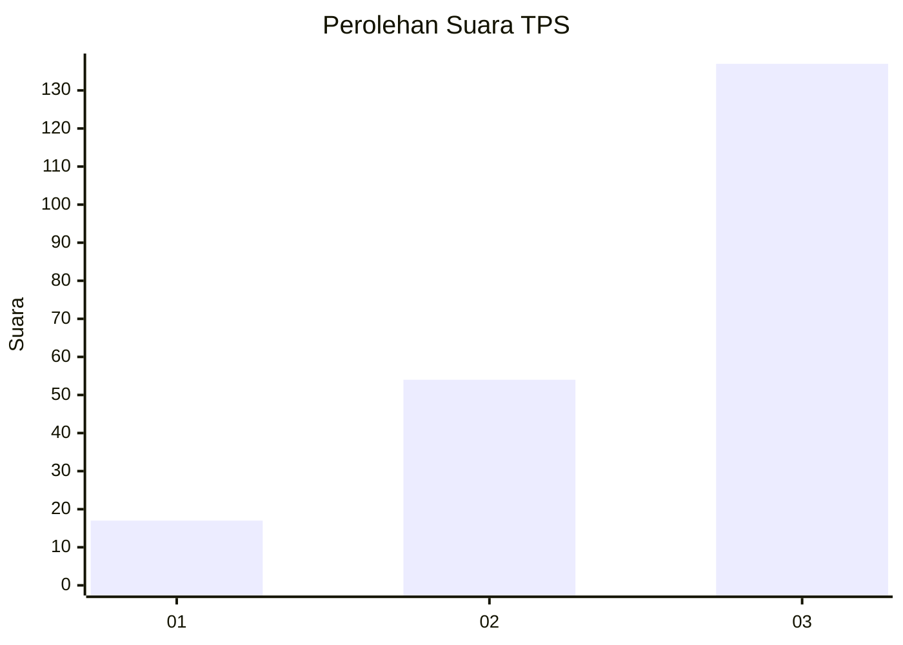
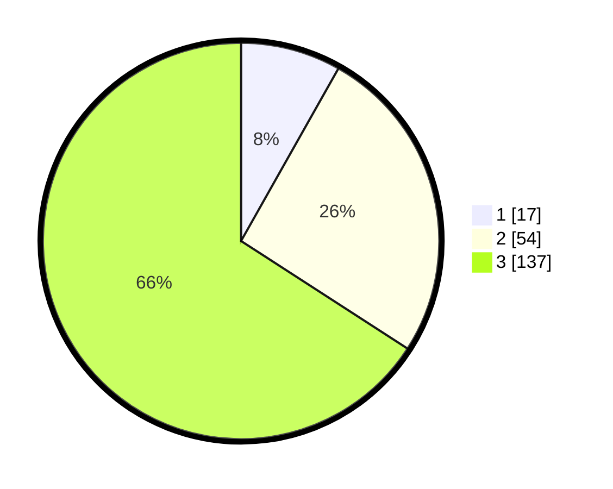

# Hasil

## Grafik

## Tabel

| No. | Nama Paslon    | Suara | Suara (raw) | Persentase |
|:--- |:-------------- | -----:| -----------:| ----------:|
| 1   | ANIES MUHAIMIN | 17    | [17][p-1]   | 8,17       |
| 2   | PRABOWO GIBRAN | 54    | [54][p-2]   | 25,96      |
| 3   | GANJAR MAHFUD  | 137   | [137][p-3]  | 65,87      |

[p-1]: https://github.com/gigit-pemilu/pemilu-2024/blob/main/pilpres/hitung-suara/sub/36-banten/sub/02-lebak/sub/19-cibeber/sub/2019-citorek-barat/sub/009-tps/sub/paslon-1.txt
[p-2]: https://github.com/gigit-pemilu/pemilu-2024/blob/main/pilpres/hitung-suara/sub/36-banten/sub/02-lebak/sub/19-cibeber/sub/2019-citorek-barat/sub/009-tps/sub/paslon-2.txt
[p-3]: https://github.com/gigit-pemilu/pemilu-2024/blob/main/pilpres/hitung-suara/sub/36-banten/sub/02-lebak/sub/19-cibeber/sub/2019-citorek-barat/sub/009-tps/sub/paslon-3.txt

## Foto C Plano

https://sirekap-obj-formc.kpu.go.id/bcf1/pemilu/ppwp/36/02/19/20/19/3602192019009-20240215-102459--99e20c57-82c7-46ea-8a6a-f2d57a9bfac7.jpg

https://sirekap-obj-formc.kpu.go.id/bcf1/pemilu/ppwp/36/02/19/20/19/3602192019009-20240215-102912--cae6616c-77c2-4059-b06e-9853634cdbb2.jpg

https://sirekap-obj-formc.kpu.go.id/bcf1/pemilu/ppwp/36/02/19/20/19/3602192019009-20240215-221530--8daaa8a5-f7d5-4bbd-af28-8173b8c345eb.jpg

## Metadata

| Key        | Value               |
| ---------- | ------------------- |
| Time Stamp | 2024-02-19 06:16:00 |

