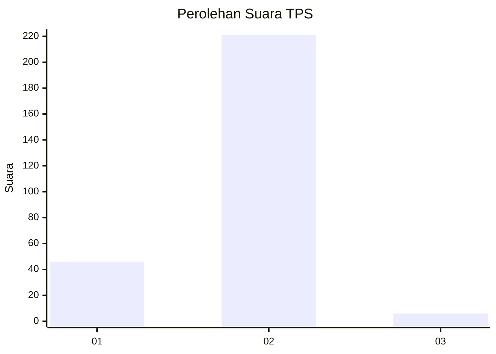
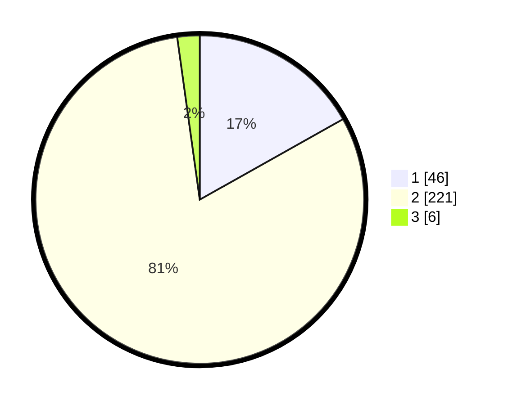

# Hasil

## Grafik

## Tabel

| No. | Nama Paslon    | Suara | Suara (raw) | Persentase |
|:--- |:-------------- | -----:| -----------:| ----------:|
| 1   | ANIES MUHAIMIN | 46    | [46][p-1]   | 16,85      |
| 2   | PRABOWO GIBRAN | 221   | [221][p-2]  | 80,95      |
| 3   | GANJAR MAHFUD  | 6     | [6][p-3]    | 2,20       |

[p-1]: https://github.com/gigit-pemilu/pemilu-2024-36-banten/blob/main/pilpres/hitung-suara/sub/36-banten/sub/02-lebak/sub/19-cibeber/sub/2022-citorek-sabrang/sub/006-tps/sub/paslon-1.txt
[p-2]: https://github.com/gigit-pemilu/pemilu-2024-36-banten/blob/main/pilpres/hitung-suara/sub/36-banten/sub/02-lebak/sub/19-cibeber/sub/2022-citorek-sabrang/sub/006-tps/sub/paslon-2.txt
[p-3]: https://github.com/gigit-pemilu/pemilu-2024-36-banten/blob/main/pilpres/hitung-suara/sub/36-banten/sub/02-lebak/sub/19-cibeber/sub/2022-citorek-sabrang/sub/006-tps/sub/paslon-3.txt

## Foto C Plano

https://sirekap-obj-formc.kpu.go.id/3b42/pemilu/ppwp/36/02/19/20/22/3602192022006-20240215-151336--4208cbdd-7ef1-494b-bf1a-9600fdc934e5.jpg

https://sirekap-obj-formc.kpu.go.id/3b42/pemilu/ppwp/36/02/19/20/22/3602192022006-20240215-151724--0e301bcd-6715-4581-b5cc-df53fa6cfb77.jpg

https://sirekap-obj-formc.kpu.go.id/3b42/pemilu/ppwp/36/02/19/20/22/3602192022006-20240215-151827--6fcb65f4-86c1-49a4-bcfc-a08ec6c18926.jpg

## Metadata

| Key        | Value               |
| ---------- | ------------------- |
| Time Stamp | 2024-02-19 06:16:00 |

