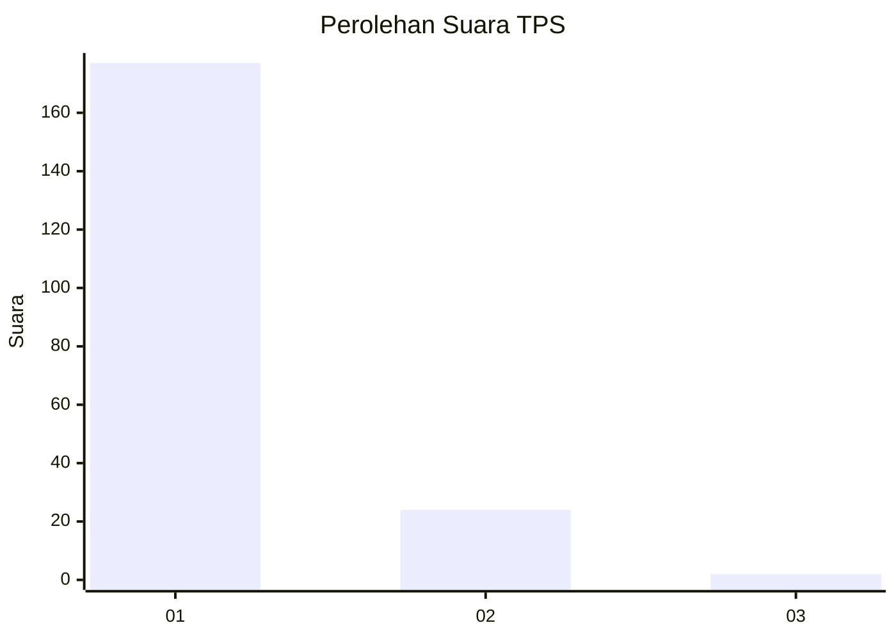
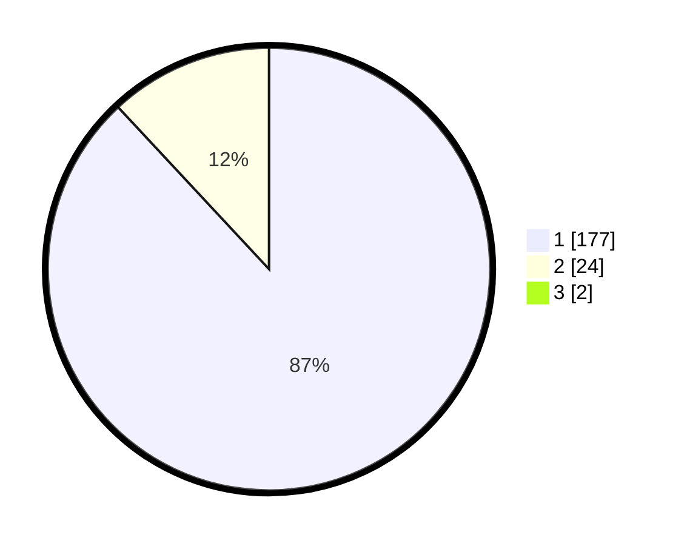

# Hasil

## Grafik

## Tabel

| No. | Nama Paslon    | Suara | Suara (raw) | Persentase |
|:--- |:-------------- | -----:| -----------:| ----------:|
| 1   | ANIES MUHAIMIN | 177   | [177][p-1]  | 87,19      |
| 2   | PRABOWO GIBRAN | 24    | [24][p-2]   | 11,82      |
| 3   | GANJAR MAHFUD  | 2     | [2][p-3]    | 0,99       |

[p-1]: https://github.com/gigit-pemilu/pemilu-2024/blob/main/pilpres/hitung-suara/sub/36-banten/sub/02-lebak/sub/20-cilograng/sub/2005-pasirbungur/sub/011-tps/sub/paslon-1.txt
[p-2]: https://github.com/gigit-pemilu/pemilu-2024/blob/main/pilpres/hitung-suara/sub/36-banten/sub/02-lebak/sub/20-cilograng/sub/2005-pasirbungur/sub/011-tps/sub/paslon-2.txt
[p-3]: https://github.com/gigit-pemilu/pemilu-2024/blob/main/pilpres/hitung-suara/sub/36-banten/sub/02-lebak/sub/20-cilograng/sub/2005-pasirbungur/sub/011-tps/sub/paslon-3.txt

## Foto C Plano

https://sirekap-obj-formc.kpu.go.id/fc7e/pemilu/ppwp/36/02/20/20/05/3602202005011-20240220-111202--66f7f6f2-5cb4-435a-ae47-446a9a219ad5.jpg

https://sirekap-obj-formc.kpu.go.id/fc7e/pemilu/ppwp/36/02/20/20/05/3602202005011-20240220-111444--90ccfac8-53de-415e-a6bd-56881dd29d48.jpg

https://sirekap-obj-formc.kpu.go.id/fc7e/pemilu/ppwp/36/02/20/20/05/3602202005011-20240220-111735--f5df4ea9-d156-4c83-b093-ed7e411a973d.jpg

## Metadata

| Key        | Value               |
| ---------- | ------------------- |
| Time Stamp | 2024-02-22 18:00:00 |

