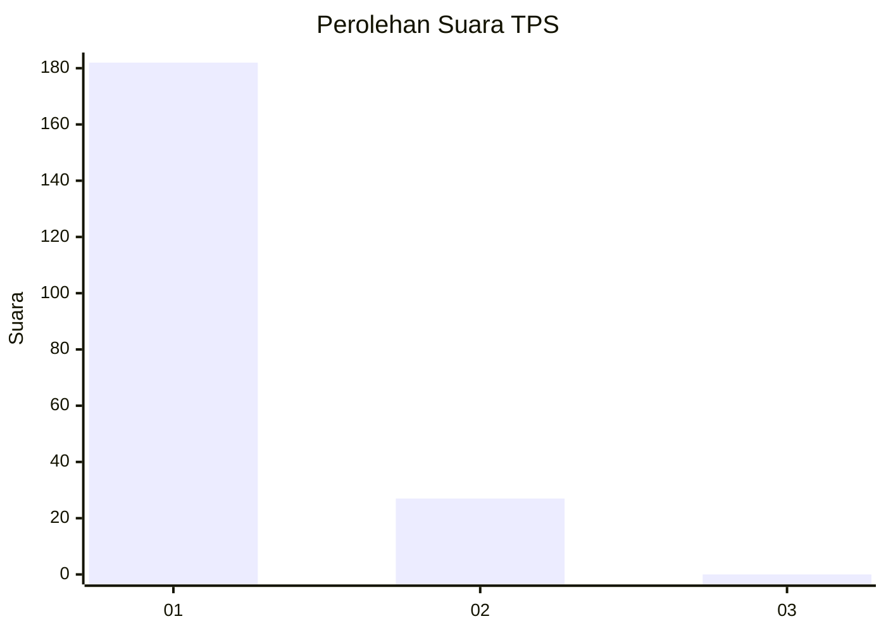
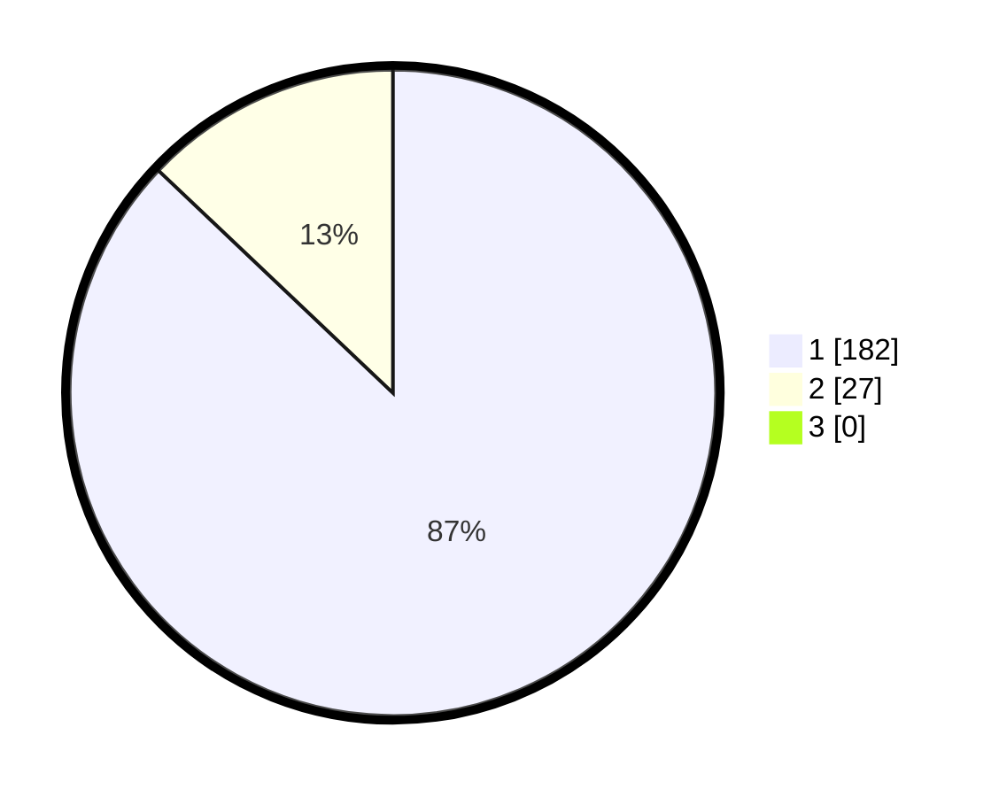

# Hasil

## Grafik

## Tabel

| No. | Nama Paslon    | Suara | Suara (raw) | Persentase |
|:--- |:-------------- | -----:| -----------:| ----------:|
| 1   | ANIES MUHAIMIN | 182   | [182][p-1]  | 87,08      |
| 2   | PRABOWO GIBRAN | 27    | [27][p-2]   | 12,92      |
| 3   | GANJAR MAHFUD  | 0     | [0][p-3]    | 0,00       |

[p-1]: https://github.com/gigit-pemilu/pemilu-2024/blob/main/pilpres/hitung-suara/sub/36-banten/sub/02-lebak/sub/20-cilograng/sub/2005-pasirbungur/sub/012-tps/sub/paslon-1.txt
[p-2]: https://github.com/gigit-pemilu/pemilu-2024/blob/main/pilpres/hitung-suara/sub/36-banten/sub/02-lebak/sub/20-cilograng/sub/2005-pasirbungur/sub/012-tps/sub/paslon-2.txt
[p-3]: https://github.com/gigit-pemilu/pemilu-2024/blob/main/pilpres/hitung-suara/sub/36-banten/sub/02-lebak/sub/20-cilograng/sub/2005-pasirbungur/sub/012-tps/sub/paslon-3.txt

## Foto C Plano

https://sirekap-obj-formc.kpu.go.id/8bf3/pemilu/ppwp/36/02/20/20/05/3602202005012-20240215-095431--b0e13aae-a9fc-41bd-89c1-96328923277b.jpg

https://sirekap-obj-formc.kpu.go.id/8bf3/pemilu/ppwp/36/02/20/20/05/3602202005012-20240215-095636--0bab9eab-4f24-4a4b-98fe-ad692f3f3a9e.jpg

https://sirekap-obj-formc.kpu.go.id/8bf3/pemilu/ppwp/36/02/20/20/05/3602202005012-20240215-095908--3661878c-41e3-4a93-a9ab-16475c38b407.jpg

## Metadata

| Key        | Value               |
| ---------- | ------------------- |
| Time Stamp | 2024-02-19 06:16:00 |

