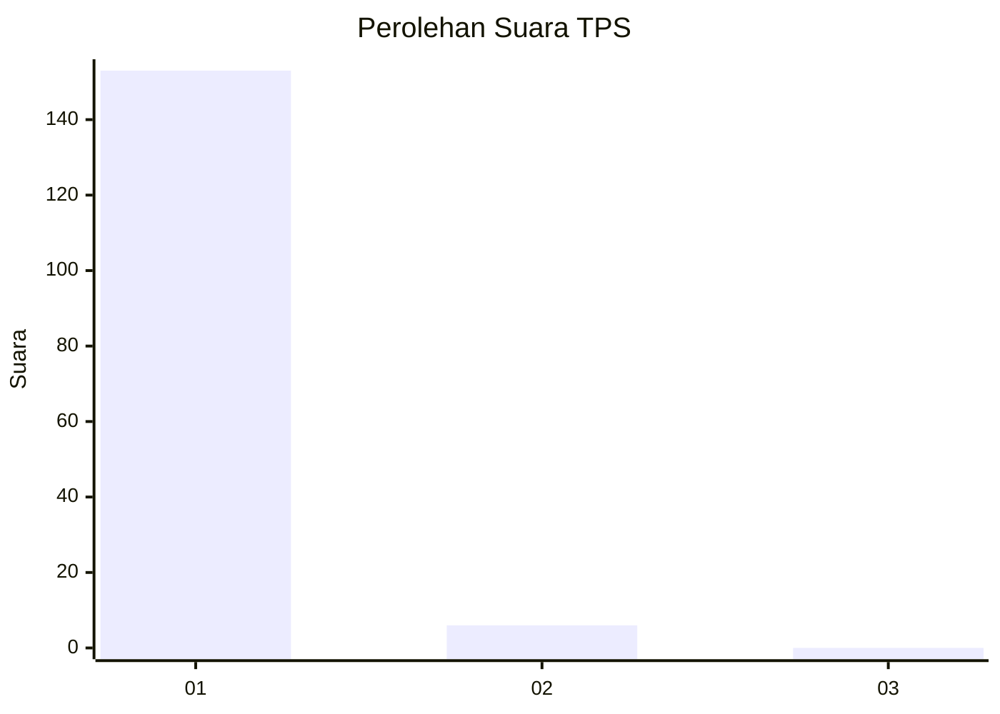
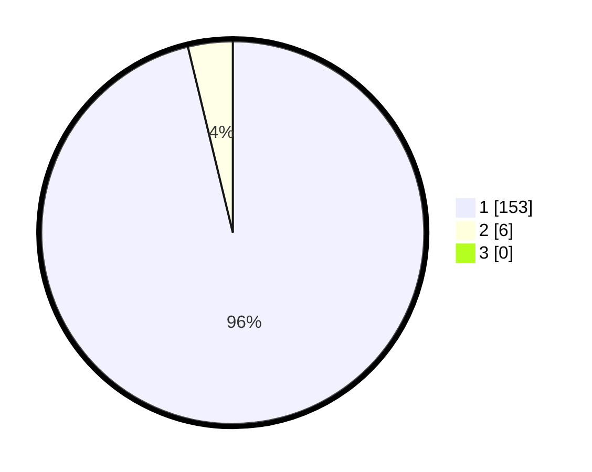

# Hasil

## Grafik

## Tabel

| No. | Nama Paslon    | Suara | Suara (raw) | Persentase |
|:--- |:-------------- | -----:| -----------:| ----------:|
| 1   | ANIES MUHAIMIN | 153   | [153][p-1]  | 96,23      |
| 2   | PRABOWO GIBRAN | 6     | [6][p-2]    | 3,77       |
| 3   | GANJAR MAHFUD  | 0     | [0][p-3]    | 0,00       |

[p-1]: https://github.com/gigit-pemilu/pemilu-2024-36-banten/blob/main/pilpres/hitung-suara/sub/36-banten/sub/02-lebak/sub/20-cilograng/sub/2005-pasirbungur/sub/013-tps/sub/paslon-1.txt
[p-2]: https://github.com/gigit-pemilu/pemilu-2024-36-banten/blob/main/pilpres/hitung-suara/sub/36-banten/sub/02-lebak/sub/20-cilograng/sub/2005-pasirbungur/sub/013-tps/sub/paslon-2.txt
[p-3]: https://github.com/gigit-pemilu/pemilu-2024-36-banten/blob/main/pilpres/hitung-suara/sub/36-banten/sub/02-lebak/sub/20-cilograng/sub/2005-pasirbungur/sub/013-tps/sub/paslon-3.txt

## Foto C Plano

https://sirekap-obj-formc.kpu.go.id/6049/pemilu/ppwp/36/02/20/20/05/3602202005013-20240215-110521--cfdd1e68-258e-41d9-b0c1-af39468493f9.jpg

https://sirekap-obj-formc.kpu.go.id/6049/pemilu/ppwp/36/02/20/20/05/3602202005013-20240215-110805--abf37d59-5783-4511-9d05-cbb7346f0dae.jpg

https://sirekap-obj-formc.kpu.go.id/6049/pemilu/ppwp/36/02/20/20/05/3602202005013-20240215-111020--3fe4f8ad-ba7c-4d45-b09f-2d6088a947b3.jpg

## Metadata

| Key        | Value               |
| ---------- | ------------------- |
| Time Stamp | 2024-02-17 13:37:34 |

