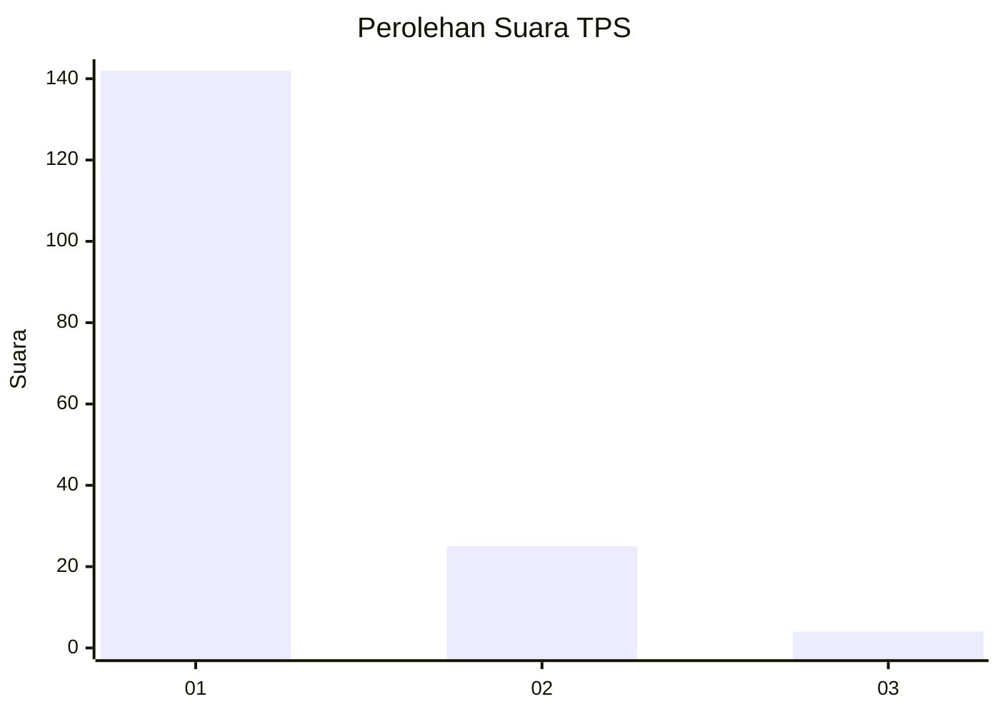
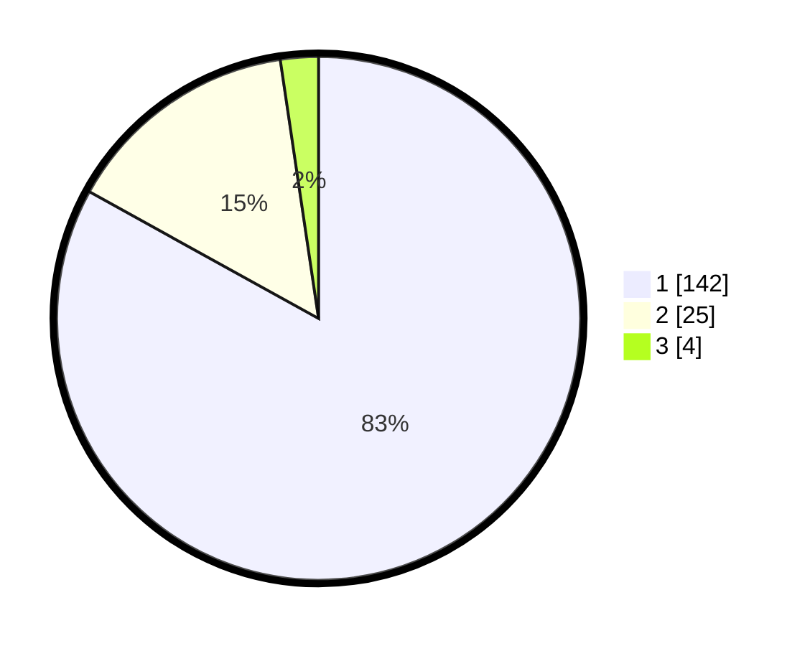

# Hasil

## Grafik

## Tabel

| No. | Nama Paslon    | Suara | Suara (raw) | Persentase |
|:--- |:-------------- | -----:| -----------:| ----------:|
| 1   | ANIES MUHAIMIN | 142   | [142][p-1]  | 83,04      |
| 2   | PRABOWO GIBRAN | 25    | [25][p-2]   | 14,62      |
| 3   | GANJAR MAHFUD  | 4     | [4][p-3]    | 2,34       |

[p-1]: https://github.com/gigit-pemilu/pemilu-2024-36-banten/blob/main/pilpres/hitung-suara/sub/36-banten/sub/02-lebak/sub/20-cilograng/sub/2005-pasirbungur/sub/014-tps/sub/paslon-1.txt
[p-2]: https://github.com/gigit-pemilu/pemilu-2024-36-banten/blob/main/pilpres/hitung-suara/sub/36-banten/sub/02-lebak/sub/20-cilograng/sub/2005-pasirbungur/sub/014-tps/sub/paslon-2.txt
[p-3]: https://github.com/gigit-pemilu/pemilu-2024-36-banten/blob/main/pilpres/hitung-suara/sub/36-banten/sub/02-lebak/sub/20-cilograng/sub/2005-pasirbungur/sub/014-tps/sub/paslon-3.txt

## Foto C Plano

https://sirekap-obj-formc.kpu.go.id/45aa/pemilu/ppwp/36/02/20/20/05/3602202005014-20240220-112046--2d4c77ab-1d1e-4306-be8e-d46386e6a923.jpg

https://sirekap-obj-formc.kpu.go.id/45aa/pemilu/ppwp/36/02/20/20/05/3602202005014-20240220-112156--2dc5214a-386e-492f-932f-27d8a05deb63.jpg

https://sirekap-obj-formc.kpu.go.id/45aa/pemilu/ppwp/36/02/20/20/05/3602202005014-20240220-112250--c858594a-299a-4e21-90fc-bd727004e3d2.jpg

## Metadata

| Key        | Value               |
| ---------- | ------------------- |
| Time Stamp | 2024-02-20 12:00:00 |

