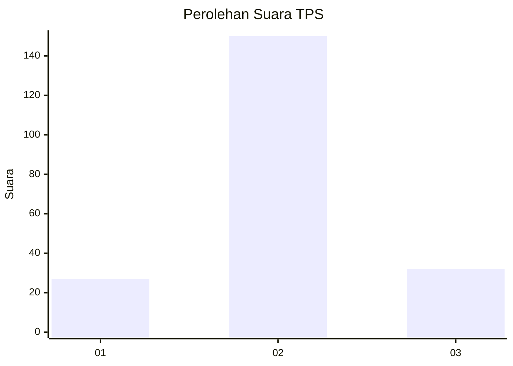
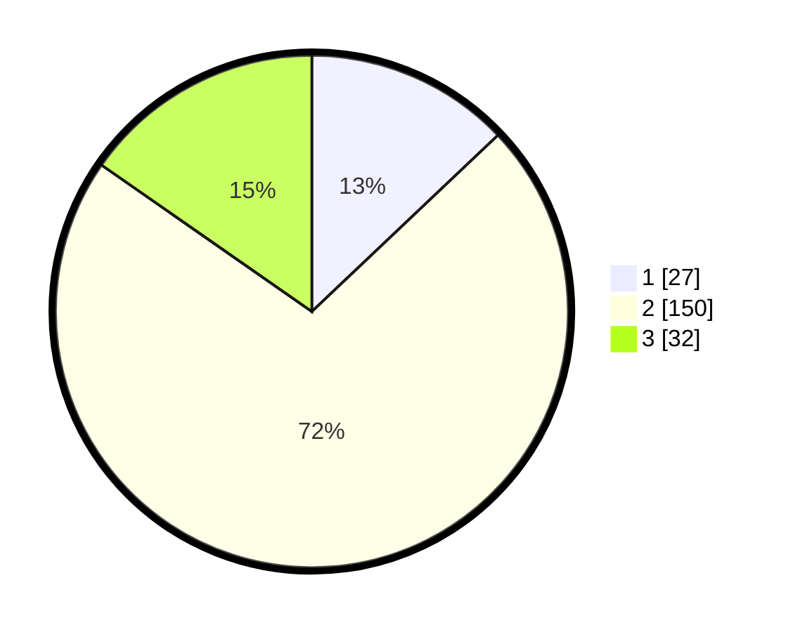

# Hasil

## Grafik

## Tabel

| No. | Nama Paslon    | Suara | Suara (raw) | Persentase |
|:--- |:-------------- | -----:| -----------:| ----------:|
| 1   | ANIES MUHAIMIN | 27    | [27][p-1]   | 12,92      |
| 2   | PRABOWO GIBRAN | 150   | [150][p-2]  | 71,77      |
| 3   | GANJAR MAHFUD  | 32    | [32][p-3]   | 15,31      |

[p-1]: https://github.com/gigit-pemilu/pemilu-2024-36-banten/blob/main/pilpres/hitung-suara/sub/36-banten/sub/02-lebak/sub/21-wanasalam/sub/2001-wanasalam/sub/001-tps/sub/paslon-1.txt
[p-2]: https://github.com/gigit-pemilu/pemilu-2024-36-banten/blob/main/pilpres/hitung-suara/sub/36-banten/sub/02-lebak/sub/21-wanasalam/sub/2001-wanasalam/sub/001-tps/sub/paslon-2.txt
[p-3]: https://github.com/gigit-pemilu/pemilu-2024-36-banten/blob/main/pilpres/hitung-suara/sub/36-banten/sub/02-lebak/sub/21-wanasalam/sub/2001-wanasalam/sub/001-tps/sub/paslon-3.txt

## Foto C Plano

https://sirekap-obj-formc.kpu.go.id/a30c/pemilu/ppwp/36/02/21/20/01/3602212001001-20240214-225343--f7ed54d2-e28f-4c88-83e4-5a17f64e959f.jpg

https://sirekap-obj-formc.kpu.go.id/a30c/pemilu/ppwp/36/02/21/20/01/3602212001001-20240214-225454--8cef4f49-0308-4d8c-b15d-1d824ddbe697.jpg

https://sirekap-obj-formc.kpu.go.id/a30c/pemilu/ppwp/36/02/21/20/01/3602212001001-20240214-225647--3e053eb7-a381-43f9-a13b-46917894d26a.jpg

## Metadata

| Key        | Value               |
| ---------- | ------------------- |
| Time Stamp | 2024-02-16 21:01:00 |

