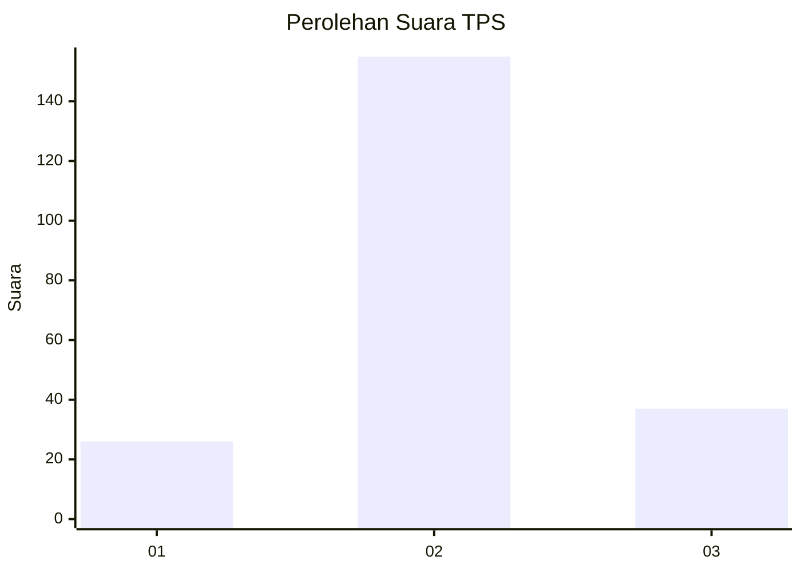
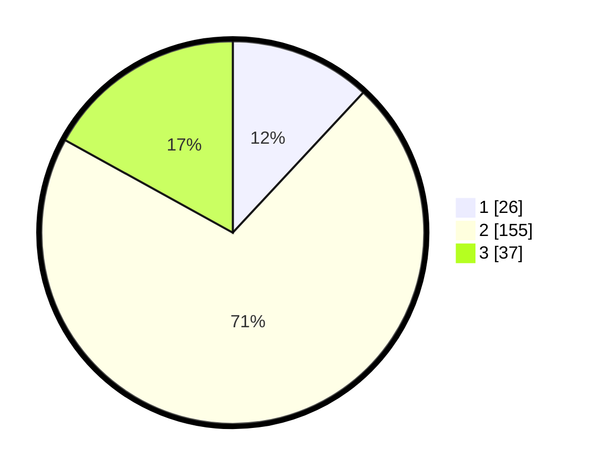

# Hasil

## Grafik

## Tabel

| No. | Nama Paslon    | Suara | Suara (raw) | Persentase |
|:--- |:-------------- | -----:| -----------:| ----------:|
| 1   | ANIES MUHAIMIN | 26    | [26][p-1]   | 11,93      |
| 2   | PRABOWO GIBRAN | 155   | [155][p-2]  | 71,10      |
| 3   | GANJAR MAHFUD  | 37    | [37][p-3]   | 16,97      |

[p-1]: https://github.com/gigit-pemilu/pemilu-2024/blob/main/pilpres/hitung-suara/sub/36-banten/sub/02-lebak/sub/21-wanasalam/sub/2001-wanasalam/sub/002-tps/sub/paslon-1.txt
[p-2]: https://github.com/gigit-pemilu/pemilu-2024/blob/main/pilpres/hitung-suara/sub/36-banten/sub/02-lebak/sub/21-wanasalam/sub/2001-wanasalam/sub/002-tps/sub/paslon-2.txt
[p-3]: https://github.com/gigit-pemilu/pemilu-2024/blob/main/pilpres/hitung-suara/sub/36-banten/sub/02-lebak/sub/21-wanasalam/sub/2001-wanasalam/sub/002-tps/sub/paslon-3.txt

## Foto C Plano

https://sirekap-obj-formc.kpu.go.id/afe6/pemilu/ppwp/36/02/21/20/01/3602212001002-20240215-034051--e1fc6227-b9bd-4622-8fb7-464fced36a45.jpg

https://sirekap-obj-formc.kpu.go.id/afe6/pemilu/ppwp/36/02/21/20/01/3602212001002-20240215-034125--a77e5297-a3ea-4cfb-aa90-e57256d12cce.jpg

https://sirekap-obj-formc.kpu.go.id/afe6/pemilu/ppwp/36/02/21/20/01/3602212001002-20240215-034202--511dcf6b-ef49-45fb-b305-47ef6c6530f6.jpg

## Metadata

| Key        | Value               |
| ---------- | ------------------- |
| Time Stamp | 2024-02-17 02:00:02 |

