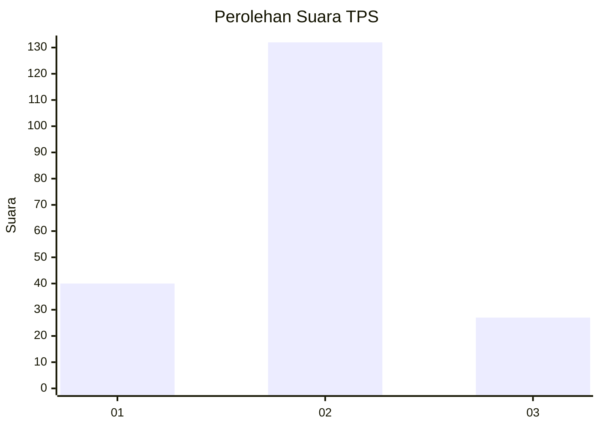
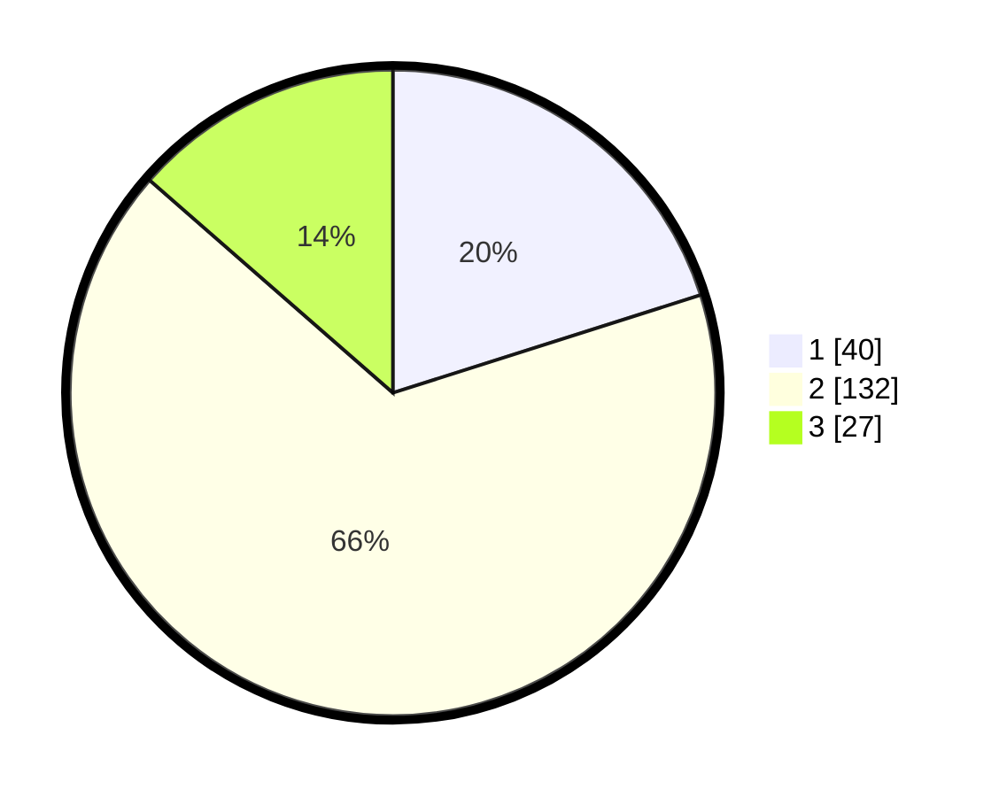

# Hasil

## Grafik

## Tabel

| No. | Nama Paslon    | Suara | Suara (raw) | Persentase |
|:--- |:-------------- | -----:| -----------:| ----------:|
| 1   | ANIES MUHAIMIN | 40    | [40][p-1]   | 20,10      |
| 2   | PRABOWO GIBRAN | 132   | [132][p-2]  | 66,33      |
| 3   | GANJAR MAHFUD  | 27    | [27][p-3]   | 13,57      |

[p-1]: https://github.com/gigit-pemilu/pemilu-2024/blob/main/pilpres/hitung-suara/sub/36-banten/sub/02-lebak/sub/21-wanasalam/sub/2002-bejod/sub/004-tps/sub/paslon-1.txt
[p-2]: https://github.com/gigit-pemilu/pemilu-2024/blob/main/pilpres/hitung-suara/sub/36-banten/sub/02-lebak/sub/21-wanasalam/sub/2002-bejod/sub/004-tps/sub/paslon-2.txt
[p-3]: https://github.com/gigit-pemilu/pemilu-2024/blob/main/pilpres/hitung-suara/sub/36-banten/sub/02-lebak/sub/21-wanasalam/sub/2002-bejod/sub/004-tps/sub/paslon-3.txt

## Foto C Plano

https://sirekap-obj-formc.kpu.go.id/c4d9/pemilu/ppwp/36/02/21/20/02/3602212002004-20240215-041311--878c4de5-5a77-405e-b2da-8be03a9b5b6b.jpg

https://sirekap-obj-formc.kpu.go.id/c4d9/pemilu/ppwp/36/02/21/20/02/3602212002004-20240215-131245--929ffc61-8543-445d-8ffc-3caba8032869.jpg

https://sirekap-obj-formc.kpu.go.id/c4d9/pemilu/ppwp/36/02/21/20/02/3602212002004-20240214-221948--57e6a78b-68d8-4ad0-a740-1d5e75ae9da7.jpg

## Metadata

| Key        | Value               |
| ---------- | ------------------- |
| Time Stamp | 2024-02-17 02:00:02 |

