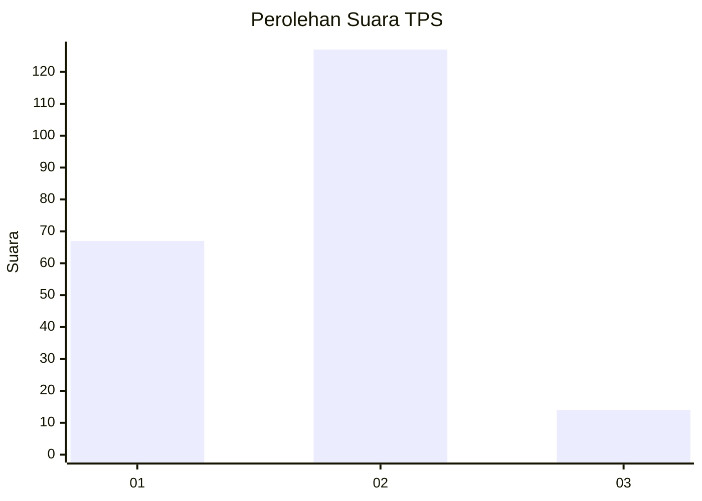
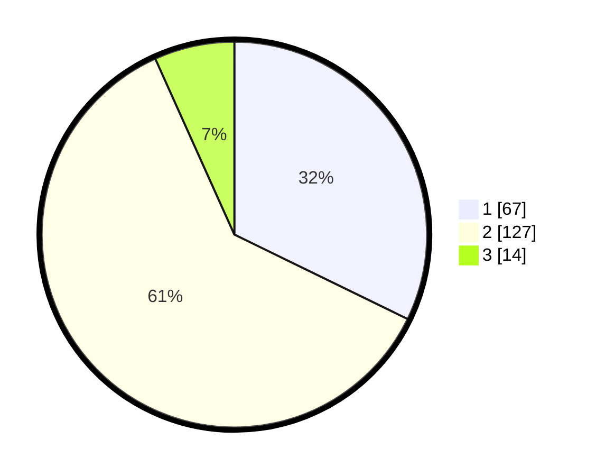

# Hasil

## Grafik

## Tabel

| No. | Nama Paslon    | Suara | Suara (raw) | Persentase |
|:--- |:-------------- | -----:| -----------:| ----------:|
| 1   | ANIES MUHAIMIN | 67    | [67][p-1]   | 32,21      |
| 2   | PRABOWO GIBRAN | 127   | [127][p-2]  | 61,06      |
| 3   | GANJAR MAHFUD  | 14    | [14][p-3]   | 6,73       |

[p-1]: https://github.com/gigit-pemilu/pemilu-2024/blob/main/pilpres/hitung-suara/sub/36-banten/sub/02-lebak/sub/21-wanasalam/sub/2005-muara/sub/028-tps/sub/paslon-1.txt
[p-2]: https://github.com/gigit-pemilu/pemilu-2024/blob/main/pilpres/hitung-suara/sub/36-banten/sub/02-lebak/sub/21-wanasalam/sub/2005-muara/sub/028-tps/sub/paslon-2.txt
[p-3]: https://github.com/gigit-pemilu/pemilu-2024/blob/main/pilpres/hitung-suara/sub/36-banten/sub/02-lebak/sub/21-wanasalam/sub/2005-muara/sub/028-tps/sub/paslon-3.txt

## Foto C Plano

https://sirekap-obj-formc.kpu.go.id/05b3/pemilu/ppwp/36/02/21/20/05/3602212005028-20240214-200249--68e5b6bf-67fd-4676-b78d-eb680ca02b86.jpg

https://sirekap-obj-formc.kpu.go.id/05b3/pemilu/ppwp/36/02/21/20/05/3602212005028-20240214-200600--31b51bdd-3706-4de7-8151-a7c56bc70e9a.jpg

https://sirekap-obj-formc.kpu.go.id/05b3/pemilu/ppwp/36/02/21/20/05/3602212005028-20240214-212657--b49becc7-f6ae-4ce7-abd8-f08a7afcb66a.jpg

## Metadata

| Key        | Value               |
| ---------- | ------------------- |
| Time Stamp | 2024-02-16 00:00:26 |

## DATA PEMILIH TETAP

Jumlah pemilih dalam DPT: **234**.
 * L: **535**.
 * P: **52**.

## DATA PENGGUNA HAK PILIH

Jumlah pengguna hak pilih dalam DPT: **329**.
 * L: **552**.
 * P: **353**.

Jumlah pengguna hak pilih dalam DPTb: **888**.
 * L: **88**.
 * P: **800**.

Jumlah pengguna hak pilih dalam DPK: **800**.
 * L: **8**.
 * P: **0**.

Jumlah pengguna hak pilih: **225**.
 * L: **700**.
 * P: **115**.

## JUMLAH SUARA SAH DAN TIDAK SAH

JUMLAH SELURUH SUARA SAH: **208**.

JUMLAH SUARA TIDAK SAH: **7**.

JUMLAH SELURUH SUARA SAH DAN SUARA TIDAK SAH: **215**.

