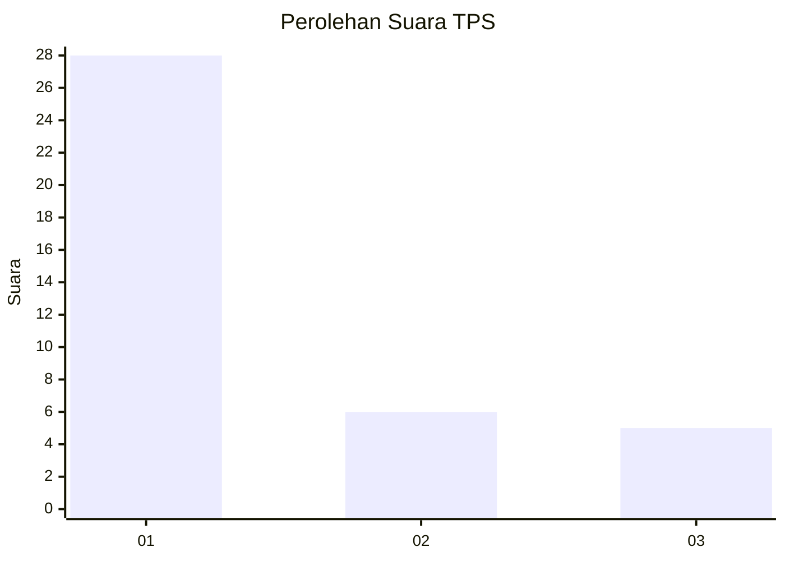
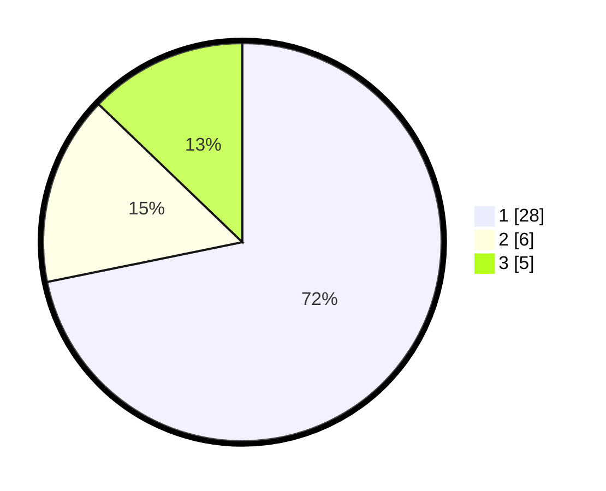

# Hasil

## Grafik

## Tabel

| No. | Nama Paslon    | Suara | Suara (raw) | Persentase |
|:--- |:-------------- | -----:| -----------:| ----------:|
| 1   | ANIES MUHAIMIN | 28    | [28][p-1]   | 71,79      |
| 2   | PRABOWO GIBRAN | 6     | [6][p-2]    | 15,38      |
| 3   | GANJAR MAHFUD  | 5     | [5][p-3]    | 12,82      |

[p-1]: https://github.com/gigit-pemilu/pemilu-2024/blob/main/pilpres/hitung-suara/sub/36-banten/sub/02-lebak/sub/21-wanasalam/sub/2009-cisarap/sub/003-tps/sub/paslon-1.txt
[p-2]: https://github.com/gigit-pemilu/pemilu-2024/blob/main/pilpres/hitung-suara/sub/36-banten/sub/02-lebak/sub/21-wanasalam/sub/2009-cisarap/sub/003-tps/sub/paslon-2.txt
[p-3]: https://github.com/gigit-pemilu/pemilu-2024/blob/main/pilpres/hitung-suara/sub/36-banten/sub/02-lebak/sub/21-wanasalam/sub/2009-cisarap/sub/003-tps/sub/paslon-3.txt

## Foto C Plano

https://sirekap-obj-formc.kpu.go.id/5077/pemilu/ppwp/36/02/21/20/09/3602212009003-20240215-151518--d6cab801-2459-423b-b11b-1bbcb47ee3c2.jpg

https://sirekap-obj-formc.kpu.go.id/5077/pemilu/ppwp/36/02/21/20/09/3602212009003-20240215-220126--22113c96-3c28-406c-b5ef-1c2003bb3b17.jpg

https://sirekap-obj-formc.kpu.go.id/5077/pemilu/ppwp/36/02/21/20/09/3602212009003-20240215-230605--6a0d5c76-f53a-4cea-b217-fd86ac05555b.jpg

## Metadata

| Key        | Value               |
| ---------- | ------------------- |
| Time Stamp | 2024-02-15 23:29:50 |

