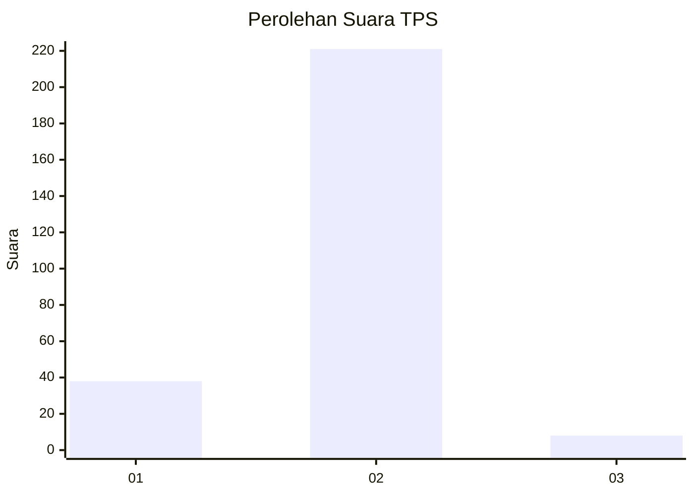
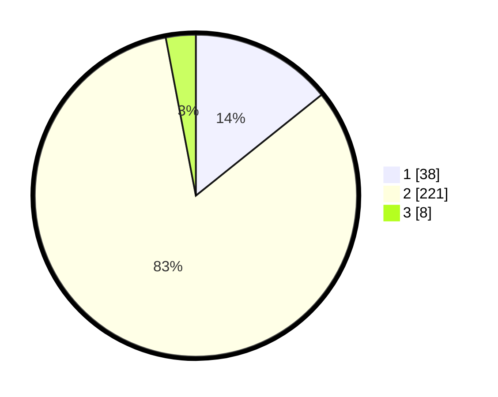

# Hasil

## Grafik

## Tabel

| No. | Nama Paslon    | Suara | Suara (raw) | Persentase |
|:--- |:-------------- | -----:| -----------:| ----------:|
| 1   | ANIES MUHAIMIN | 38    | [38][p-1]   | 14,23      |
| 2   | PRABOWO GIBRAN | 221   | [221][p-2]  | 82,77      |
| 3   | GANJAR MAHFUD  | 8     | [8][p-3]    | 3,00       |

[p-1]: https://github.com/gigit-pemilu/pemilu-2024-36-banten/blob/main/pilpres/hitung-suara/sub/36-banten/sub/02-lebak/sub/22-sobang/sub/2007-majasari/sub/007-tps/sub/paslon-1.txt
[p-2]: https://github.com/gigit-pemilu/pemilu-2024-36-banten/blob/main/pilpres/hitung-suara/sub/36-banten/sub/02-lebak/sub/22-sobang/sub/2007-majasari/sub/007-tps/sub/paslon-2.txt
[p-3]: https://github.com/gigit-pemilu/pemilu-2024-36-banten/blob/main/pilpres/hitung-suara/sub/36-banten/sub/02-lebak/sub/22-sobang/sub/2007-majasari/sub/007-tps/sub/paslon-3.txt

## Foto C Plano

https://sirekap-obj-formc.kpu.go.id/315a/pemilu/ppwp/36/02/22/20/07/3602222007007-20240215-204811--3b8786d5-4a91-465e-acba-3f09f1b37837.jpg

https://sirekap-obj-formc.kpu.go.id/315a/pemilu/ppwp/36/02/22/20/07/3602222007007-20240215-205133--9bfc6ca1-6ea9-4be3-8bb8-17627da3c343.jpg

https://sirekap-obj-formc.kpu.go.id/315a/pemilu/ppwp/36/02/22/20/07/3602222007007-20240215-205702--f5b3af7b-f9c7-4dde-890f-792a60614492.jpg

## Metadata

| Key        | Value               |
| ---------- | ------------------- |
| Time Stamp | 2024-02-15 22:00:27 |

