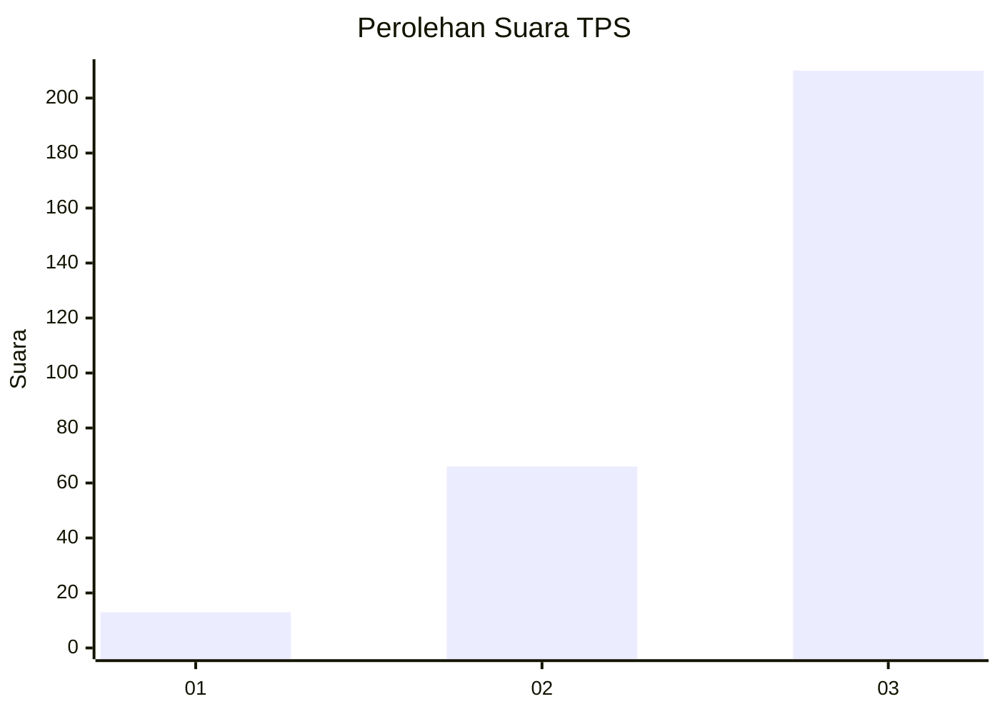
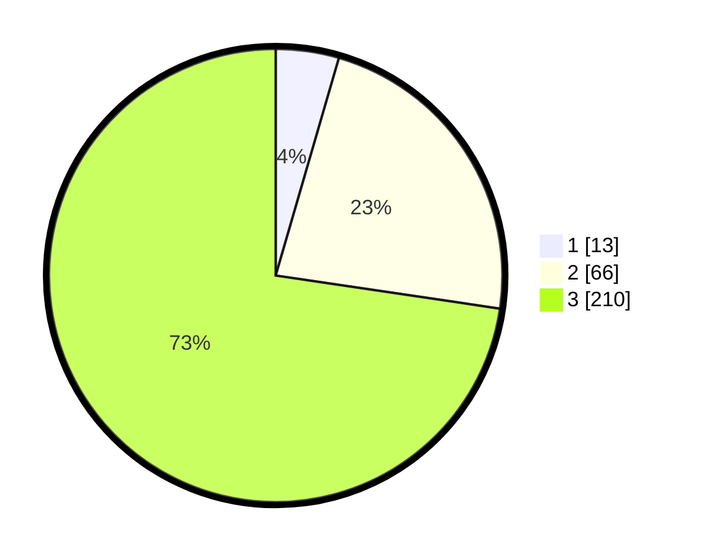

# Hasil

## Grafik

## Tabel

| No. | Nama Paslon    | Suara | Suara (raw) | Persentase |
|:--- |:-------------- | -----:| -----------:| ----------:|
| 1   | ANIES MUHAIMIN | 13    | [13][p-1]   | 4,50       |
| 2   | PRABOWO GIBRAN | 66    | [66][p-2]   | 22,84      |
| 3   | GANJAR MAHFUD  | 210   | [210][p-3]  | 72,66      |

[p-1]: https://github.com/gigit-pemilu/pemilu-2024-36-banten/blob/main/pilpres/hitung-suara/sub/36-banten/sub/02-lebak/sub/23-curug-bitung/sub/2001-guradog/sub/004-tps/sub/paslon-1.txt
[p-2]: https://github.com/gigit-pemilu/pemilu-2024-36-banten/blob/main/pilpres/hitung-suara/sub/36-banten/sub/02-lebak/sub/23-curug-bitung/sub/2001-guradog/sub/004-tps/sub/paslon-2.txt
[p-3]: https://github.com/gigit-pemilu/pemilu-2024-36-banten/blob/main/pilpres/hitung-suara/sub/36-banten/sub/02-lebak/sub/23-curug-bitung/sub/2001-guradog/sub/004-tps/sub/paslon-3.txt

## Foto C Plano

https://sirekap-obj-formc.kpu.go.id/f2ad/pemilu/ppwp/36/02/23/20/01/3602232001004-20240215-130015--39f38ca8-e9e1-4ba8-91f8-416ae70bd16f.jpg

https://sirekap-obj-formc.kpu.go.id/f2ad/pemilu/ppwp/36/02/23/20/01/3602232001004-20240215-163923--41ea6fa4-10af-4801-848a-38add5e10285.jpg

https://sirekap-obj-formc.kpu.go.id/f2ad/pemilu/ppwp/36/02/23/20/01/3602232001004-20240215-164507--790dfcf6-abfa-48b6-a3e5-4d71ba96bafc.jpg

## Metadata

| Key        | Value               |
| ---------- | ------------------- |
| Time Stamp | 2024-02-17 01:00:00 |

## DATA PEMILIH TETAP

Jumlah pemilih dalam DPT: **291**.
 * L: **147**.
 * P: **144**.

## DATA PENGGUNA HAK PILIH

Jumlah pengguna hak pilih dalam DPT: **289**.
 * L: **146**.
 * P: **143**.

Jumlah pengguna hak pilih dalam DPTb: **0**.
 * L: **0**.
 * P: **0**.

Jumlah pengguna hak pilih dalam DPK: **0**.
 * L: **0**.
 * P: **0**.

Jumlah pengguna hak pilih: **289**.
 * L: **146**.
 * P: **143**.

## JUMLAH SUARA SAH DAN TIDAK SAH

JUMLAH SELURUH SUARA SAH: **289**.

JUMLAH SUARA TIDAK SAH: **0**.

JUMLAH SELURUH SUARA SAH DAN SUARA TIDAK SAH: **289**.

