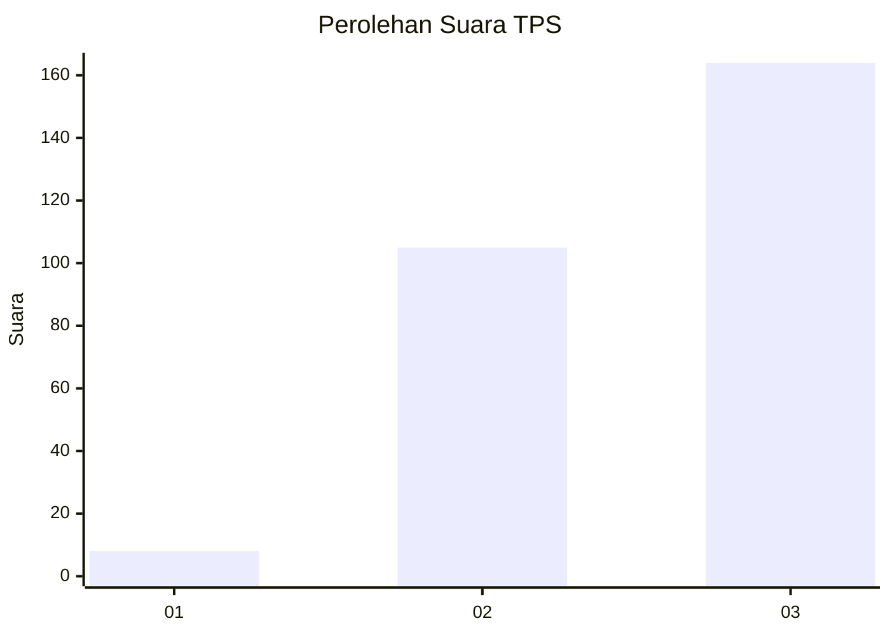
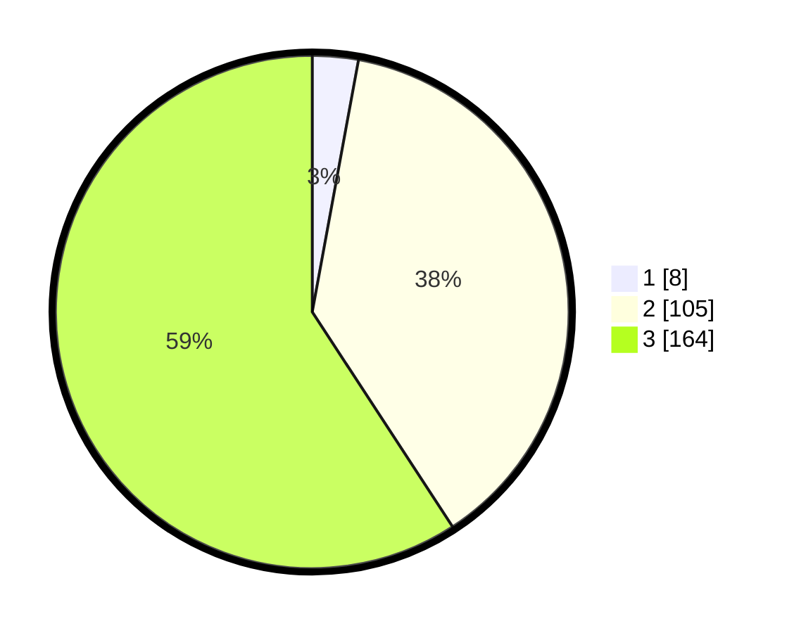

# Hasil

## Grafik

## Tabel

| No. | Nama Paslon    | Suara | Suara (raw) | Persentase |
|:--- |:-------------- | -----:| -----------:| ----------:|
| 1   | ANIES MUHAIMIN | 8     | [8][p-1]    | 2,89       |
| 2   | PRABOWO GIBRAN | 105   | [105][p-2]  | 37,91      |
| 3   | GANJAR MAHFUD  | 164   | [164][p-3]  | 59,21      |

[p-1]: https://github.com/gigit-pemilu/pemilu-2024-36-banten/blob/main/pilpres/hitung-suara/sub/36-banten/sub/02-lebak/sub/23-curug-bitung/sub/2001-guradog/sub/005-tps/sub/paslon-1.txt
[p-2]: https://github.com/gigit-pemilu/pemilu-2024-36-banten/blob/main/pilpres/hitung-suara/sub/36-banten/sub/02-lebak/sub/23-curug-bitung/sub/2001-guradog/sub/005-tps/sub/paslon-2.txt
[p-3]: https://github.com/gigit-pemilu/pemilu-2024-36-banten/blob/main/pilpres/hitung-suara/sub/36-banten/sub/02-lebak/sub/23-curug-bitung/sub/2001-guradog/sub/005-tps/sub/paslon-3.txt

## Foto C Plano

https://sirekap-obj-formc.kpu.go.id/c3b8/pemilu/ppwp/36/02/23/20/01/3602232001005-20240215-142958--a275ca56-40f6-455a-b152-9ddf3515a211.jpg

https://sirekap-obj-formc.kpu.go.id/c3b8/pemilu/ppwp/36/02/23/20/01/3602232001005-20240215-103212--d7e5780a-8e77-4298-a433-3a156e40d1b4.jpg

https://sirekap-obj-formc.kpu.go.id/c3b8/pemilu/ppwp/36/02/23/20/01/3602232001005-20240215-142833--b9946b7c-51df-4ea6-87d4-e7db9a96a449.jpg

## Metadata

| Key        | Value               |
| ---------- | ------------------- |
| Time Stamp | 2024-02-19 06:16:00 |

