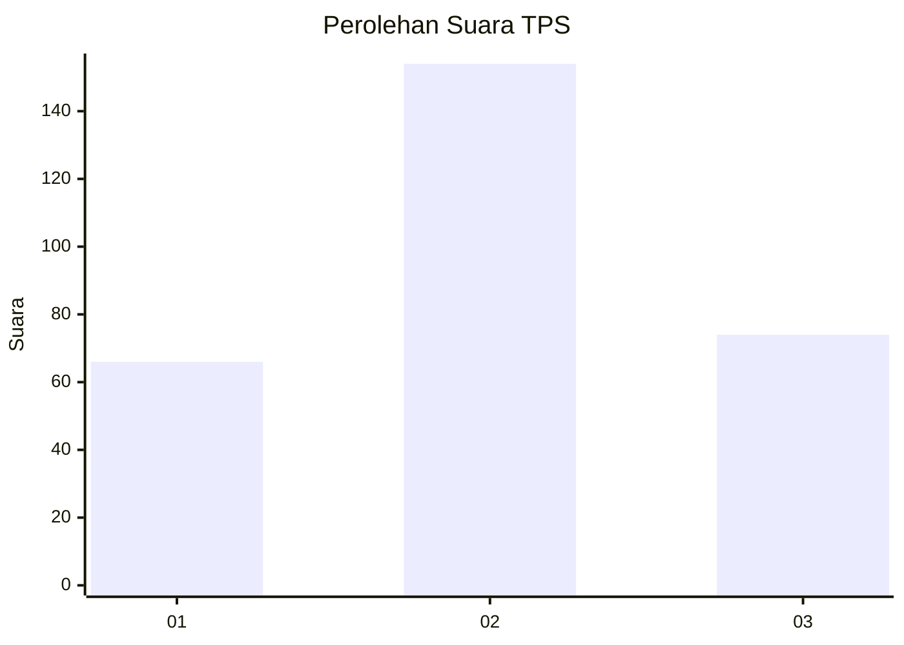
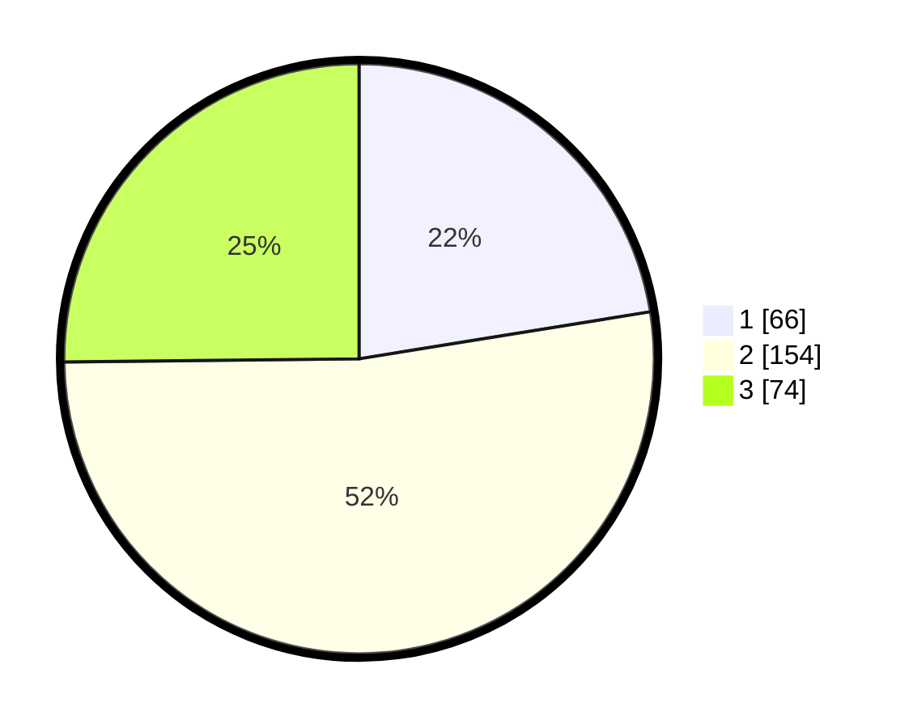

# Hasil

## Grafik

## Tabel

| No. | Nama Paslon    | Suara | Suara (raw) | Persentase |
|:--- |:-------------- | -----:| -----------:| ----------:|
| 1   | ANIES MUHAIMIN | 66    | [66][p-1]   | 22,45      |
| 2   | PRABOWO GIBRAN | 154   | [154][p-2]  | 52,38      |
| 3   | GANJAR MAHFUD  | 74    | [74][p-3]   | 25,17      |

[p-1]: https://github.com/gigit-pemilu/pemilu-2024/blob/main/pilpres/hitung-suara/sub/36-banten/sub/02-lebak/sub/23-curug-bitung/sub/2001-guradog/sub/007-tps/sub/paslon-1.txt
[p-2]: https://github.com/gigit-pemilu/pemilu-2024/blob/main/pilpres/hitung-suara/sub/36-banten/sub/02-lebak/sub/23-curug-bitung/sub/2001-guradog/sub/007-tps/sub/paslon-2.txt
[p-3]: https://github.com/gigit-pemilu/pemilu-2024/blob/main/pilpres/hitung-suara/sub/36-banten/sub/02-lebak/sub/23-curug-bitung/sub/2001-guradog/sub/007-tps/sub/paslon-3.txt

## Foto C Plano

https://sirekap-obj-formc.kpu.go.id/912b/pemilu/ppwp/36/02/23/20/01/3602232001007-20240215-074254--c904e2b8-2f33-4d9a-8ddf-f04e248122cf.jpg

https://sirekap-obj-formc.kpu.go.id/912b/pemilu/ppwp/36/02/23/20/01/3602232001007-20240215-074451--23d43c2a-f877-49c1-a54d-e731df83b503.jpg

https://sirekap-obj-formc.kpu.go.id/912b/pemilu/ppwp/36/02/23/20/01/3602232001007-20240215-074636--6c9efece-2a55-48c2-a79d-9b283e4550a1.jpg

## Metadata

| Key        | Value               |
| ---------- | ------------------- |
| Time Stamp | 2024-02-17 01:00:00 |

