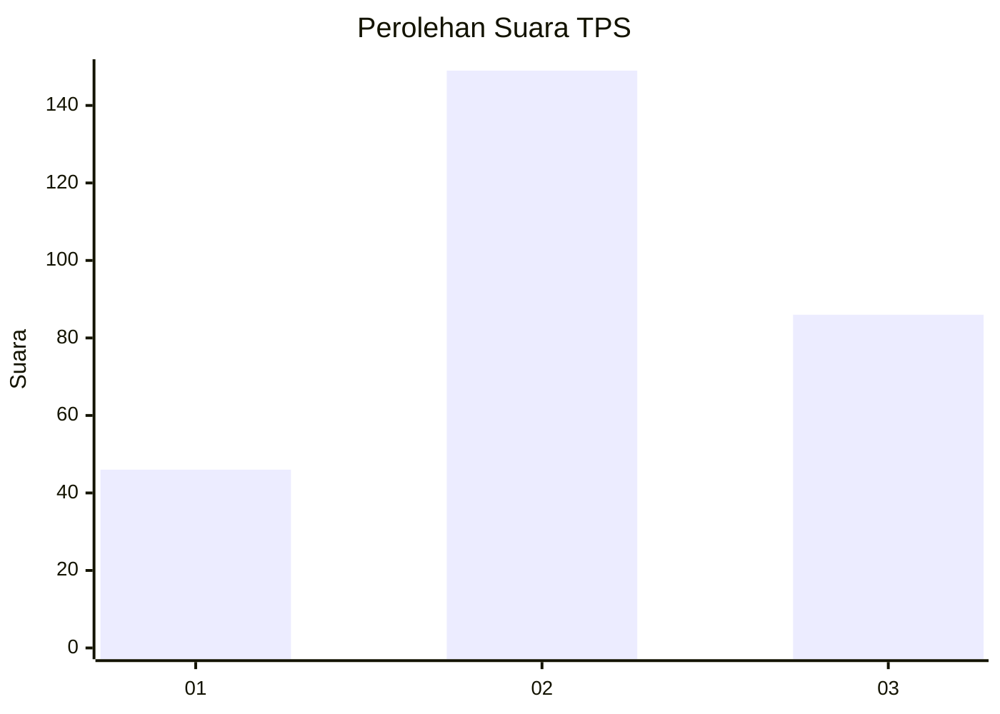
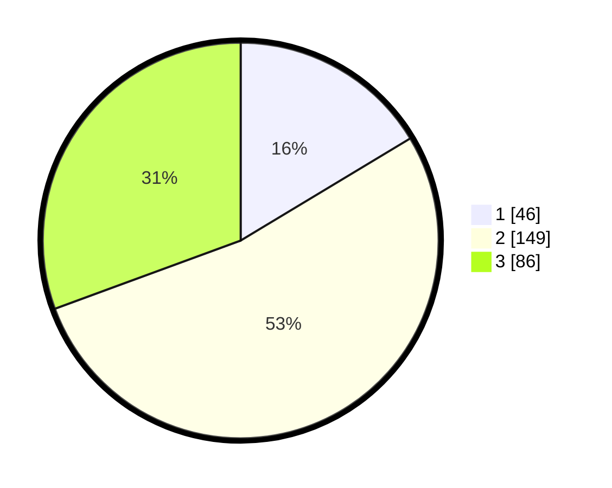

# Hasil

## Grafik

## Tabel

| No. | Nama Paslon    | Suara | Suara (raw) | Persentase |
|:--- |:-------------- | -----:| -----------:| ----------:|
| 1   | ANIES MUHAIMIN | 46    | [46][p-1]   | 16,37      |
| 2   | PRABOWO GIBRAN | 149   | [149][p-2]  | 53,02      |
| 3   | GANJAR MAHFUD  | 86    | [86][p-3]   | 30,60      |

[p-1]: https://github.com/gigit-pemilu/pemilu-2024-36-banten/blob/main/pilpres/hitung-suara/sub/36-banten/sub/02-lebak/sub/23-curug-bitung/sub/2001-guradog/sub/009-tps/sub/paslon-1.txt
[p-2]: https://github.com/gigit-pemilu/pemilu-2024-36-banten/blob/main/pilpres/hitung-suara/sub/36-banten/sub/02-lebak/sub/23-curug-bitung/sub/2001-guradog/sub/009-tps/sub/paslon-2.txt
[p-3]: https://github.com/gigit-pemilu/pemilu-2024-36-banten/blob/main/pilpres/hitung-suara/sub/36-banten/sub/02-lebak/sub/23-curug-bitung/sub/2001-guradog/sub/009-tps/sub/paslon-3.txt

## Foto C Plano

https://sirekap-obj-formc.kpu.go.id/2a62/pemilu/ppwp/36/02/23/20/01/3602232001009-20240215-014409--446c6384-5aeb-4113-95c3-0f4301e7eb21.jpg

https://sirekap-obj-formc.kpu.go.id/2a62/pemilu/ppwp/36/02/23/20/01/3602232001009-20240214-192755--9afc6db6-0e4b-494f-bcf0-08c518c2300e.jpg

https://sirekap-obj-formc.kpu.go.id/2a62/pemilu/ppwp/36/02/23/20/01/3602232001009-20240215-154336--a6ae2296-2479-4a7d-a522-c4e56da8c3d9.jpg

## Metadata

| Key        | Value               |
| ---------- | ------------------- |
| Time Stamp | 2024-02-15 16:00:26 |

