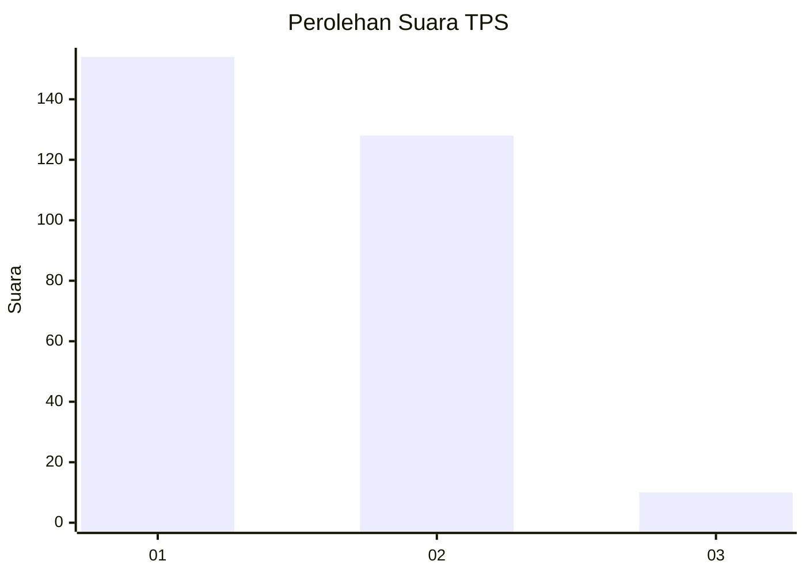
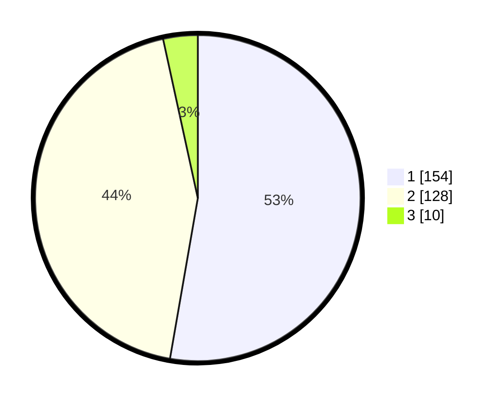

# Hasil

## Grafik

## Tabel

| No. | Nama Paslon    | Suara | Suara (raw) | Persentase |
|:--- |:-------------- | -----:| -----------:| ----------:|
| 1   | ANIES MUHAIMIN | 154   | [154][p-1]  | 52,74      |
| 2   | PRABOWO GIBRAN | 128   | [128][p-2]  | 43,84      |
| 3   | GANJAR MAHFUD  | 10    | [10][p-3]   | 3,42       |

[p-1]: https://github.com/gigit-pemilu/pemilu-2024-36-banten/blob/main/pilpres/hitung-suara/sub/36-banten/sub/02-lebak/sub/25-lebakgedong/sub/2001-banjaririgasi/sub/005-tps/sub/paslon-1.txt
[p-2]: https://github.com/gigit-pemilu/pemilu-2024-36-banten/blob/main/pilpres/hitung-suara/sub/36-banten/sub/02-lebak/sub/25-lebakgedong/sub/2001-banjaririgasi/sub/005-tps/sub/paslon-2.txt
[p-3]: https://github.com/gigit-pemilu/pemilu-2024-36-banten/blob/main/pilpres/hitung-suara/sub/36-banten/sub/02-lebak/sub/25-lebakgedong/sub/2001-banjaririgasi/sub/005-tps/sub/paslon-3.txt

## Foto C Plano

https://sirekap-obj-formc.kpu.go.id/6f94/pemilu/ppwp/36/02/25/20/01/3602252001005-20240220-155947--d082d3ea-5e75-401e-a794-80c5104fc942.jpg

https://sirekap-obj-formc.kpu.go.id/6f94/pemilu/ppwp/36/02/25/20/01/3602252001005-20240220-155949--cd9e69dd-d29f-4622-935b-9f0f5bb310ac.jpg

https://sirekap-obj-formc.kpu.go.id/6f94/pemilu/ppwp/36/02/25/20/01/3602252001005-20240220-155948--a9b73817-f0f8-4096-ae44-307136003c32.jpg

## Metadata

| Key        | Value               |
| ---------- | ------------------- |
| Time Stamp | 2024-02-21 15:00:00 |

## DATA PEMILIH TETAP

Jumlah pemilih dalam DPT: **291**.
 * L: **154**.
 * P: **157**.

## DATA PENGGUNA HAK PILIH

Jumlah pengguna hak pilih dalam DPT: **288**.
 * L: **151**.
 * P: **137**.

Jumlah pengguna hak pilih dalam DPTb: **8**.
 * L: **7**.
 * P: **1**.

Jumlah pengguna hak pilih dalam DPK: **1**.
 * L: **1**.
 * P: **0**.

Jumlah pengguna hak pilih: **297**.
 * L: **159**.
 * P: **138**.

## JUMLAH SUARA SAH DAN TIDAK SAH

JUMLAH SELURUH SUARA SAH: **292**.

JUMLAH SUARA TIDAK SAH: **5**.

JUMLAH SELURUH SUARA SAH DAN SUARA TIDAK SAH: **297**.

