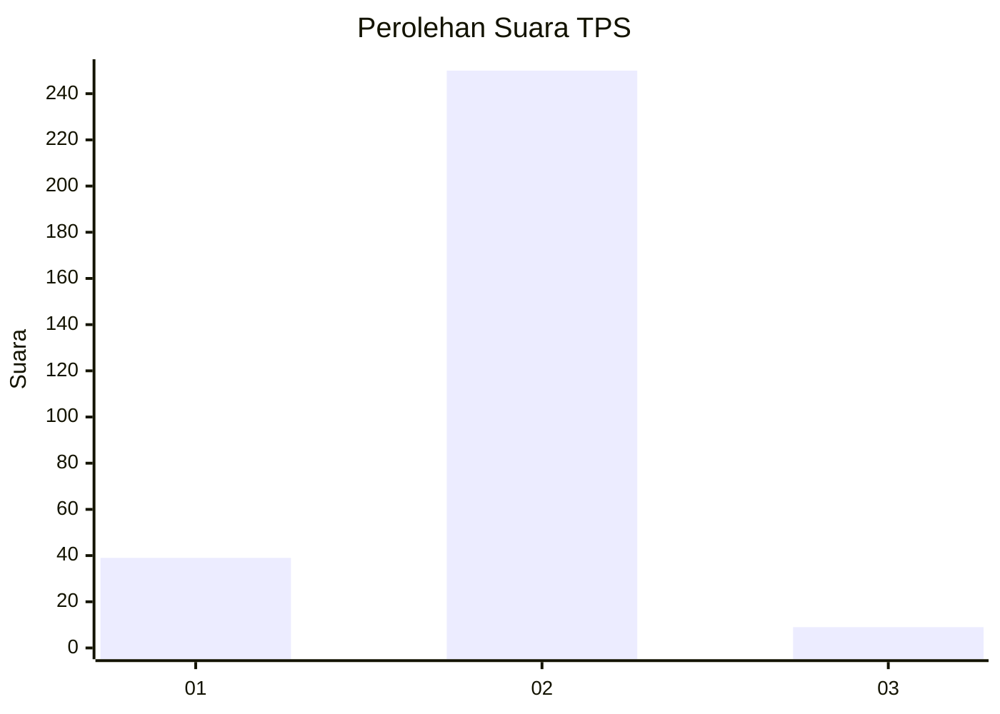
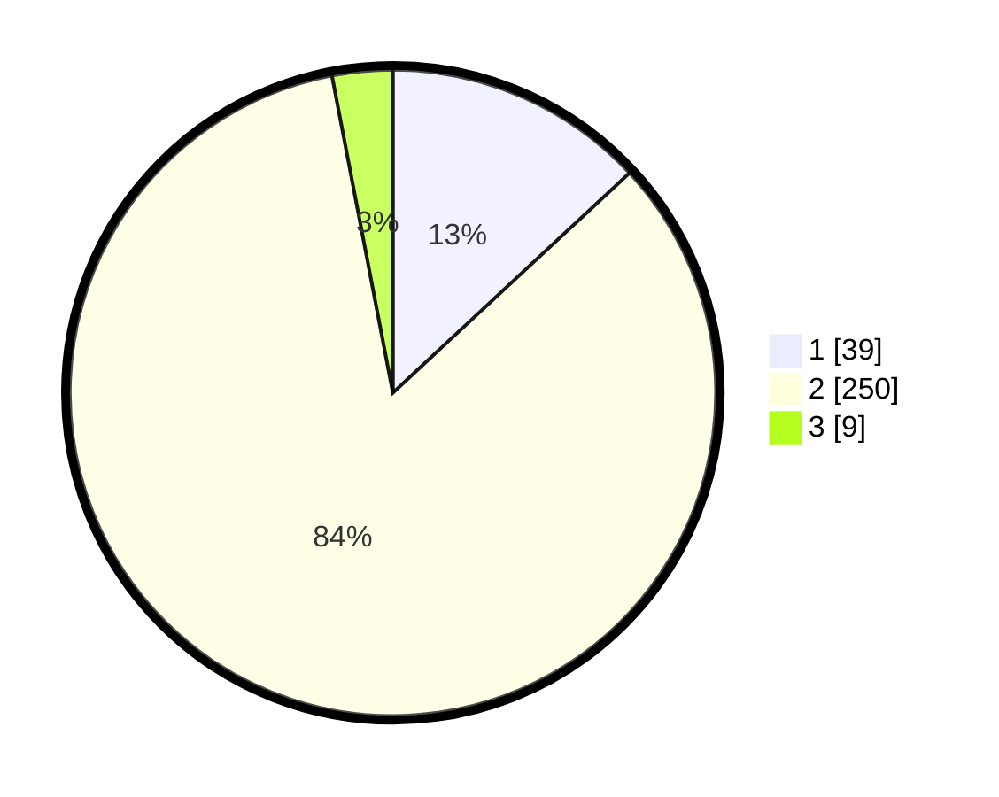

# Hasil

## Grafik

## Tabel

| No. | Nama Paslon    | Suara | Suara (raw) | Persentase |
|:--- |:-------------- | -----:| -----------:| ----------:|
| 1   | ANIES MUHAIMIN | 39    | [39][p-1]   | 13,09      |
| 2   | PRABOWO GIBRAN | 250   | [250][p-2]  | 83,89      |
| 3   | GANJAR MAHFUD  | 9     | [9][p-3]    | 3,02       |

[p-1]: https://github.com/gigit-pemilu/pemilu-2024-36-banten/blob/main/pilpres/hitung-suara/sub/36-banten/sub/02-lebak/sub/25-lebakgedong/sub/2004-banjarsari/sub/007-tps/sub/paslon-1.txt
[p-2]: https://github.com/gigit-pemilu/pemilu-2024-36-banten/blob/main/pilpres/hitung-suara/sub/36-banten/sub/02-lebak/sub/25-lebakgedong/sub/2004-banjarsari/sub/007-tps/sub/paslon-2.txt
[p-3]: https://github.com/gigit-pemilu/pemilu-2024-36-banten/blob/main/pilpres/hitung-suara/sub/36-banten/sub/02-lebak/sub/25-lebakgedong/sub/2004-banjarsari/sub/007-tps/sub/paslon-3.txt

## Foto C Plano

https://sirekap-obj-formc.kpu.go.id/e567/pemilu/ppwp/36/02/25/20/04/3602252004007-20240215-005408--2aedba59-5e86-4a62-bc59-e5e3d9ce1014.jpg

https://sirekap-obj-formc.kpu.go.id/e567/pemilu/ppwp/36/02/25/20/04/3602252004007-20240215-032502--fd1dcc54-b4aa-4b6a-87ea-ce80d3319a8f.jpg

https://sirekap-obj-formc.kpu.go.id/e567/pemilu/ppwp/36/02/25/20/04/3602252004007-20240214-200745--76566cf1-e909-4623-a6e9-7d104dd96d76.jpg

## Metadata

| Key        | Value               |
| ---------- | ------------------- |
| Time Stamp | 2024-02-19 06:16:00 |

