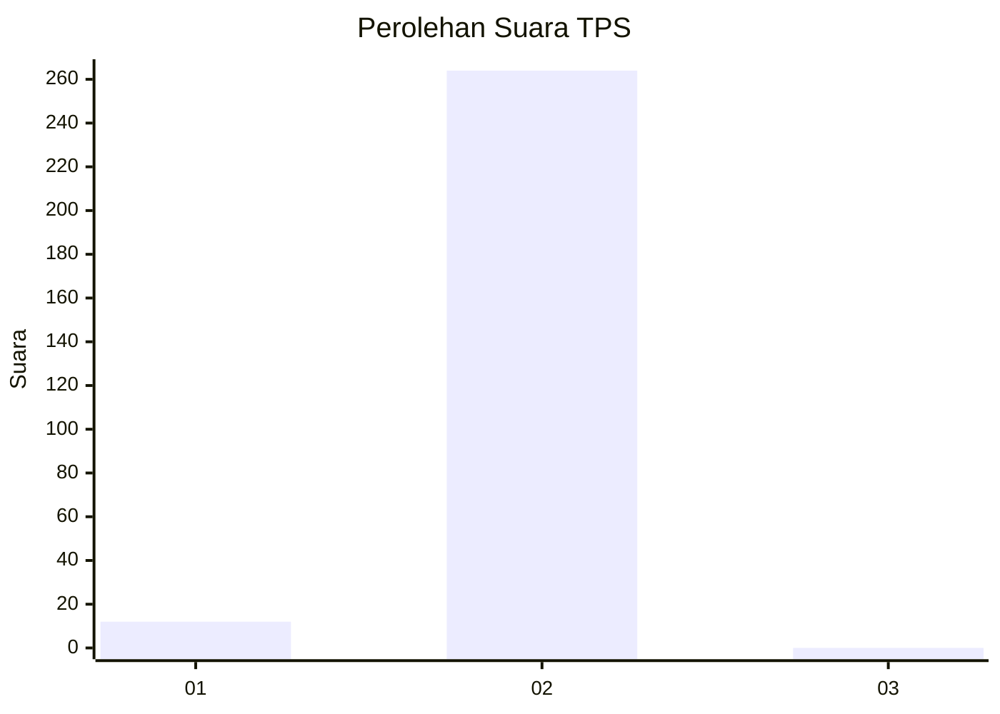
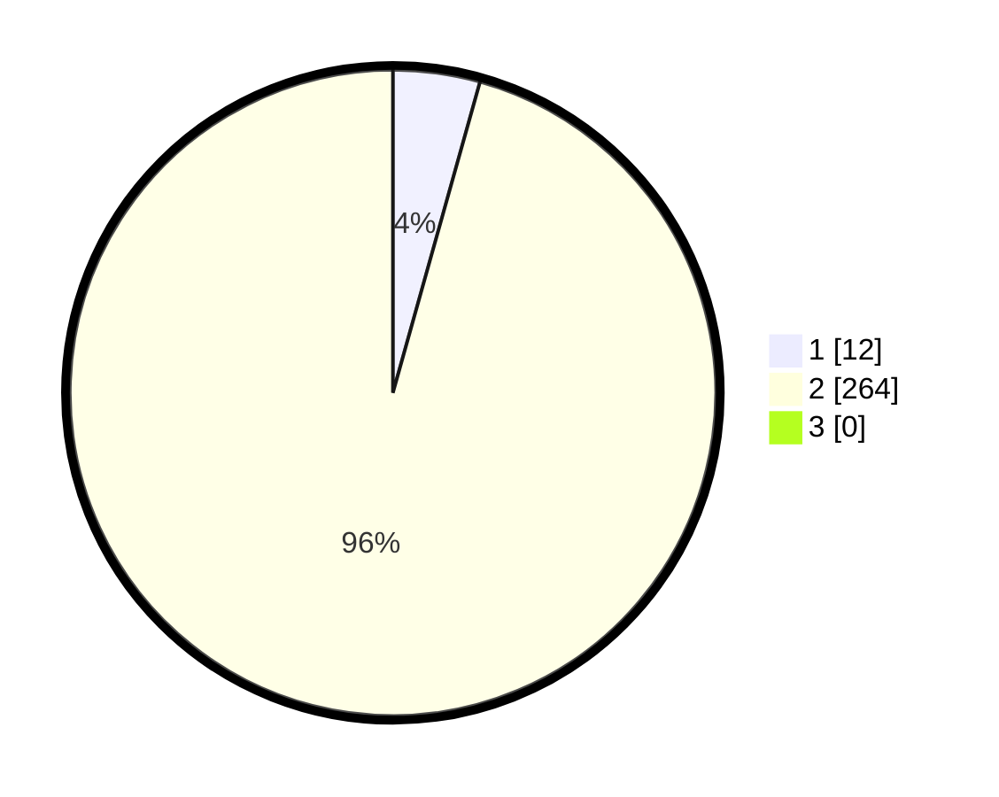

# Hasil

## Grafik

## Tabel

| No. | Nama Paslon    | Suara | Suara (raw) | Persentase |
|:--- |:-------------- | -----:| -----------:| ----------:|
| 1   | ANIES MUHAIMIN | 12    | [12][p-1]   | 4,35       |
| 2   | PRABOWO GIBRAN | 264   | [264][p-2]  | 95,65      |
| 3   | GANJAR MAHFUD  | 0     | [0][p-3]    | 0,00       |

[p-1]: https://github.com/gigit-pemilu/pemilu-2024-36-banten/blob/main/pilpres/hitung-suara/sub/36-banten/sub/02-lebak/sub/25-lebakgedong/sub/2006-lebaksangka/sub/003-tps/sub/paslon-1.txt
[p-2]: https://github.com/gigit-pemilu/pemilu-2024-36-banten/blob/main/pilpres/hitung-suara/sub/36-banten/sub/02-lebak/sub/25-lebakgedong/sub/2006-lebaksangka/sub/003-tps/sub/paslon-2.txt
[p-3]: https://github.com/gigit-pemilu/pemilu-2024-36-banten/blob/main/pilpres/hitung-suara/sub/36-banten/sub/02-lebak/sub/25-lebakgedong/sub/2006-lebaksangka/sub/003-tps/sub/paslon-3.txt

## Foto C Plano

https://sirekap-obj-formc.kpu.go.id/e65c/pemilu/ppwp/36/02/25/20/06/3602252006003-20240215-113035--7f87031f-d623-430a-8f90-b501d48b445c.jpg

https://sirekap-obj-formc.kpu.go.id/e65c/pemilu/ppwp/36/02/25/20/06/3602252006003-20240215-113157--23935f09-4a4e-41d1-998c-6efeb15578b7.jpg

https://sirekap-obj-formc.kpu.go.id/e65c/pemilu/ppwp/36/02/25/20/06/3602252006003-20240215-113535--aff0c9df-6ec2-40ca-acaa-b9d48e445ce5.jpg

## Metadata

| Key        | Value               |
| ---------- | ------------------- |
| Time Stamp | 2024-02-17 00:28:35 |

