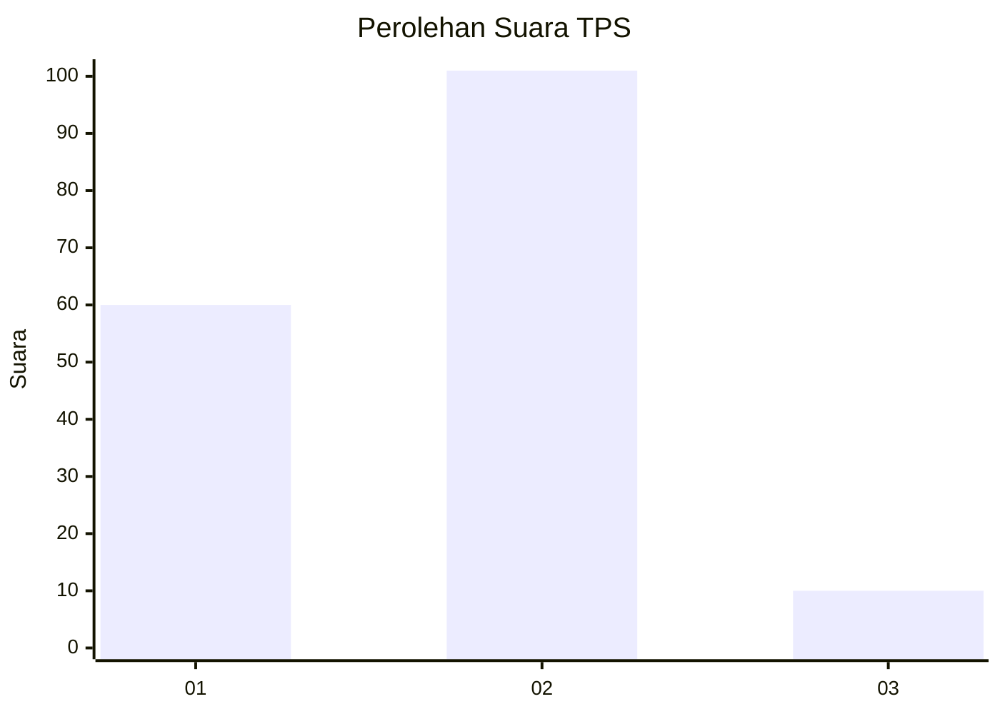
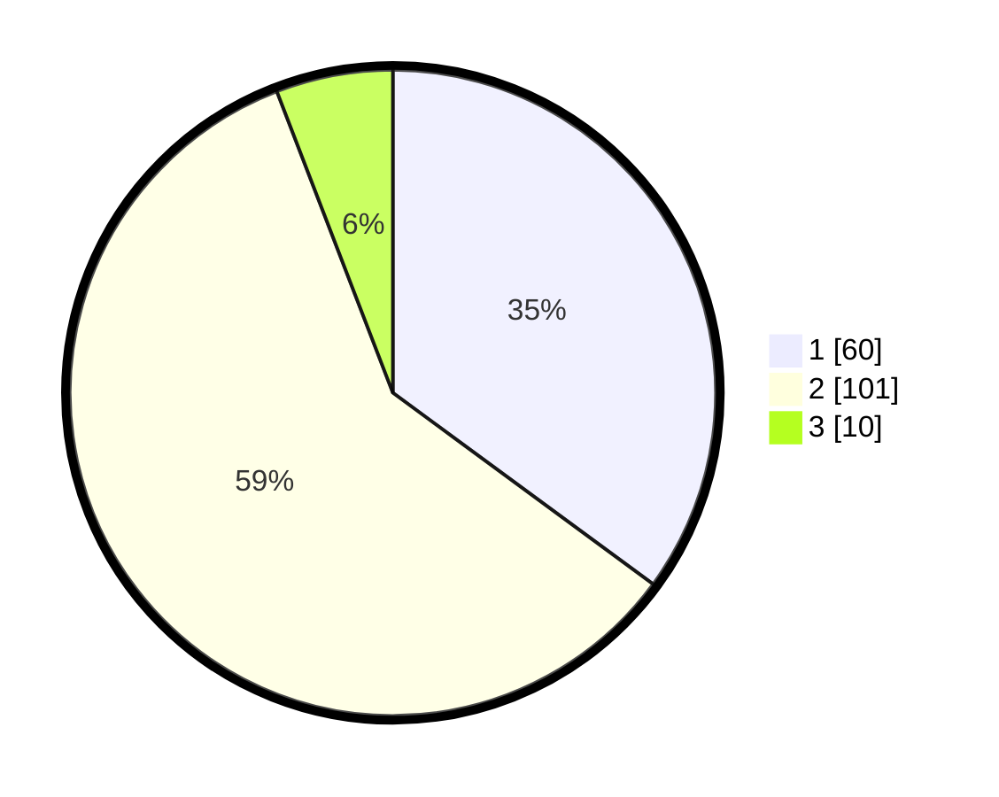

# Hasil

## Grafik

## Tabel

| No. | Nama Paslon    | Suara | Suara (raw) | Persentase |
|:--- |:-------------- | -----:| -----------:| ----------:|
| 1   | ANIES MUHAIMIN | 60    | [60][p-1]   | 35,09      |
| 2   | PRABOWO GIBRAN | 101   | [101][p-2]  | 59,06      |
| 3   | GANJAR MAHFUD  | 10    | [10][p-3]   | 5,85       |

[p-1]: https://github.com/gigit-pemilu/pemilu-2024/blob/main/pilpres/hitung-suara/sub/36-banten/sub/03-tangerang/sub/01-balaraja/sub/1001-balaraja/sub/006-tps/sub/paslon-1.txt
[p-2]: https://github.com/gigit-pemilu/pemilu-2024/blob/main/pilpres/hitung-suara/sub/36-banten/sub/03-tangerang/sub/01-balaraja/sub/1001-balaraja/sub/006-tps/sub/paslon-2.txt
[p-3]: https://github.com/gigit-pemilu/pemilu-2024/blob/main/pilpres/hitung-suara/sub/36-banten/sub/03-tangerang/sub/01-balaraja/sub/1001-balaraja/sub/006-tps/sub/paslon-3.txt

## Foto C Plano

https://sirekap-obj-formc.kpu.go.id/c659/pemilu/ppwp/36/03/01/10/01/3603011001006-20240220-131518--167300cf-5ce5-47cd-97ce-ec8951a3851e.jpg

https://sirekap-obj-formc.kpu.go.id/c659/pemilu/ppwp/36/03/01/10/01/3603011001006-20240220-131708--b483b683-aed8-431f-b4a2-dafad121b286.jpg

https://sirekap-obj-formc.kpu.go.id/c659/pemilu/ppwp/36/03/01/10/01/3603011001006-20240220-131803--44d02897-82f4-47dc-a95a-1f3b8c816fd0.jpg

## Metadata

| Key        | Value               |
| ---------- | ------------------- |
| Time Stamp | 2024-02-20 14:00:00 |

## DATA PEMILIH TETAP

Jumlah pemilih dalam DPT: **266**.
 * L: **0**.
 * P: **25**.

## DATA PENGGUNA HAK PILIH

Jumlah pengguna hak pilih dalam DPT: **0**.
 * L: **950**.
 * P: **5**.

Jumlah pengguna hak pilih dalam DPTb: **6**.
 * L: **5**.
 * P: **0**.

Jumlah pengguna hak pilih dalam DPK: **779**.
 * L: **757**.
 * P: **500**.

Jumlah pengguna hak pilih: **54**.
 * L: **0**.
 * P: **0**.

## JUMLAH SUARA SAH DAN TIDAK SAH

JUMLAH SELURUH SUARA SAH: **171**.

JUMLAH SUARA TIDAK SAH: **2**.

JUMLAH SELURUH SUARA SAH DAN SUARA TIDAK SAH: **174**.

