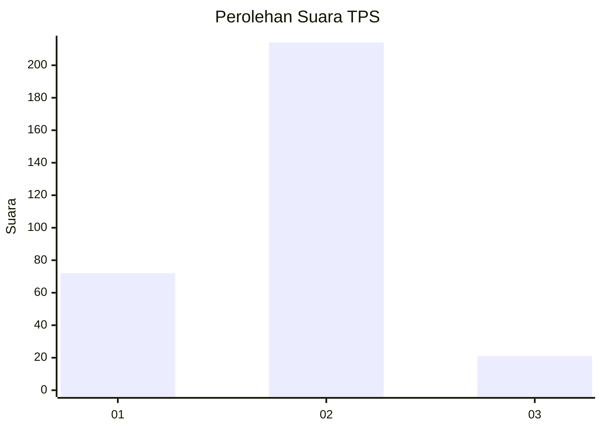
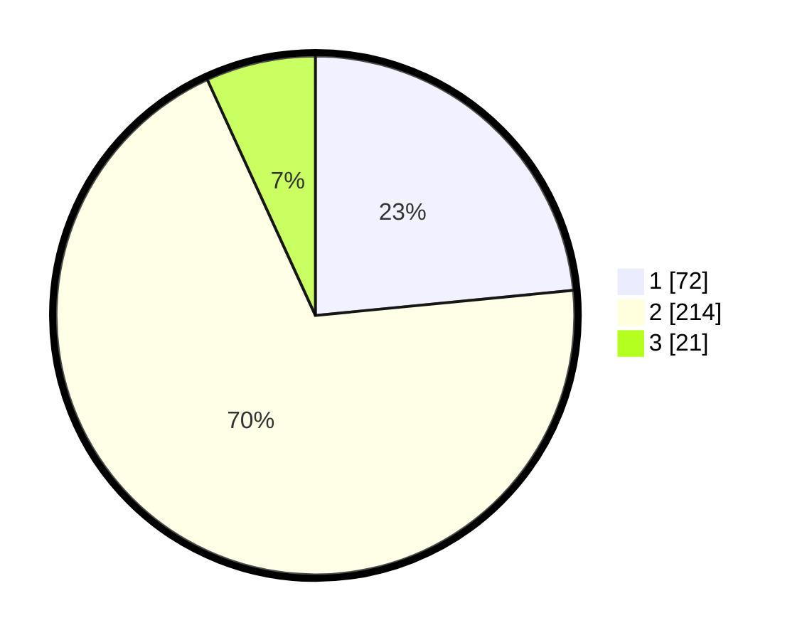

# Hasil

## Grafik

## Tabel

| No. | Nama Paslon    | Suara | Suara (raw) | Persentase |
|:--- |:-------------- | -----:| -----------:| ----------:|
| 1   | ANIES MUHAIMIN | 72    | [72][p-1]   | 23,45      |
| 2   | PRABOWO GIBRAN | 214   | [214][p-2]  | 69,71      |
| 3   | GANJAR MAHFUD  | 21    | [21][p-3]   | 6,84       |

[p-1]: https://github.com/gigit-pemilu/pemilu-2024/blob/main/pilpres/hitung-suara/sub/36-banten/sub/03-tangerang/sub/01-balaraja/sub/1001-balaraja/sub/016-tps/sub/paslon-1.txt
[p-2]: https://github.com/gigit-pemilu/pemilu-2024/blob/main/pilpres/hitung-suara/sub/36-banten/sub/03-tangerang/sub/01-balaraja/sub/1001-balaraja/sub/016-tps/sub/paslon-2.txt
[p-3]: https://github.com/gigit-pemilu/pemilu-2024/blob/main/pilpres/hitung-suara/sub/36-banten/sub/03-tangerang/sub/01-balaraja/sub/1001-balaraja/sub/016-tps/sub/paslon-3.txt

## Foto C Plano

https://sirekap-obj-formc.kpu.go.id/fcaf/pemilu/ppwp/36/03/01/10/01/3603011001016-20240223-144246--e1452862-46f4-41de-9789-76e7c4f84c40.jpg

https://sirekap-obj-formc.kpu.go.id/fcaf/pemilu/ppwp/36/03/01/10/01/3603011001016-20240214-185920--b14de257-71e5-45a3-a0db-3c59f0cd2693.jpg

https://sirekap-obj-formc.kpu.go.id/fcaf/pemilu/ppwp/36/03/01/10/01/3603011001016-20240214-232829--17253949-9939-477d-af2f-9a98a7502b46.jpg

## Metadata

| Key        | Value               |
| ---------- | ------------------- |
| Time Stamp | 2024-02-24 22:31:28 |

