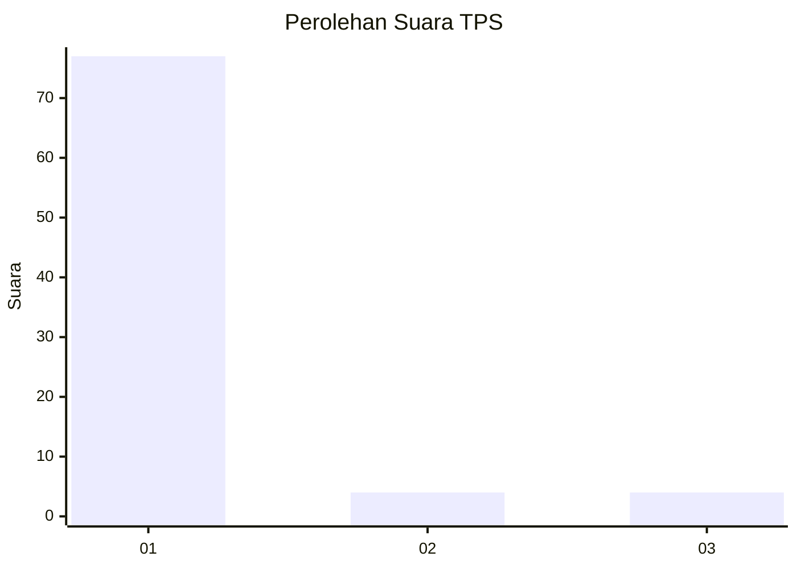
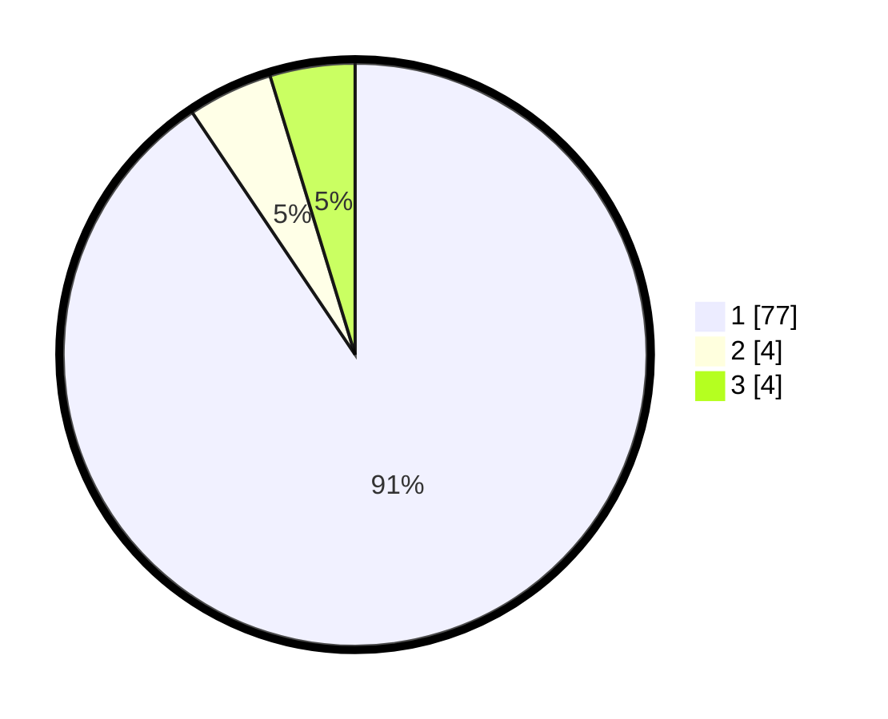

# Hasil

## Grafik

## Tabel

| No. | Nama Paslon    | Suara | Suara (raw) | Persentase |
|:--- |:-------------- | -----:| -----------:| ----------:|
| 1   | ANIES MUHAIMIN | 77    | [77][p-1]   | 90,59      |
| 2   | PRABOWO GIBRAN | 4     | [4][p-2]    | 4,71       |
| 3   | GANJAR MAHFUD  | 4     | [4][p-3]    | 4,71       |

[p-1]: https://github.com/gigit-pemilu/pemilu-2024/blob/main/pilpres/hitung-suara/sub/36-banten/sub/03-tangerang/sub/01-balaraja/sub/1001-balaraja/sub/020-tps/sub/paslon-1.txt
[p-2]: https://github.com/gigit-pemilu/pemilu-2024/blob/main/pilpres/hitung-suara/sub/36-banten/sub/03-tangerang/sub/01-balaraja/sub/1001-balaraja/sub/020-tps/sub/paslon-2.txt
[p-3]: https://github.com/gigit-pemilu/pemilu-2024/blob/main/pilpres/hitung-suara/sub/36-banten/sub/03-tangerang/sub/01-balaraja/sub/1001-balaraja/sub/020-tps/sub/paslon-3.txt

## Foto C Plano

https://sirekap-obj-formc.kpu.go.id/09b9/pemilu/ppwp/36/03/01/10/01/3603011001020-20240221-163028--27350fd6-1184-40d2-8296-0f4301782483.jpg

https://sirekap-obj-formc.kpu.go.id/09b9/pemilu/ppwp/36/03/01/10/01/3603011001020-20240221-163316--c9314550-15ab-4686-bf67-510791469711.jpg

https://sirekap-obj-formc.kpu.go.id/09b9/pemilu/ppwp/36/03/01/10/01/3603011001020-20240223-145651--10877d94-148e-4d85-8902-9c2b28e8ce53.jpg

## Metadata

| Key        | Value               |
| ---------- | ------------------- |
| Time Stamp | 2024-02-24 22:31:28 |

