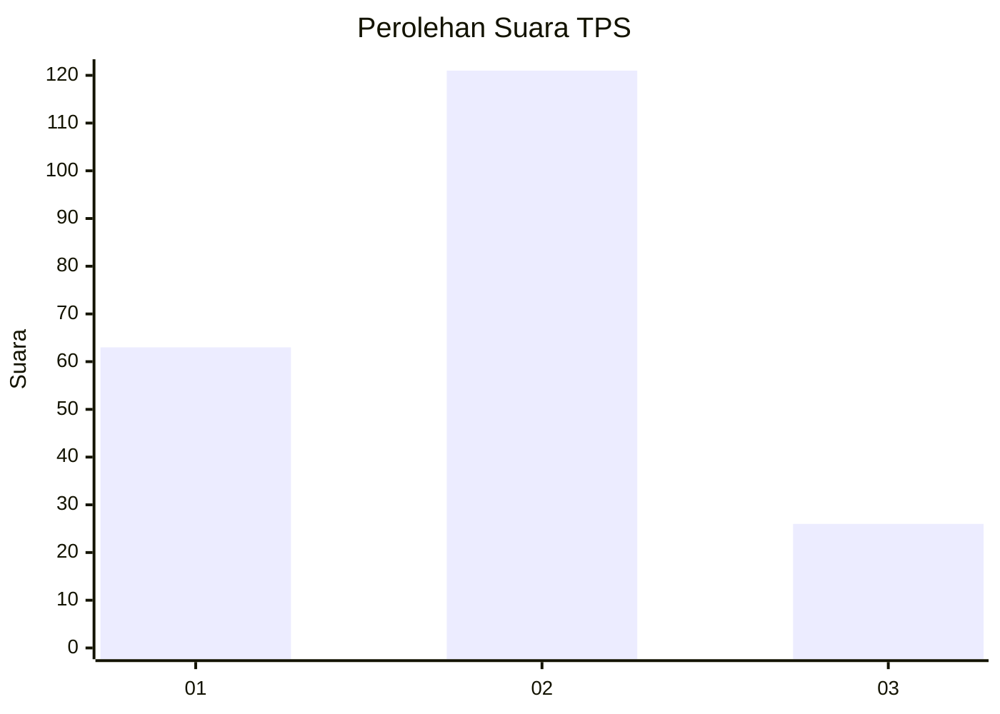
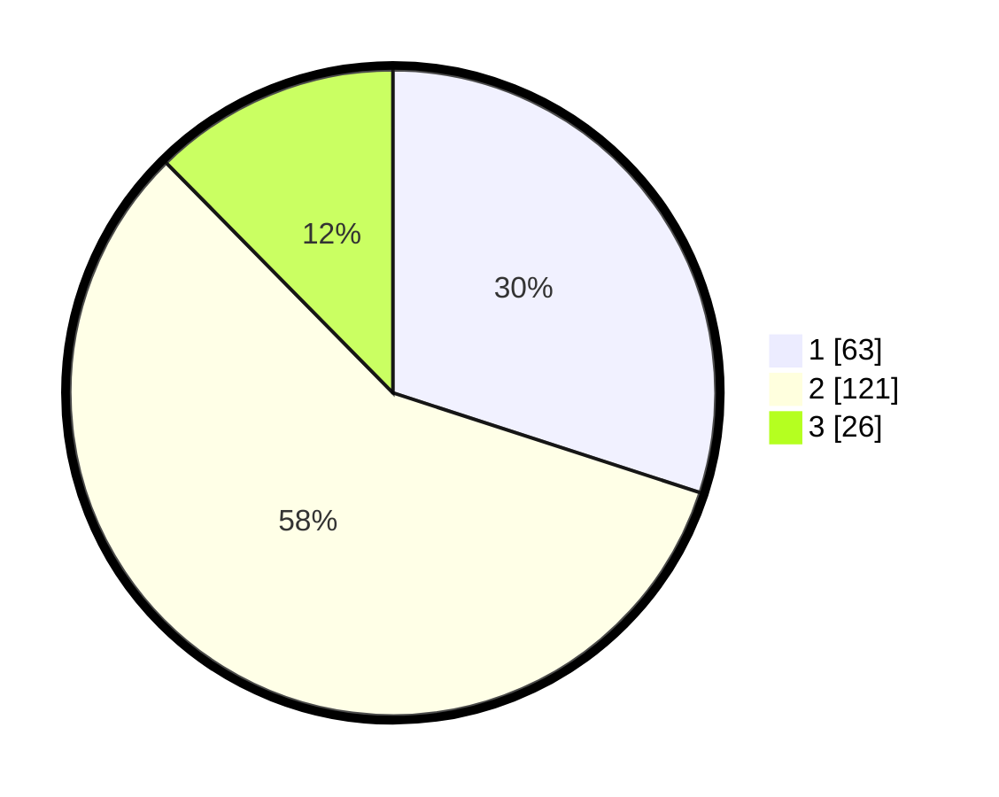

# Hasil

## Grafik

## Tabel

| No. | Nama Paslon    | Suara | Suara (raw) | Persentase |
|:--- |:-------------- | -----:| -----------:| ----------:|
| 1   | ANIES MUHAIMIN | 63    | [63][p-1]   | 30,00      |
| 2   | PRABOWO GIBRAN | 121   | [121][p-2]  | 57,62      |
| 3   | GANJAR MAHFUD  | 26    | [26][p-3]   | 12,38      |

[p-1]: https://github.com/gigit-pemilu/pemilu-2024-36-banten/blob/main/pilpres/hitung-suara/sub/36-banten/sub/03-tangerang/sub/01-balaraja/sub/2003-cangkudu/sub/044-tps/sub/paslon-1.txt
[p-2]: https://github.com/gigit-pemilu/pemilu-2024-36-banten/blob/main/pilpres/hitung-suara/sub/36-banten/sub/03-tangerang/sub/01-balaraja/sub/2003-cangkudu/sub/044-tps/sub/paslon-2.txt
[p-3]: https://github.com/gigit-pemilu/pemilu-2024-36-banten/blob/main/pilpres/hitung-suara/sub/36-banten/sub/03-tangerang/sub/01-balaraja/sub/2003-cangkudu/sub/044-tps/sub/paslon-3.txt

## Foto C Plano

https://sirekap-obj-formc.kpu.go.id/a9ac/pemilu/ppwp/36/03/01/20/03/3603012003044-20240224-115019--d8a58282-a1cf-46d2-8e78-1bf3c9b23199.jpg

https://sirekap-obj-formc.kpu.go.id/a9ac/pemilu/ppwp/36/03/01/20/03/3603012003044-20240224-110825--32caf7bc-d6e0-43a8-95b8-c89c00b32d3c.jpg

https://sirekap-obj-formc.kpu.go.id/a9ac/pemilu/ppwp/36/03/01/20/03/3603012003044-20240224-110900--0ae80d58-0272-46c8-b1c5-4b3737e0fb8d.jpg

## Metadata

| Key        | Value               |
| ---------- | ------------------- |
| Time Stamp | 2024-02-24 22:31:28 |

## DATA PEMILIH TETAP

Jumlah pemilih dalam DPT: **283**.
 * L: **141**.
 * P: **142**.

## DATA PENGGUNA HAK PILIH

Jumlah pengguna hak pilih dalam DPT: **297**.
 * L: **102**.
 * P: **25**.

Jumlah pengguna hak pilih dalam DPTb: **700**.
 * L: **0**.
 * P: **200**.

Jumlah pengguna hak pilih dalam DPK: **24**.
 * L: **6**.
 * P: **8**.

Jumlah pengguna hak pilih: **211**.
 * L: **108**.
 * P: **705**.

## JUMLAH SUARA SAH DAN TIDAK SAH

JUMLAH SELURUH SUARA SAH: **210**.

JUMLAH SUARA TIDAK SAH: **91**.

JUMLAH SELURUH SUARA SAH DAN SUARA TIDAK SAH: **211**.

