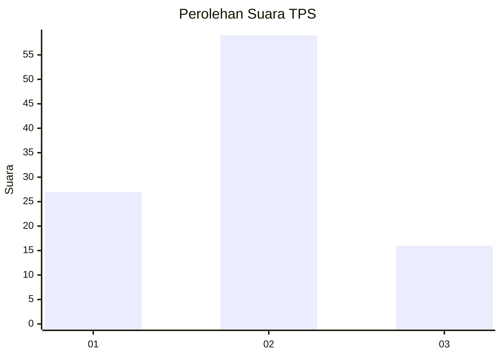
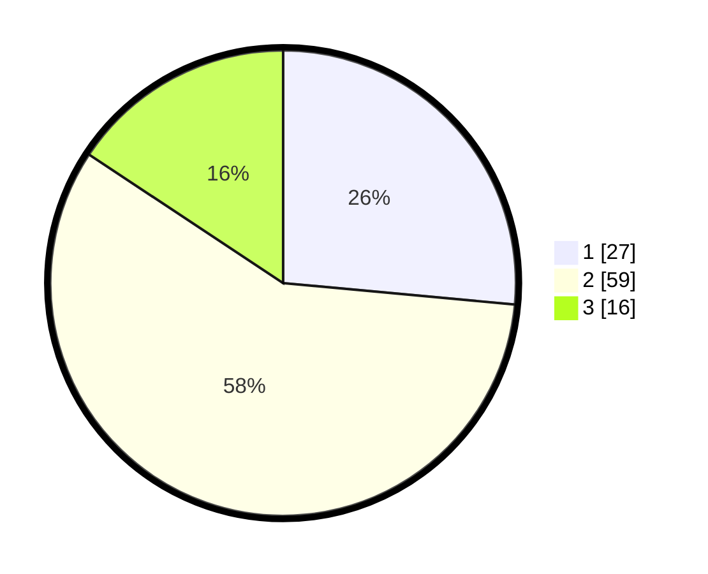

# Hasil

## Grafik

## Tabel

| No. | Nama Paslon    | Suara | Suara (raw) | Persentase |
|:--- |:-------------- | -----:| -----------:| ----------:|
| 1   | ANIES MUHAIMIN | 27    | [27][p-1]   | 26,47      |
| 2   | PRABOWO GIBRAN | 59    | [59][p-2]   | 57,84      |
| 3   | GANJAR MAHFUD  | 16    | [16][p-3]   | 15,69      |

[p-1]: https://github.com/gigit-pemilu/pemilu-2024/blob/main/pilpres/hitung-suara/sub/36-banten/sub/03-tangerang/sub/01-balaraja/sub/2009-tobat/sub/026-tps/sub/paslon-1.txt
[p-2]: https://github.com/gigit-pemilu/pemilu-2024/blob/main/pilpres/hitung-suara/sub/36-banten/sub/03-tangerang/sub/01-balaraja/sub/2009-tobat/sub/026-tps/sub/paslon-2.txt
[p-3]: https://github.com/gigit-pemilu/pemilu-2024/blob/main/pilpres/hitung-suara/sub/36-banten/sub/03-tangerang/sub/01-balaraja/sub/2009-tobat/sub/026-tps/sub/paslon-3.txt

## Foto C Plano

https://sirekap-obj-formc.kpu.go.id/d815/pemilu/ppwp/36/03/01/20/09/3603012009026-20240224-143510--d5583368-b0e3-42ed-a207-43e0e7e2f705.jpg

https://sirekap-obj-formc.kpu.go.id/d815/pemilu/ppwp/36/03/01/20/09/3603012009026-20240224-143535--726398be-5f8f-439f-8ad5-e1ea4926bc7e.jpg

https://sirekap-obj-formc.kpu.go.id/d815/pemilu/ppwp/36/03/01/20/09/3603012009026-20240224-143614--7ebf16bb-6324-47d9-88c6-d41d209fbc7e.jpg

## Metadata

| Key        | Value               |
| ---------- | ------------------- |
| Time Stamp | 2024-02-24 22:31:28 |

## DATA PEMILIH TETAP

Jumlah pemilih dalam DPT: **219**.
 * L: **116**.
 * P: **103**.

## DATA PENGGUNA HAK PILIH

Jumlah pengguna hak pilih dalam DPT: **163**.
 * L: **282**.
 * P: **281**.

Jumlah pengguna hak pilih dalam DPTb: **222**.
 * L: **722**.
 * P: **222**.

Jumlah pengguna hak pilih dalam DPK: **622**.
 * L: **226**.
 * P: **262**.

Jumlah pengguna hak pilih: **163**.
 * L: **282**.
 * P: **681**.

## JUMLAH SUARA SAH DAN TIDAK SAH

JUMLAH SELURUH SUARA SAH: **162**.

JUMLAH SUARA TIDAK SAH: **1**.

JUMLAH SELURUH SUARA SAH DAN SUARA TIDAK SAH: **163**.

