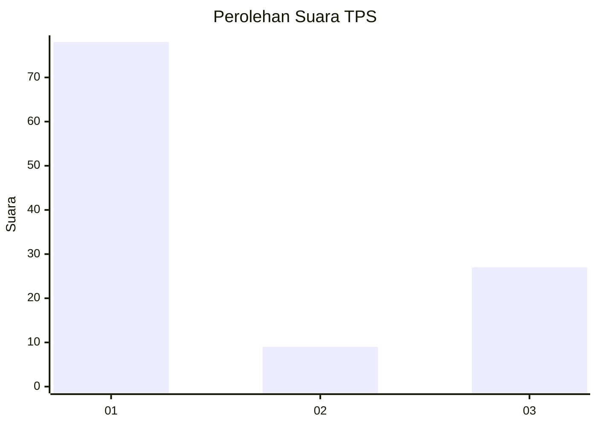
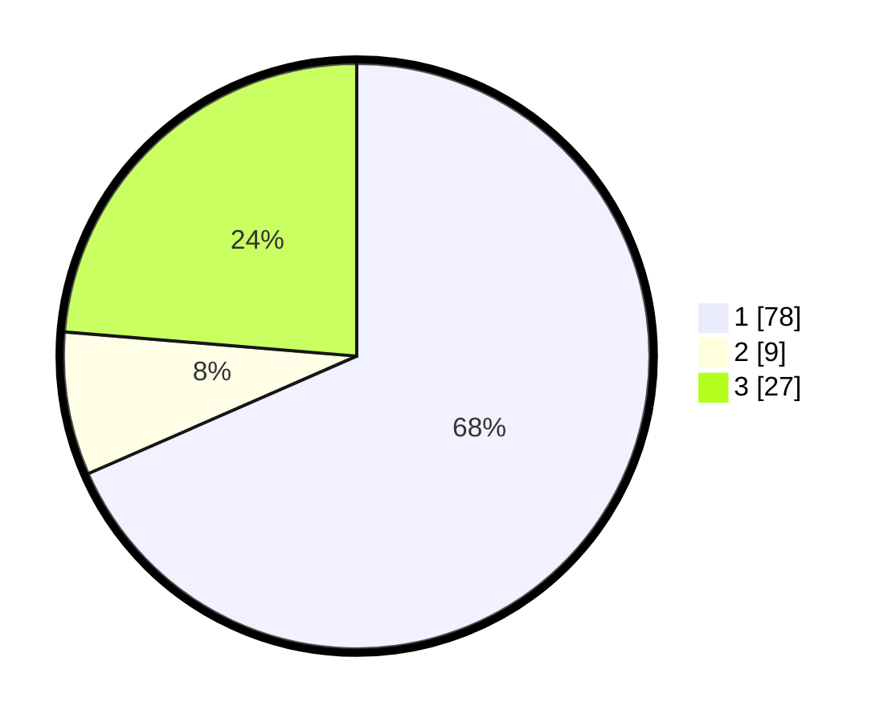

# Hasil

## Grafik

## Tabel

| No. | Nama Paslon    | Suara | Suara (raw) | Persentase |
|:--- |:-------------- | -----:| -----------:| ----------:|
| 1   | ANIES MUHAIMIN | 78    | [78][p-1]   | 68,42      |
| 2   | PRABOWO GIBRAN | 9     | [9][p-2]    | 7,89       |
| 3   | GANJAR MAHFUD  | 27    | [27][p-3]   | 23,68      |

[p-1]: https://github.com/gigit-pemilu/pemilu-2024-36-banten/blob/main/pilpres/hitung-suara/sub/36-banten/sub/03-tangerang/sub/01-balaraja/sub/2014-saga/sub/048-tps/sub/paslon-1.txt
[p-2]: https://github.com/gigit-pemilu/pemilu-2024-36-banten/blob/main/pilpres/hitung-suara/sub/36-banten/sub/03-tangerang/sub/01-balaraja/sub/2014-saga/sub/048-tps/sub/paslon-2.txt
[p-3]: https://github.com/gigit-pemilu/pemilu-2024-36-banten/blob/main/pilpres/hitung-suara/sub/36-banten/sub/03-tangerang/sub/01-balaraja/sub/2014-saga/sub/048-tps/sub/paslon-3.txt

## Foto C Plano

https://sirekap-obj-formc.kpu.go.id/4bf6/pemilu/ppwp/36/03/01/20/14/3603012014048-20240214-205006--12d66d52-6c18-4231-abb5-28d63f5ce932.jpg

https://sirekap-obj-formc.kpu.go.id/4bf6/pemilu/ppwp/36/03/01/20/14/3603012014048-20240223-145318--7a620283-4303-4898-846c-199f93bc93b5.jpg

https://sirekap-obj-formc.kpu.go.id/4bf6/pemilu/ppwp/36/03/01/20/14/3603012014048-20240223-145412--c77ba175-4e13-4e53-a2fa-6a02ec4caaf0.jpg

## Metadata

| Key        | Value               |
| ---------- | ------------------- |
| Time Stamp | 2024-02-24 22:31:28 |

