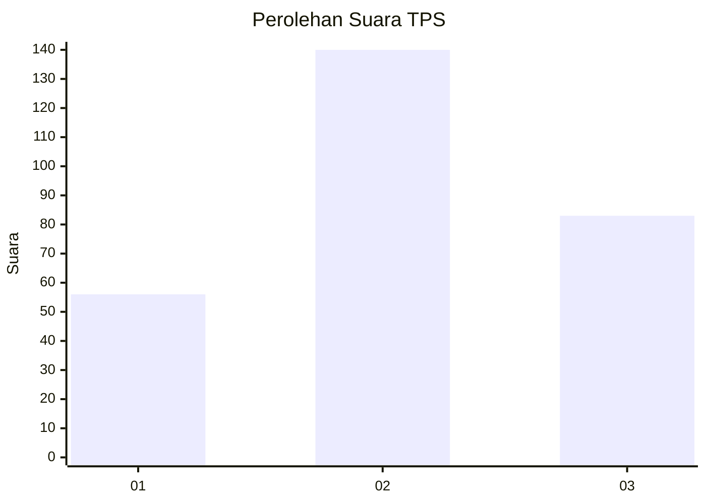
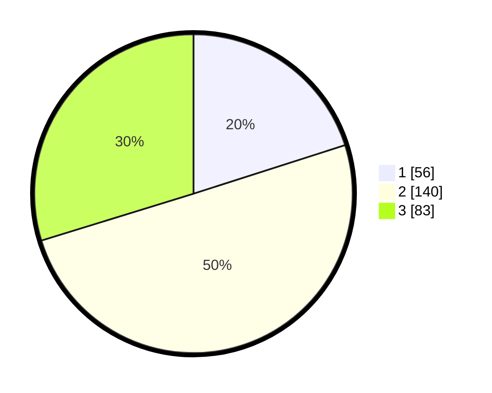

# Hasil

## Grafik

## Tabel

| No. | Nama Paslon    | Suara | Suara (raw) | Persentase |
|:--- |:-------------- | -----:| -----------:| ----------:|
| 1   | ANIES MUHAIMIN | 56    | [56][p-1]   | 20,07      |
| 2   | PRABOWO GIBRAN | 140   | [140][p-2]  | 50,18      |
| 3   | GANJAR MAHFUD  | 83    | [83][p-3]   | 29,75      |

[p-1]: https://github.com/gigit-pemilu/pemilu-2024/blob/main/pilpres/hitung-suara/sub/36-banten/sub/03-tangerang/sub/01-balaraja/sub/2016-sentul-jaya/sub/001-tps/sub/paslon-1.txt
[p-2]: https://github.com/gigit-pemilu/pemilu-2024/blob/main/pilpres/hitung-suara/sub/36-banten/sub/03-tangerang/sub/01-balaraja/sub/2016-sentul-jaya/sub/001-tps/sub/paslon-2.txt
[p-3]: https://github.com/gigit-pemilu/pemilu-2024/blob/main/pilpres/hitung-suara/sub/36-banten/sub/03-tangerang/sub/01-balaraja/sub/2016-sentul-jaya/sub/001-tps/sub/paslon-3.txt

## Foto C Plano

https://sirekap-obj-formc.kpu.go.id/7cc1/pemilu/ppwp/36/03/01/20/16/3603012016001-20240220-091920--8187e727-173e-4e7f-95ac-39c3afea2d1a.jpg

https://sirekap-obj-formc.kpu.go.id/7cc1/pemilu/ppwp/36/03/01/20/16/3603012016001-20240220-092035--566c6e6c-fc19-48df-bcd7-974412eb9f59.jpg

https://sirekap-obj-formc.kpu.go.id/7cc1/pemilu/ppwp/36/03/01/20/16/3603012016001-20240220-092112--467eaf2c-06dc-4402-976b-424c9aee6357.jpg

## Metadata

| Key        | Value               |
| ---------- | ------------------- |
| Time Stamp | 2024-02-20 10:00:00 |

## DATA PEMILIH TETAP

Jumlah pemilih dalam DPT: **92**.
 * L: **231**.
 * P: **141**.

## DATA PENGGUNA HAK PILIH

Jumlah pengguna hak pilih dalam DPT: **992**.
 * L: **31**.
 * P: **40**.

Jumlah pengguna hak pilih dalam DPTb: **22**.
 * L: **80**.
 * P: **0**.

Jumlah pengguna hak pilih dalam DPK: **4**.
 * L: **0**.
 * P: **0**.

Jumlah pengguna hak pilih: **924**.
 * L: **921**.
 * P: **40**.

## JUMLAH SUARA SAH DAN TIDAK SAH

JUMLAH SELURUH SUARA SAH: **199**.

JUMLAH SUARA TIDAK SAH: **4**.

JUMLAH SELURUH SUARA SAH DAN SUARA TIDAK SAH: **203**.

