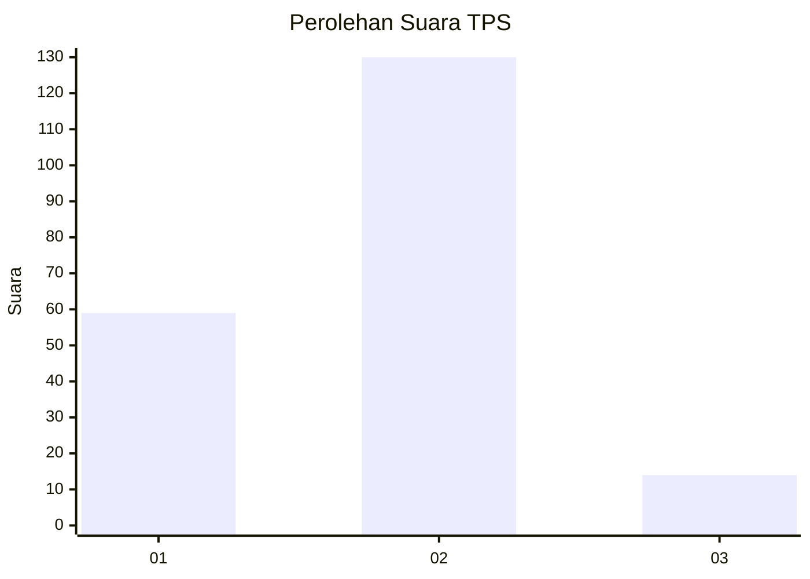
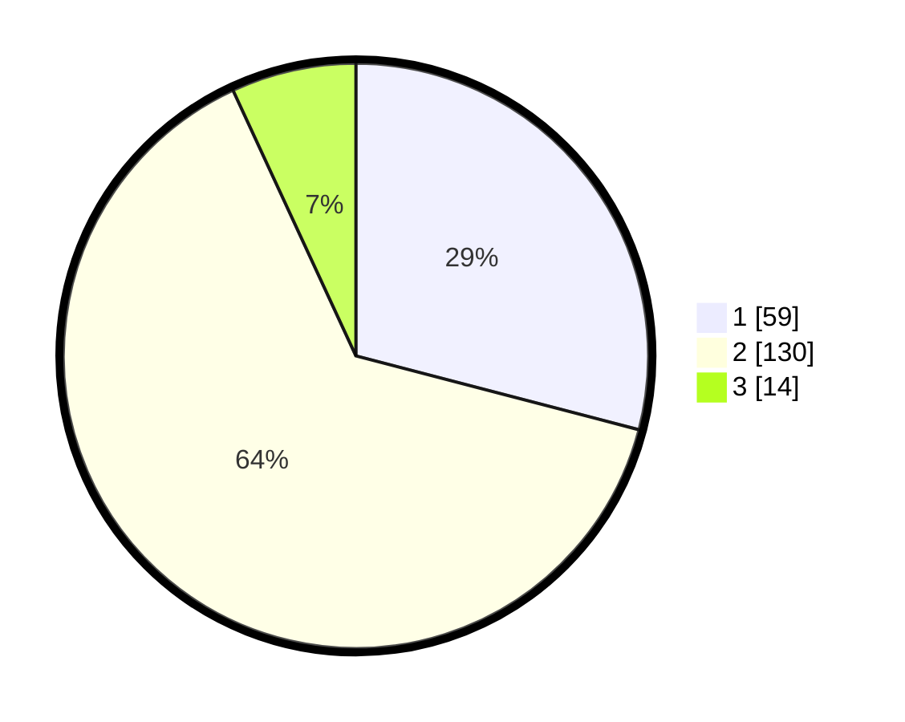

# Hasil

## Grafik

## Tabel

| No. | Nama Paslon    | Suara | Suara (raw) | Persentase |
|:--- |:-------------- | -----:| -----------:| ----------:|
| 1   | ANIES MUHAIMIN | 59    | [59][p-1]   | 29,06      |
| 2   | PRABOWO GIBRAN | 130   | [130][p-2]  | 64,04      |
| 3   | GANJAR MAHFUD  | 14    | [14][p-3]   | 6,90       |

[p-1]: https://github.com/gigit-pemilu/pemilu-2024/blob/main/pilpres/hitung-suara/sub/36-banten/sub/03-tangerang/sub/02-jayanti/sub/2001-pangkat/sub/002-tps/sub/paslon-1.txt
[p-2]: https://github.com/gigit-pemilu/pemilu-2024/blob/main/pilpres/hitung-suara/sub/36-banten/sub/03-tangerang/sub/02-jayanti/sub/2001-pangkat/sub/002-tps/sub/paslon-2.txt
[p-3]: https://github.com/gigit-pemilu/pemilu-2024/blob/main/pilpres/hitung-suara/sub/36-banten/sub/03-tangerang/sub/02-jayanti/sub/2001-pangkat/sub/002-tps/sub/paslon-3.txt

## Foto C Plano

https://sirekap-obj-formc.kpu.go.id/ee0d/pemilu/ppwp/36/03/02/20/01/3603022001002-20240221-150548--09fbb58b-f69f-4de2-9131-f750be97624a.jpg

https://sirekap-obj-formc.kpu.go.id/ee0d/pemilu/ppwp/36/03/02/20/01/3603022001002-20240221-150701--89b3f554-025b-4e53-8dc7-511854aceaa8.jpg

https://sirekap-obj-formc.kpu.go.id/ee0d/pemilu/ppwp/36/03/02/20/01/3603022001002-20240221-150818--e642c1db-9deb-438b-b211-71549d336157.jpg

## Metadata

| Key        | Value               |
| ---------- | ------------------- |
| Time Stamp | 2024-02-22 11:00:00 |

