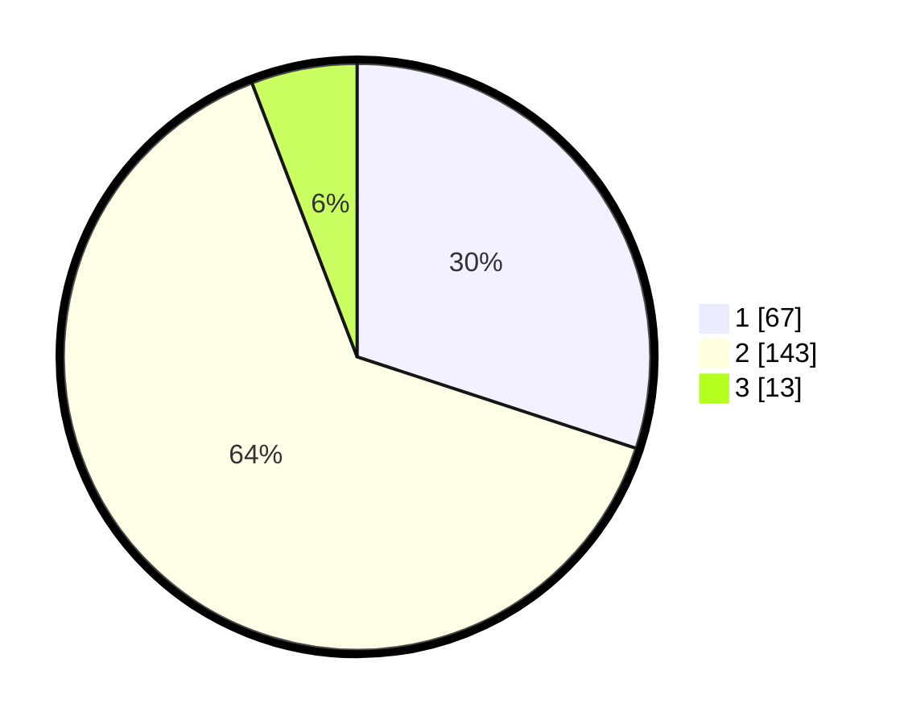

# Hasil

## Grafik

## Tabel

| No. | Nama Paslon    | Suara | Suara (raw) | Persentase |
|:--- |:-------------- | -----:| -----------:| ----------:|
| 1   | ANIES MUHAIMIN | 67    | [67][p-1]   | 30,04      |
| 2   | PRABOWO GIBRAN | 143   | [143][p-2]  | 64,13      |
| 3   | GANJAR MAHFUD  | 13    | [13][p-3]   | 5,83       |

[p-1]: https://github.com/gigit-pemilu/pemilu-2024/blob/main/pilpres/hitung-suara/sub/36-banten/sub/03-tangerang/sub/02-jayanti/sub/2001-pangkat/sub/003-tps/sub/paslon-1.txt
[p-2]: https://github.com/gigit-pemilu/pemilu-2024/blob/main/pilpres/hitung-suara/sub/36-banten/sub/03-tangerang/sub/02-jayanti/sub/2001-pangkat/sub/003-tps/sub/paslon-2.txt
[p-3]: https://github.com/gigit-pemilu/pemilu-2024/blob/main/pilpres/hitung-suara/sub/36-banten/sub/03-tangerang/sub/02-jayanti/sub/2001-pangkat/sub/003-tps/sub/paslon-3.txt

## Foto C Plano

https://sirekap-obj-formc.kpu.go.id/7632/pemilu/ppwp/36/03/02/20/01/3603022001003-20240214-230200--a84800aa-a980-4992-8c29-7009488e8458.jpg

https://sirekap-obj-formc.kpu.go.id/7632/pemilu/ppwp/36/03/02/20/01/3603022001003-20240214-220808--bdcfedfc-6e9f-43fa-b697-1f4a6ac6ca4e.jpg

https://sirekap-obj-formc.kpu.go.id/7632/pemilu/ppwp/36/03/02/20/01/3603022001003-20240214-220951--bce4c35b-2809-49d8-b7d5-9ad8977b31b7.jpg

## Metadata

| Key        | Value               |
| ---------- | ------------------- |
| Time Stamp | 2024-02-19 14:00:00 |

