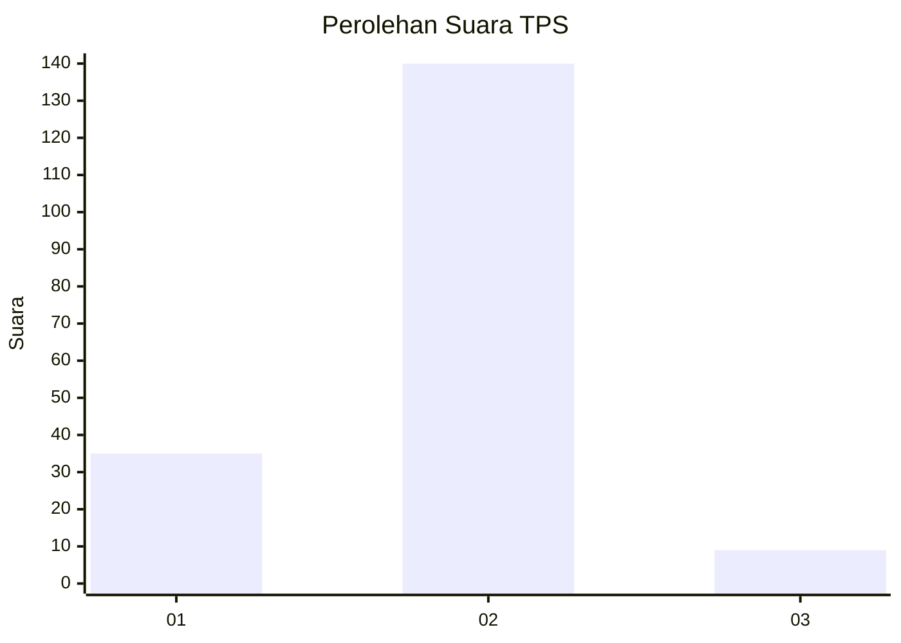
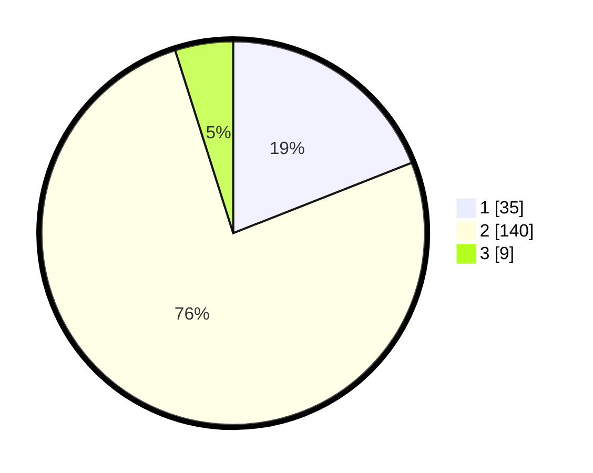

# Hasil

## Grafik

## Tabel

| No. | Nama Paslon    | Suara | Suara (raw) | Persentase |
|:--- |:-------------- | -----:| -----------:| ----------:|
| 1   | ANIES MUHAIMIN | 35    | [35][p-1]   | 19,02      |
| 2   | PRABOWO GIBRAN | 140   | [140][p-2]  | 76,09      |
| 3   | GANJAR MAHFUD  | 9     | [9][p-3]    | 4,89       |

[p-1]: https://github.com/gigit-pemilu/pemilu-2024/blob/main/pilpres/hitung-suara/sub/36-banten/sub/03-tangerang/sub/02-jayanti/sub/2001-pangkat/sub/006-tps/sub/paslon-1.txt
[p-2]: https://github.com/gigit-pemilu/pemilu-2024/blob/main/pilpres/hitung-suara/sub/36-banten/sub/03-tangerang/sub/02-jayanti/sub/2001-pangkat/sub/006-tps/sub/paslon-2.txt
[p-3]: https://github.com/gigit-pemilu/pemilu-2024/blob/main/pilpres/hitung-suara/sub/36-banten/sub/03-tangerang/sub/02-jayanti/sub/2001-pangkat/sub/006-tps/sub/paslon-3.txt

## Foto C Plano

https://sirekap-obj-formc.kpu.go.id/4270/pemilu/ppwp/36/03/02/20/01/3603022001006-20240221-151001--f4b84708-29cf-4340-a920-a7752e65212a.jpg

https://sirekap-obj-formc.kpu.go.id/4270/pemilu/ppwp/36/03/02/20/01/3603022001006-20240221-151050--9ed02c0f-c6d8-4797-8531-59b4891096c9.jpg

https://sirekap-obj-formc.kpu.go.id/4270/pemilu/ppwp/36/03/02/20/01/3603022001006-20240221-151139--29a767fd-16a1-46c9-97cb-d29f299c0e3a.jpg

## Metadata

| Key        | Value               |
| ---------- | ------------------- |
| Time Stamp | 2024-02-22 12:00:00 |

