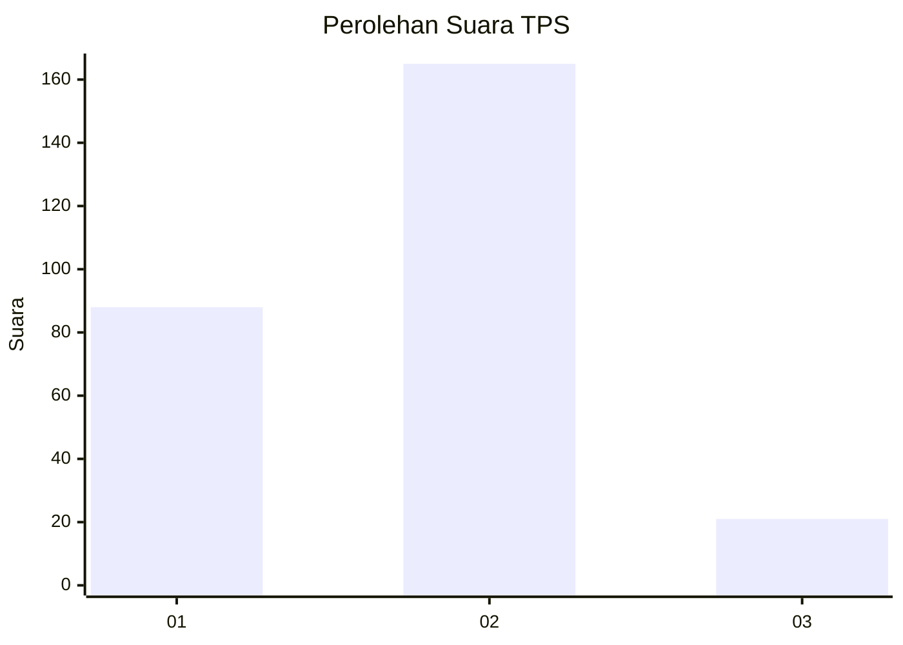
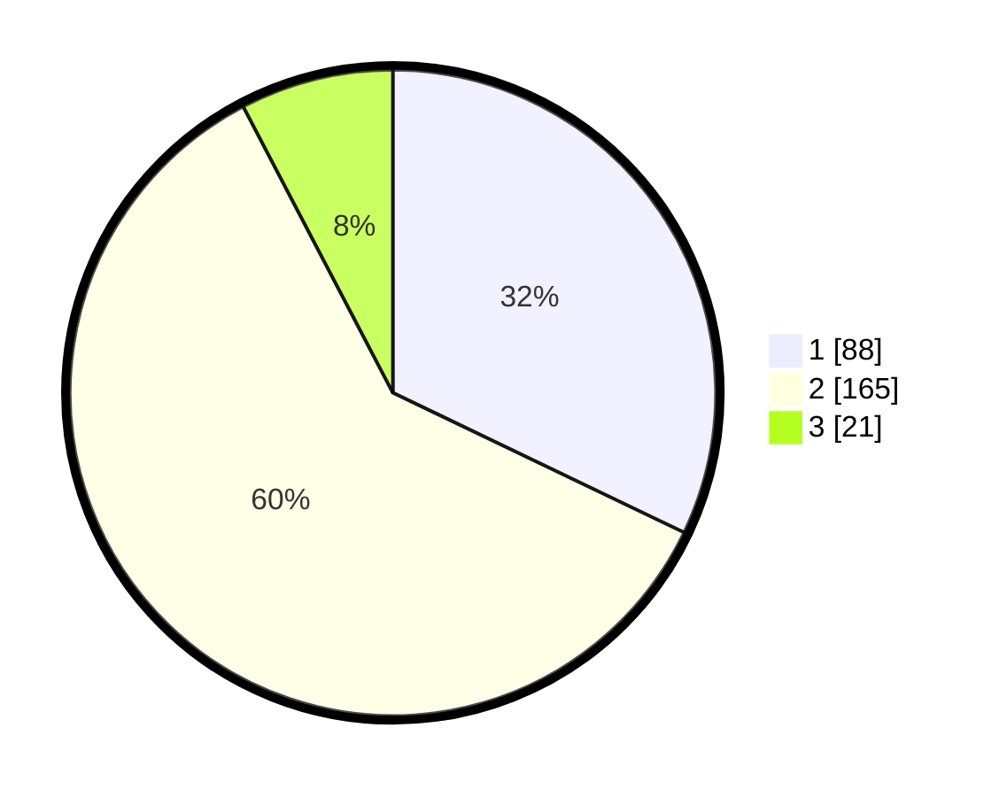

# Hasil

## Grafik

## Tabel

| No. | Nama Paslon    | Suara | Suara (raw) | Persentase |
|:--- |:-------------- | -----:| -----------:| ----------:|
| 1   | ANIES MUHAIMIN | 88    | [88][p-1]   | 32,12      |
| 2   | PRABOWO GIBRAN | 165   | [165][p-2]  | 60,22      |
| 3   | GANJAR MAHFUD  | 21    | [21][p-3]   | 7,66       |

[p-1]: https://github.com/gigit-pemilu/pemilu-2024-36-banten/blob/main/pilpres/hitung-suara/sub/36-banten/sub/03-tangerang/sub/02-jayanti/sub/2005-sumur-bandung/sub/006-tps/sub/paslon-1.txt
[p-2]: https://github.com/gigit-pemilu/pemilu-2024-36-banten/blob/main/pilpres/hitung-suara/sub/36-banten/sub/03-tangerang/sub/02-jayanti/sub/2005-sumur-bandung/sub/006-tps/sub/paslon-2.txt
[p-3]: https://github.com/gigit-pemilu/pemilu-2024-36-banten/blob/main/pilpres/hitung-suara/sub/36-banten/sub/03-tangerang/sub/02-jayanti/sub/2005-sumur-bandung/sub/006-tps/sub/paslon-3.txt

## Foto C Plano

https://sirekap-obj-formc.kpu.go.id/6cd4/pemilu/ppwp/36/03/02/20/05/3603022005006-20240217-110120--ffa1ac87-3653-49a7-96a0-12b691f9ed9d.jpg

https://sirekap-obj-formc.kpu.go.id/6cd4/pemilu/ppwp/36/03/02/20/05/3603022005006-20240217-110007--26f61b36-ed92-4132-a8c4-e6762f3c870a.jpg

https://sirekap-obj-formc.kpu.go.id/6cd4/pemilu/ppwp/36/03/02/20/05/3603022005006-20240217-110037--f0b94929-5768-4903-93ed-69bf8a574eb2.jpg

## Metadata

| Key        | Value               |
| ---------- | ------------------- |
| Time Stamp | 2024-02-19 15:00:00 |

