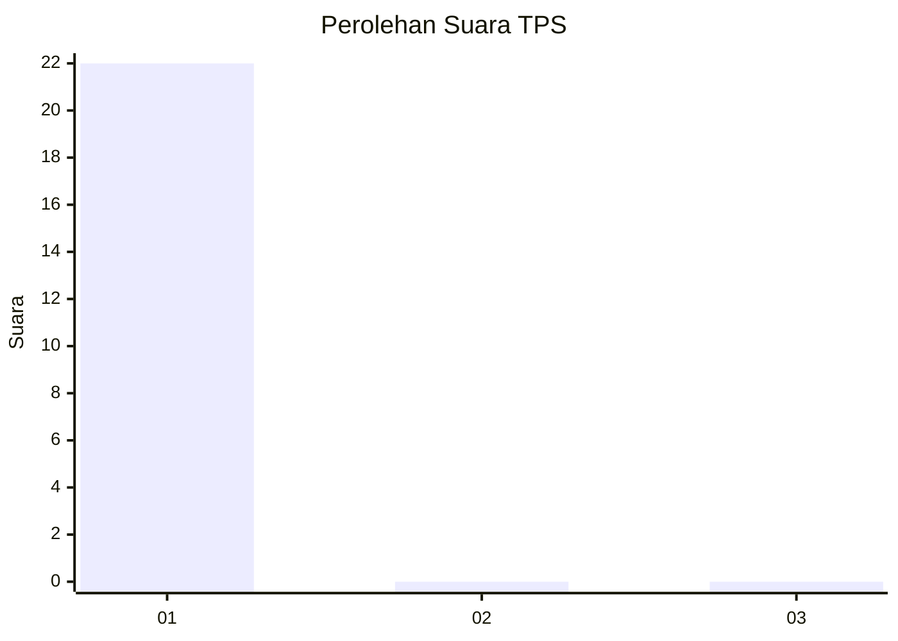
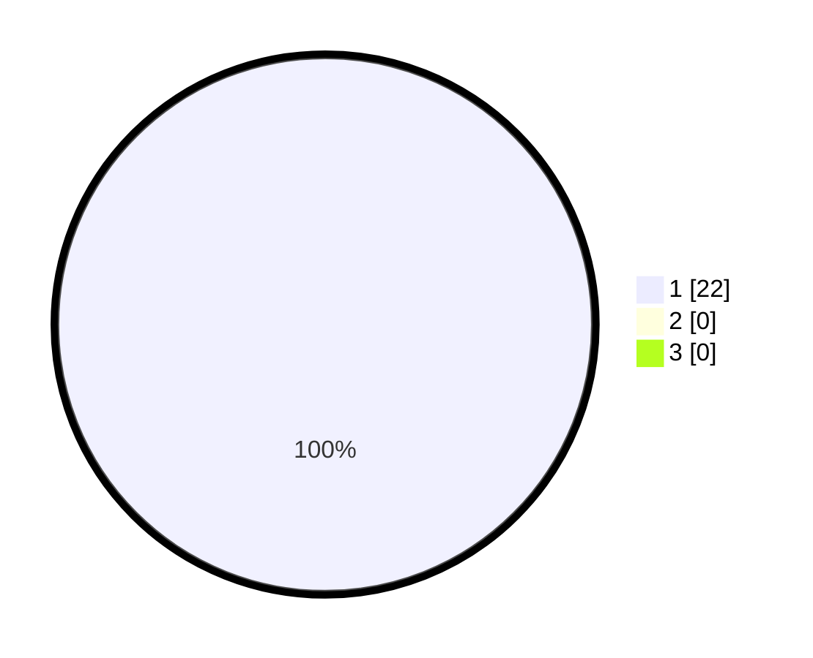

# Hasil

## Grafik

## Tabel

| No. | Nama Paslon    | Suara | Suara (raw) | Persentase |
|:--- |:-------------- | -----:| -----------:| ----------:|
| 1   | ANIES MUHAIMIN | 22    | [22][p-1]   | 100,00     |
| 2   | PRABOWO GIBRAN | 0     | [0][p-2]    | 0,00       |
| 3   | GANJAR MAHFUD  | 0     | [0][p-3]    | 0,00       |

[p-1]: https://github.com/gigit-pemilu/pemilu-2024-36-banten/blob/main/pilpres/hitung-suara/sub/36-banten/sub/03-tangerang/sub/03-tigaraksa/sub/1001-tigaraksa/sub/016-tps/sub/paslon-1.txt
[p-2]: https://github.com/gigit-pemilu/pemilu-2024-36-banten/blob/main/pilpres/hitung-suara/sub/36-banten/sub/03-tangerang/sub/03-tigaraksa/sub/1001-tigaraksa/sub/016-tps/sub/paslon-2.txt
[p-3]: https://github.com/gigit-pemilu/pemilu-2024-36-banten/blob/main/pilpres/hitung-suara/sub/36-banten/sub/03-tangerang/sub/03-tigaraksa/sub/1001-tigaraksa/sub/016-tps/sub/paslon-3.txt

## Foto C Plano

https://sirekap-obj-formc.kpu.go.id/ce48/pemilu/ppwp/36/03/03/10/01/3603031001016-20240223-145503--822c7154-1808-4652-9d08-903ae6f4473f.jpg

https://sirekap-obj-formc.kpu.go.id/ce48/pemilu/ppwp/36/03/03/10/01/3603031001016-20240223-145217--c190016a-55f3-4d4b-ae3f-d236ae811b0a.jpg

https://sirekap-obj-formc.kpu.go.id/ce48/pemilu/ppwp/36/03/03/10/01/3603031001016-20240223-145546--17f39219-f49f-416a-9424-a2b43afb0757.jpg

## Metadata

| Key        | Value               |
| ---------- | ------------------- |
| Time Stamp | 2024-02-24 22:31:28 |

## DATA PEMILIH TETAP

Jumlah pemilih dalam DPT: **0**.
 * L: **220**.
 * P: **0**.

## DATA PENGGUNA HAK PILIH

Jumlah pengguna hak pilih dalam DPT: **551**.
 * L: **10**.
 * P: **555**.

Jumlah pengguna hak pilih dalam DPTb: **551**.
 * L: **55**.
 * P: **555**.

Jumlah pengguna hak pilih dalam DPK: **554**.
 * L: **55**.
 * P: **555**.

Jumlah pengguna hak pilih: **751**.
 * L: **50**.
 * P: **755**.

## JUMLAH SUARA SAH DAN TIDAK SAH

JUMLAH SELURUH SUARA SAH: **243**.

JUMLAH SUARA TIDAK SAH: **64**.

JUMLAH SELURUH SUARA SAH DAN SUARA TIDAK SAH: **220**.

