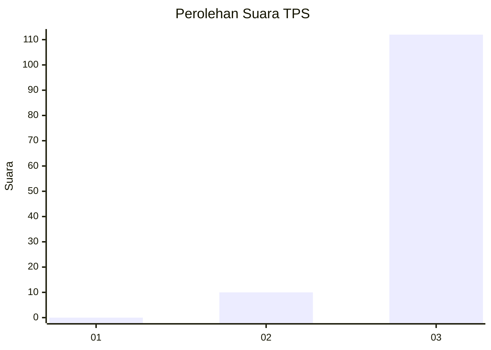
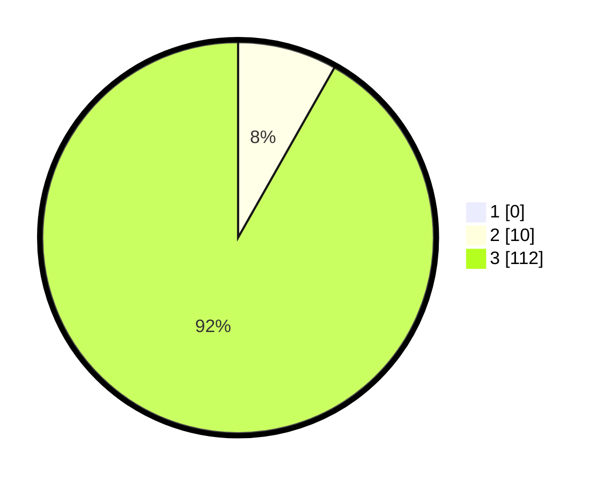

# Hasil

## Grafik

## Tabel

| No. | Nama Paslon    | Suara | Suara (raw) | Persentase |
|:--- |:-------------- | -----:| -----------:| ----------:|
| 1   | ANIES MUHAIMIN | 0     | [0][p-1]    | 0,00       |
| 2   | PRABOWO GIBRAN | 10    | [10][p-2]   | 8,20       |
| 3   | GANJAR MAHFUD  | 112   | [112][p-3]  | 91,80      |

[p-1]: https://github.com/gigit-pemilu/pemilu-2024-36-banten/blob/main/pilpres/hitung-suara/sub/36-banten/sub/03-tangerang/sub/03-tigaraksa/sub/1001-tigaraksa/sub/038-tps/sub/paslon-1.txt
[p-2]: https://github.com/gigit-pemilu/pemilu-2024-36-banten/blob/main/pilpres/hitung-suara/sub/36-banten/sub/03-tangerang/sub/03-tigaraksa/sub/1001-tigaraksa/sub/038-tps/sub/paslon-2.txt
[p-3]: https://github.com/gigit-pemilu/pemilu-2024-36-banten/blob/main/pilpres/hitung-suara/sub/36-banten/sub/03-tangerang/sub/03-tigaraksa/sub/1001-tigaraksa/sub/038-tps/sub/paslon-3.txt

## Foto C Plano

https://sirekap-obj-formc.kpu.go.id/44dc/pemilu/ppwp/36/03/03/10/01/3603031001038-20240223-232501--4bfcab35-a3c5-489f-a5d1-0153c0edee42.jpg

https://sirekap-obj-formc.kpu.go.id/44dc/pemilu/ppwp/36/03/03/10/01/3603031001038-20240223-232602--75d2863a-e5ec-48bc-9405-cf169d9b7591.jpg

https://sirekap-obj-formc.kpu.go.id/44dc/pemilu/ppwp/36/03/03/10/01/3603031001038-20240223-232632--aa5e3806-166f-4450-a8af-2ddb7343f590.jpg

## Metadata

| Key        | Value               |
| ---------- | ------------------- |
| Time Stamp | 2024-02-24 22:31:28 |

## DATA PEMILIH TETAP

Jumlah pemilih dalam DPT: **0**.
 * L: **20**.
 * P: **0**.

## DATA PENGGUNA HAK PILIH

Jumlah pengguna hak pilih dalam DPT: **520**.
 * L: **0**.
 * P: **555**.

Jumlah pengguna hak pilih dalam DPTb: **0**.
 * L: **55**.
 * P: **550**.

Jumlah pengguna hak pilih dalam DPK: **0**.
 * L: **552**.
 * P: **500**.

Jumlah pengguna hak pilih: **0**.
 * L: **0**.
 * P: **0**.

## JUMLAH SUARA SAH DAN TIDAK SAH

JUMLAH SELURUH SUARA SAH: **0**.

JUMLAH SUARA TIDAK SAH: **0**.

JUMLAH SELURUH SUARA SAH DAN SUARA TIDAK SAH: **0**.

