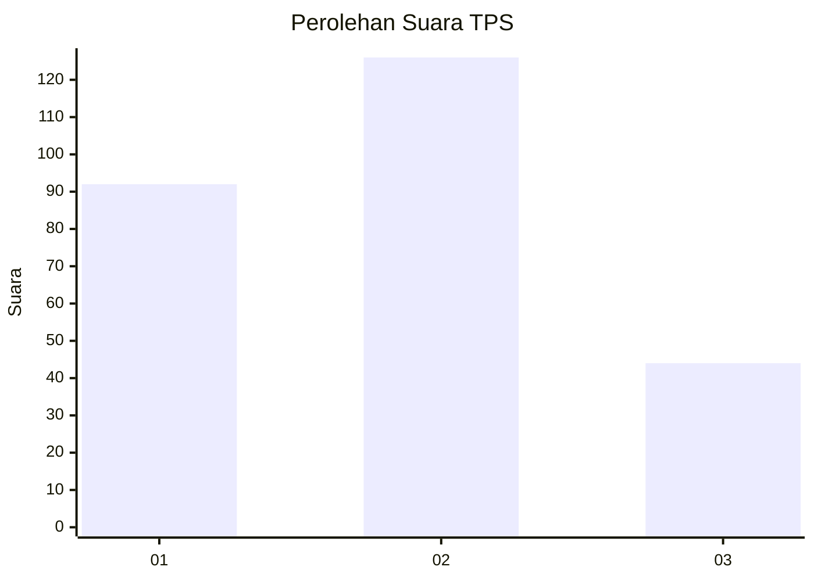
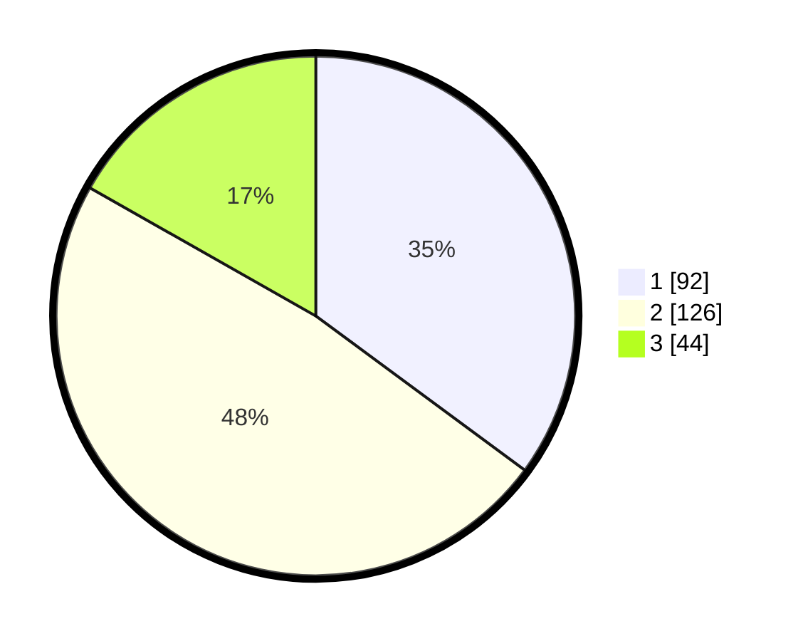

# Hasil

## Grafik

## Tabel

| No. | Nama Paslon    | Suara | Suara (raw) | Persentase |
|:--- |:-------------- | -----:| -----------:| ----------:|
| 1   | ANIES MUHAIMIN | 92    | [92][p-1]   | 35,11      |
| 2   | PRABOWO GIBRAN | 126   | [126][p-2]  | 48,09      |
| 3   | GANJAR MAHFUD  | 44    | [44][p-3]   | 16,79      |

[p-1]: https://github.com/gigit-pemilu/pemilu-2024-36-banten/blob/main/pilpres/hitung-suara/sub/36-banten/sub/03-tangerang/sub/03-tigaraksa/sub/2003-matagara/sub/001-tps/sub/paslon-1.txt
[p-2]: https://github.com/gigit-pemilu/pemilu-2024-36-banten/blob/main/pilpres/hitung-suara/sub/36-banten/sub/03-tangerang/sub/03-tigaraksa/sub/2003-matagara/sub/001-tps/sub/paslon-2.txt
[p-3]: https://github.com/gigit-pemilu/pemilu-2024-36-banten/blob/main/pilpres/hitung-suara/sub/36-banten/sub/03-tangerang/sub/03-tigaraksa/sub/2003-matagara/sub/001-tps/sub/paslon-3.txt

## Foto C Plano

https://sirekap-obj-formc.kpu.go.id/1a1e/pemilu/ppwp/36/03/03/20/03/3603032003001-20240221-135652--d3964d74-9e4f-495b-bca1-0fe233388706.jpg

https://sirekap-obj-formc.kpu.go.id/1a1e/pemilu/ppwp/36/03/03/20/03/3603032003001-20240221-135608--ac63a414-033f-4a75-aa52-0572cd688a01.jpg

https://sirekap-obj-formc.kpu.go.id/1a1e/pemilu/ppwp/36/03/03/20/03/3603032003001-20240221-135627--2a79fd75-3f03-4859-860b-6cc37d60fffa.jpg

## Metadata

| Key        | Value               |
| ---------- | ------------------- |
| Time Stamp | 2024-02-21 14:00:00 |

## DATA PEMILIH TETAP

Jumlah pemilih dalam DPT: **557**.
 * L: **777**.
 * P: **577**.

## DATA PENGGUNA HAK PILIH

Jumlah pengguna hak pilih dalam DPT: **420**.
 * L: **444**.
 * P: **401**.

Jumlah pengguna hak pilih dalam DPTb: **0**.
 * L: **444**.
 * P: **447**.

Jumlah pengguna hak pilih dalam DPK: **333**.
 * L: **444**.
 * P: **224**.

Jumlah pengguna hak pilih: **222**.
 * L: **444**.
 * P: **224**.

## JUMLAH SUARA SAH DAN TIDAK SAH

JUMLAH SELURUH SUARA SAH: **232**.

JUMLAH SUARA TIDAK SAH: **5**.

JUMLAH SELURUH SUARA SAH DAN SUARA TIDAK SAH: **237**.

