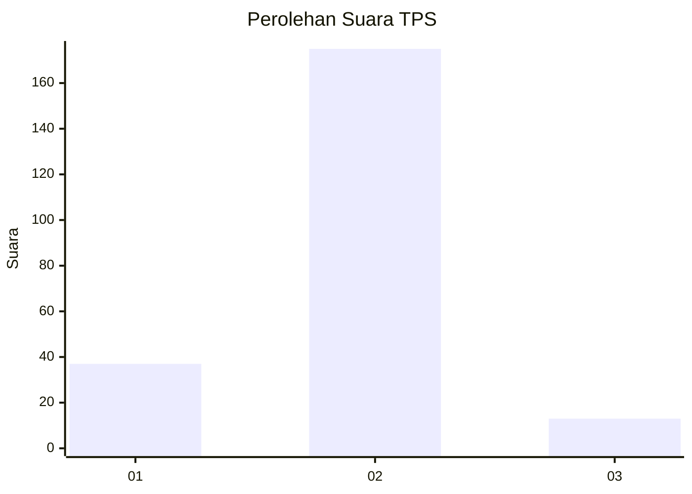
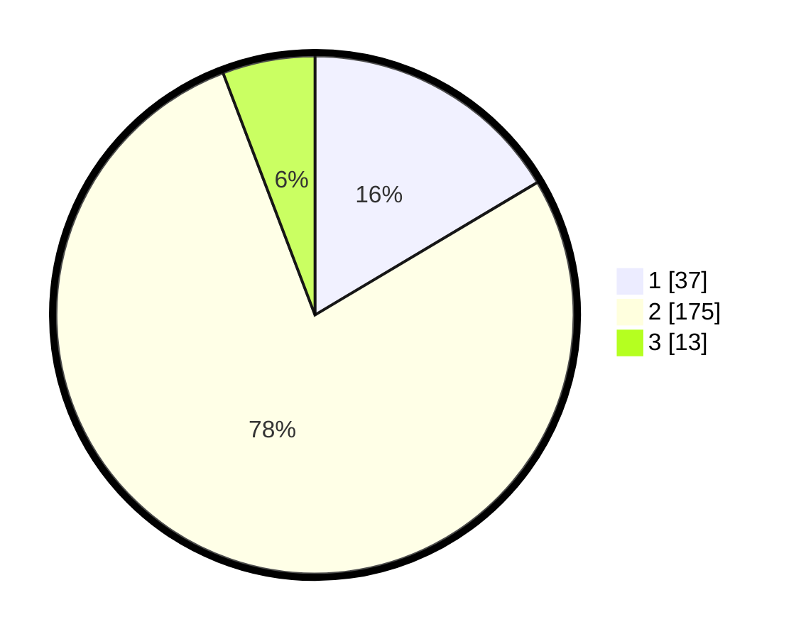

# Hasil

## Grafik

## Tabel

| No. | Nama Paslon    | Suara | Suara (raw) | Persentase |
|:--- |:-------------- | -----:| -----------:| ----------:|
| 1   | ANIES MUHAIMIN | 37    | [37][p-1]   | 16,44      |
| 2   | PRABOWO GIBRAN | 175   | [175][p-2]  | 77,78      |
| 3   | GANJAR MAHFUD  | 13    | [13][p-3]   | 5,78       |

[p-1]: https://github.com/gigit-pemilu/pemilu-2024-36-banten/blob/main/pilpres/hitung-suara/sub/36-banten/sub/03-tangerang/sub/03-tigaraksa/sub/2004-pasir-nangka/sub/022-tps/sub/paslon-1.txt
[p-2]: https://github.com/gigit-pemilu/pemilu-2024-36-banten/blob/main/pilpres/hitung-suara/sub/36-banten/sub/03-tangerang/sub/03-tigaraksa/sub/2004-pasir-nangka/sub/022-tps/sub/paslon-2.txt
[p-3]: https://github.com/gigit-pemilu/pemilu-2024-36-banten/blob/main/pilpres/hitung-suara/sub/36-banten/sub/03-tangerang/sub/03-tigaraksa/sub/2004-pasir-nangka/sub/022-tps/sub/paslon-3.txt

## Foto C Plano

https://sirekap-obj-formc.kpu.go.id/5ff4/pemilu/ppwp/36/03/03/20/04/3603032004022-20240223-195556--bba8071b-bdae-4c5d-bc2a-60ff78d85bd8.jpg

https://sirekap-obj-formc.kpu.go.id/5ff4/pemilu/ppwp/36/03/03/20/04/3603032004022-20240223-200547--301ccd6a-b266-4b0c-9f5b-7b0476259a48.jpg

https://sirekap-obj-formc.kpu.go.id/5ff4/pemilu/ppwp/36/03/03/20/04/3603032004022-20240223-200546--467feb9d-dc57-4579-b14b-91d4d3ad2eed.jpg

## Metadata

| Key        | Value               |
| ---------- | ------------------- |
| Time Stamp | 2024-02-24 22:31:28 |

## DATA PEMILIH TETAP

Jumlah pemilih dalam DPT: **342**.
 * L: **834**.
 * P: **564**.

## DATA PENGGUNA HAK PILIH

Jumlah pengguna hak pilih dalam DPT: **234**.
 * L: **426**.
 * P: **480**.

Jumlah pengguna hak pilih dalam DPTb: **844**.
 * L: **884**.
 * P: **472**.

Jumlah pengguna hak pilih dalam DPK: **808**.
 * L: **488**.
 * P: **848**.

Jumlah pengguna hak pilih: **232**.
 * L: **726**.
 * P: **740**.

## JUMLAH SUARA SAH DAN TIDAK SAH

JUMLAH SELURUH SUARA SAH: **225**.

JUMLAH SUARA TIDAK SAH: **7**.

JUMLAH SELURUH SUARA SAH DAN SUARA TIDAK SAH: **232**.

