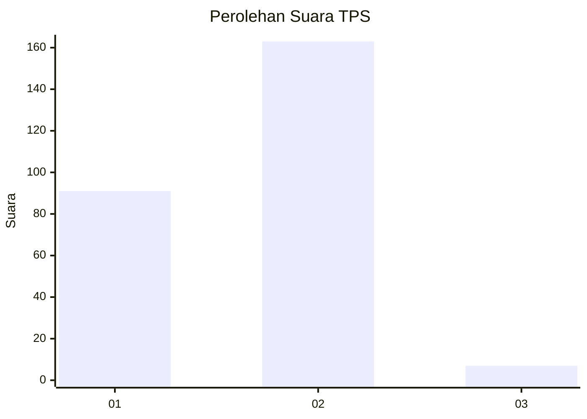
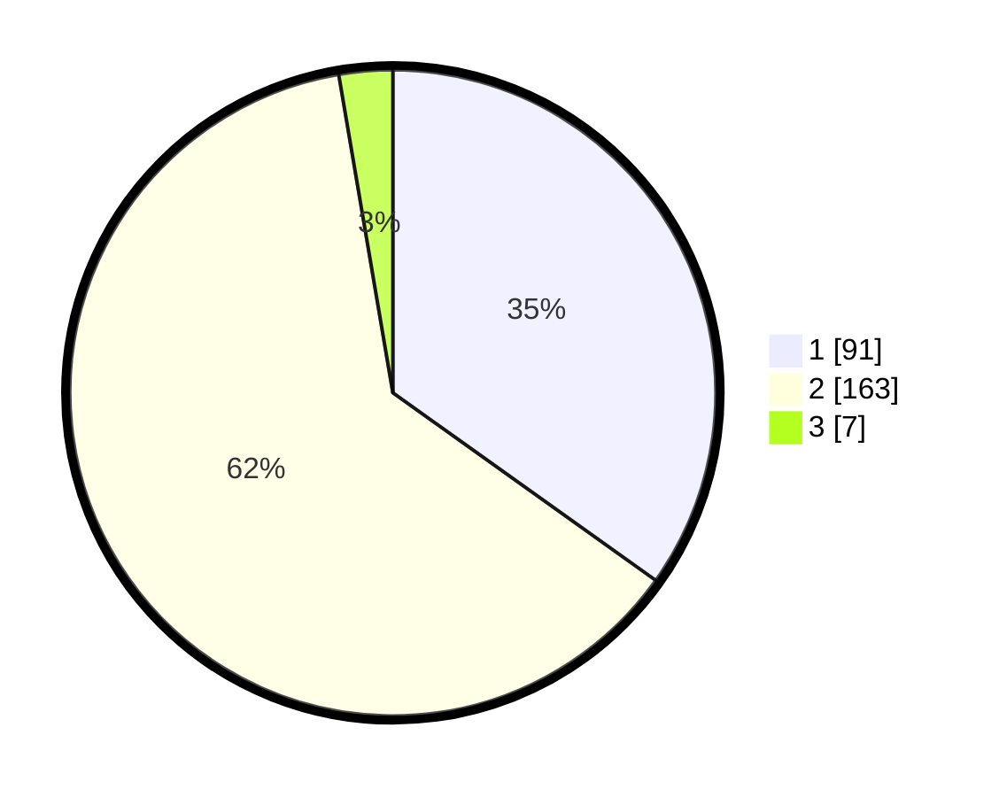

# Hasil

## Grafik

## Tabel

| No. | Nama Paslon    | Suara | Suara (raw) | Persentase |
|:--- |:-------------- | -----:| -----------:| ----------:|
| 1   | ANIES MUHAIMIN | 91    | [91][p-1]   | 34,87      |
| 2   | PRABOWO GIBRAN | 163   | [163][p-2]  | 62,45      |
| 3   | GANJAR MAHFUD  | 7     | [7][p-3]    | 2,68       |

[p-1]: https://github.com/gigit-pemilu/pemilu-2024/blob/main/pilpres/hitung-suara/sub/36-banten/sub/03-tangerang/sub/03-tigaraksa/sub/2004-pasir-nangka/sub/033-tps/sub/paslon-1.txt
[p-2]: https://github.com/gigit-pemilu/pemilu-2024/blob/main/pilpres/hitung-suara/sub/36-banten/sub/03-tangerang/sub/03-tigaraksa/sub/2004-pasir-nangka/sub/033-tps/sub/paslon-2.txt
[p-3]: https://github.com/gigit-pemilu/pemilu-2024/blob/main/pilpres/hitung-suara/sub/36-banten/sub/03-tangerang/sub/03-tigaraksa/sub/2004-pasir-nangka/sub/033-tps/sub/paslon-3.txt

## Foto C Plano

https://sirekap-obj-formc.kpu.go.id/9f21/pemilu/ppwp/36/03/03/20/04/3603032004033-20240215-073028--0b01dd16-1276-48fe-9643-502f168ed9c0.jpg

https://sirekap-obj-formc.kpu.go.id/9f21/pemilu/ppwp/36/03/03/20/04/3603032004033-20240215-073247--8fa84a38-7a1a-4dde-8441-bf107d4000a2.jpg

https://sirekap-obj-formc.kpu.go.id/9f21/pemilu/ppwp/36/03/03/20/04/3603032004033-20240215-073416--bc414276-b3b2-44db-be9e-017df00810fc.jpg

## Metadata

| Key        | Value               |
| ---------- | ------------------- |
| Time Stamp | 2024-02-19 06:16:00 |

