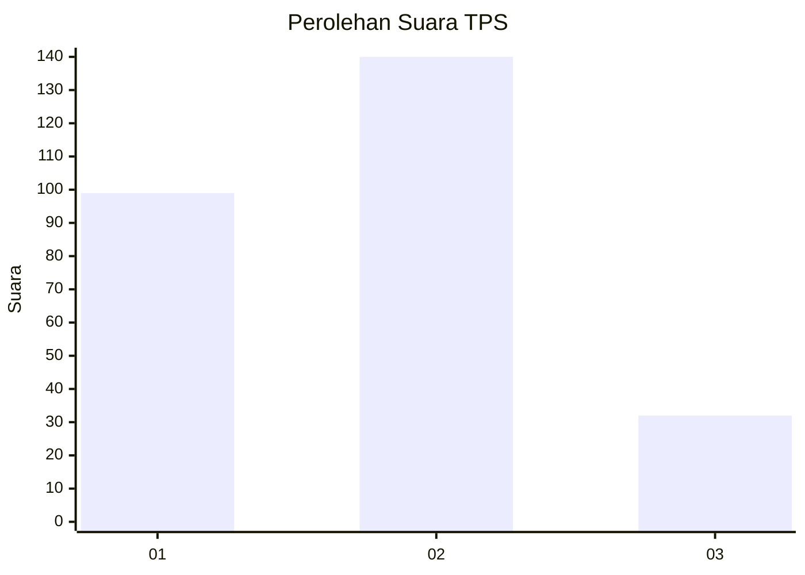
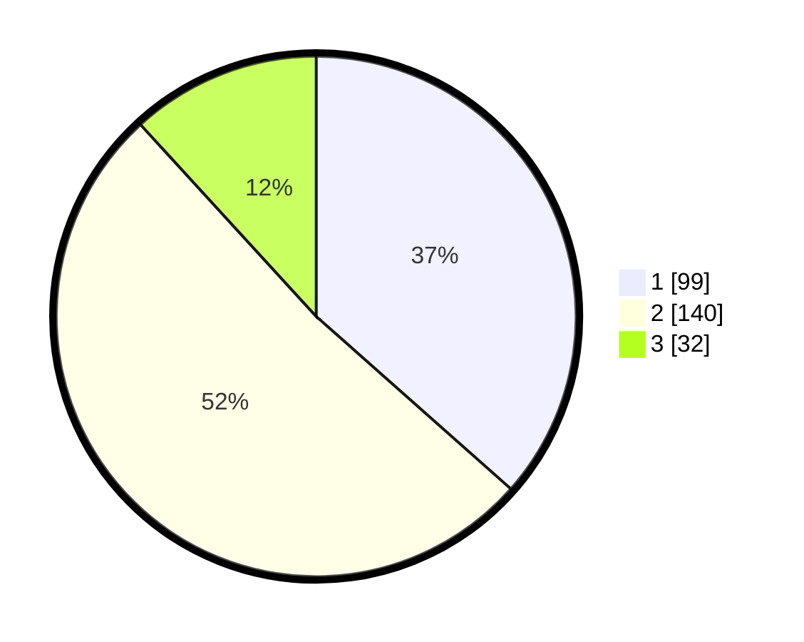

# Hasil

## Grafik

## Tabel

| No. | Nama Paslon    | Suara | Suara (raw) | Persentase |
|:--- |:-------------- | -----:| -----------:| ----------:|
| 1   | ANIES MUHAIMIN | 99    | [99][p-1]   | 36,53      |
| 2   | PRABOWO GIBRAN | 140   | [140][p-2]  | 51,66      |
| 3   | GANJAR MAHFUD  | 32    | [32][p-3]   | 11,81      |

[p-1]: https://github.com/gigit-pemilu/pemilu-2024/blob/main/pilpres/hitung-suara/sub/36-banten/sub/03-tangerang/sub/03-tigaraksa/sub/2004-pasir-nangka/sub/066-tps/sub/paslon-1.txt
[p-2]: https://github.com/gigit-pemilu/pemilu-2024/blob/main/pilpres/hitung-suara/sub/36-banten/sub/03-tangerang/sub/03-tigaraksa/sub/2004-pasir-nangka/sub/066-tps/sub/paslon-2.txt
[p-3]: https://github.com/gigit-pemilu/pemilu-2024/blob/main/pilpres/hitung-suara/sub/36-banten/sub/03-tangerang/sub/03-tigaraksa/sub/2004-pasir-nangka/sub/066-tps/sub/paslon-3.txt

## Foto C Plano

https://sirekap-obj-formc.kpu.go.id/efef/pemilu/ppwp/36/03/03/20/04/3603032004066-20240214-232514--7903365b-4770-4bab-acf8-5c5ab7a676ab.jpg

https://sirekap-obj-formc.kpu.go.id/efef/pemilu/ppwp/36/03/03/20/04/3603032004066-20240214-233044--96b2a064-61a1-488d-b1e7-df11bf51efa5.jpg

https://sirekap-obj-formc.kpu.go.id/efef/pemilu/ppwp/36/03/03/20/04/3603032004066-20240214-233158--17f52505-7d05-476e-a671-e3d232cb028c.jpg

## Metadata

| Key        | Value               |
| ---------- | ------------------- |
| Time Stamp | 2024-02-19 16:00:00 |

