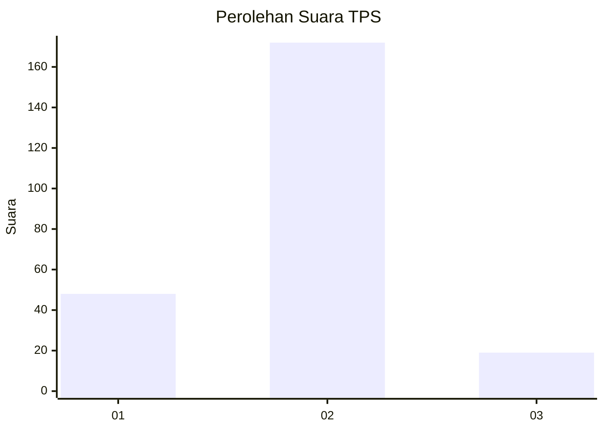
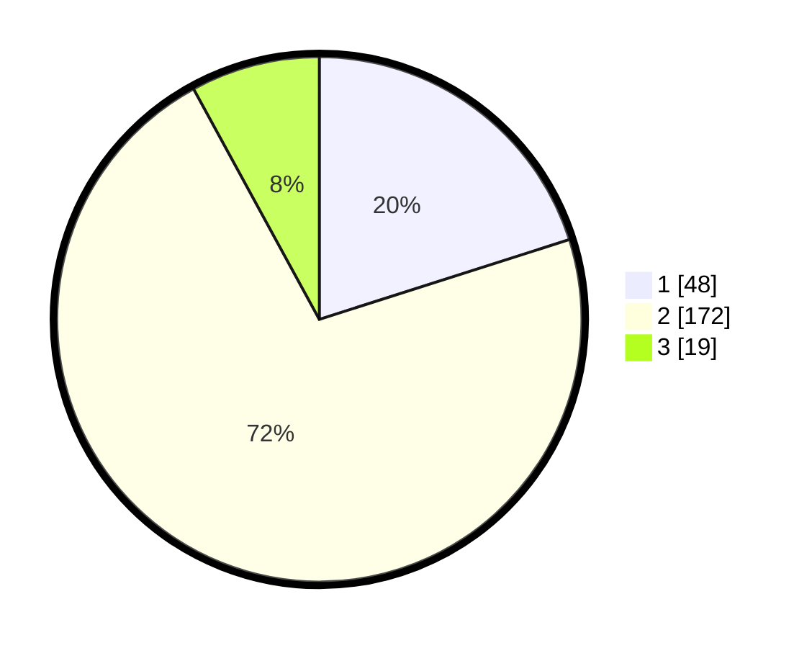

# Hasil

## Grafik

## Tabel

| No. | Nama Paslon    | Suara | Suara (raw) | Persentase |
|:--- |:-------------- | -----:| -----------:| ----------:|
| 1   | ANIES MUHAIMIN | 48    | [48][p-1]   | 20,08      |
| 2   | PRABOWO GIBRAN | 172   | [172][p-2]  | 71,97      |
| 3   | GANJAR MAHFUD  | 19    | [19][p-3]   | 7,95       |

[p-1]: https://github.com/gigit-pemilu/pemilu-2024-36-banten/blob/main/pilpres/hitung-suara/sub/36-banten/sub/03-tangerang/sub/03-tigaraksa/sub/2012-sodong/sub/001-tps/sub/paslon-1.txt
[p-2]: https://github.com/gigit-pemilu/pemilu-2024-36-banten/blob/main/pilpres/hitung-suara/sub/36-banten/sub/03-tangerang/sub/03-tigaraksa/sub/2012-sodong/sub/001-tps/sub/paslon-2.txt
[p-3]: https://github.com/gigit-pemilu/pemilu-2024-36-banten/blob/main/pilpres/hitung-suara/sub/36-banten/sub/03-tangerang/sub/03-tigaraksa/sub/2012-sodong/sub/001-tps/sub/paslon-3.txt

## Foto C Plano

https://sirekap-obj-formc.kpu.go.id/a14d/pemilu/ppwp/36/03/03/20/12/3603032012001-20240220-152750--4e20ad68-858f-4587-b17b-7b82da52bbe2.jpg

https://sirekap-obj-formc.kpu.go.id/a14d/pemilu/ppwp/36/03/03/20/12/3603032012001-20240220-152829--5a017b36-c9e6-4e14-9ed0-7ba4fbd9ea2f.jpg

https://sirekap-obj-formc.kpu.go.id/a14d/pemilu/ppwp/36/03/03/20/12/3603032012001-20240220-153037--db62bcae-3931-470a-ad6b-40b6dbdabff8.jpg

## Metadata

| Key        | Value               |
| ---------- | ------------------- |
| Time Stamp | 2024-02-21 13:00:00 |

## DATA PEMILIH TETAP

Jumlah pemilih dalam DPT: **250**.
 * L: **665**.
 * P: **425**.

## DATA PENGGUNA HAK PILIH

Jumlah pengguna hak pilih dalam DPT: **233**.
 * L: **458**.
 * P: **405**.

Jumlah pengguna hak pilih dalam DPTb: **20**.
 * L: **805**.
 * P: **845**.

Jumlah pengguna hak pilih dalam DPK: **82**.
 * L: **883**.
 * P: **884**.

Jumlah pengguna hak pilih: **248**.
 * L: **432**.
 * P: **152**.

## JUMLAH SUARA SAH DAN TIDAK SAH

JUMLAH SELURUH SUARA SAH: **239**.

JUMLAH SUARA TIDAK SAH: **9**.

JUMLAH SELURUH SUARA SAH DAN SUARA TIDAK SAH: **248**.

