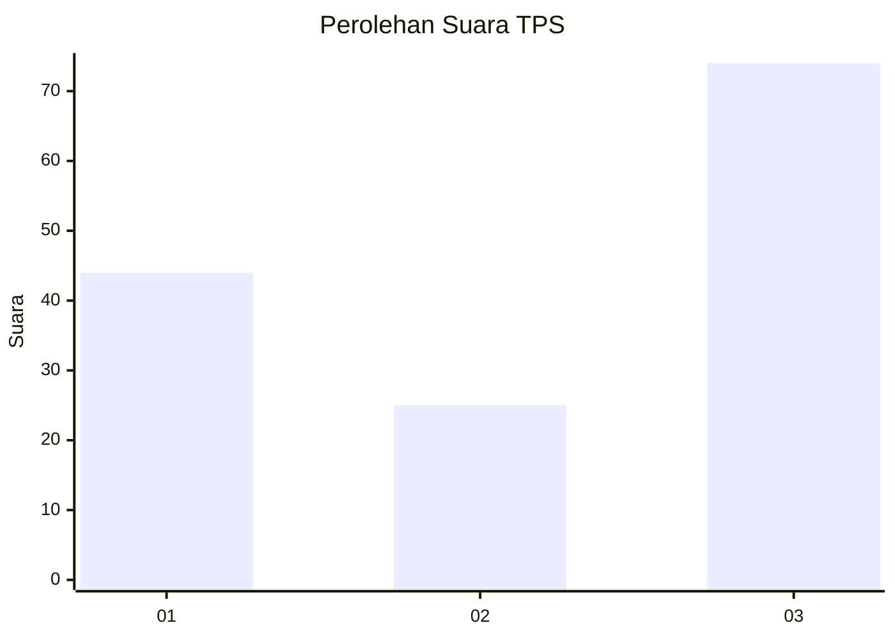
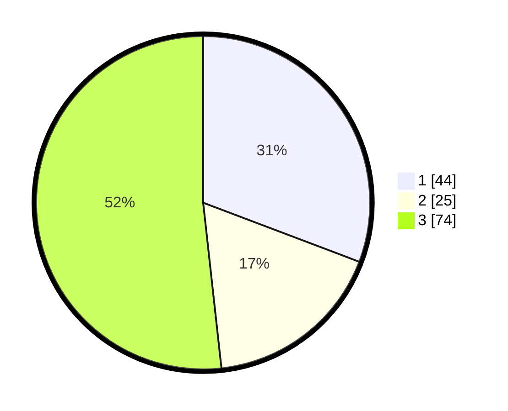

# Hasil

## Grafik

## Tabel

| No. | Nama Paslon    | Suara | Suara (raw) | Persentase |
|:--- |:-------------- | -----:| -----------:| ----------:|
| 1   | ANIES MUHAIMIN | 44    | [44][p-1]   | 30,77      |
| 2   | PRABOWO GIBRAN | 25    | [25][p-2]   | 17,48      |
| 3   | GANJAR MAHFUD  | 74    | [74][p-3]   | 51,75      |

[p-1]: https://github.com/gigit-pemilu/pemilu-2024-36-banten/blob/main/pilpres/hitung-suara/sub/36-banten/sub/03-tangerang/sub/03-tigaraksa/sub/2012-sodong/sub/011-tps/sub/paslon-1.txt
[p-2]: https://github.com/gigit-pemilu/pemilu-2024-36-banten/blob/main/pilpres/hitung-suara/sub/36-banten/sub/03-tangerang/sub/03-tigaraksa/sub/2012-sodong/sub/011-tps/sub/paslon-2.txt
[p-3]: https://github.com/gigit-pemilu/pemilu-2024-36-banten/blob/main/pilpres/hitung-suara/sub/36-banten/sub/03-tangerang/sub/03-tigaraksa/sub/2012-sodong/sub/011-tps/sub/paslon-3.txt

## Foto C Plano

https://sirekap-obj-formc.kpu.go.id/893d/pemilu/ppwp/36/03/03/20/12/3603032012011-20240222-132014--17464db2-1274-498d-9001-4fe8b6dfaa8e.jpg

https://sirekap-obj-formc.kpu.go.id/893d/pemilu/ppwp/36/03/03/20/12/3603032012011-20240222-132229--240207eb-b284-4c79-9040-c849cc8ee266.jpg

https://sirekap-obj-formc.kpu.go.id/893d/pemilu/ppwp/36/03/03/20/12/3603032012011-20240222-132420--6bb9ffee-906d-419f-8232-d5c4c37d6836.jpg

## Metadata

| Key        | Value               |
| ---------- | ------------------- |
| Time Stamp | 2024-02-22 14:00:00 |

## DATA PEMILIH TETAP

Jumlah pemilih dalam DPT: **286**.
 * L: **443**.
 * P: **243**.

## DATA PENGGUNA HAK PILIH

Jumlah pengguna hak pilih dalam DPT: **214**.
 * L: **992**.
 * P: **377**.

Jumlah pengguna hak pilih dalam DPTb: **5**.
 * L: **22**.
 * P: **53**.

Jumlah pengguna hak pilih dalam DPK: **0**.
 * L: **566**.
 * P: **260**.

Jumlah pengguna hak pilih: **239**.
 * L: **999**.
 * P: **529**.

## JUMLAH SUARA SAH DAN TIDAK SAH

JUMLAH SELURUH SUARA SAH: **219**.

JUMLAH SUARA TIDAK SAH: **5**.

JUMLAH SELURUH SUARA SAH DAN SUARA TIDAK SAH: **255**.

