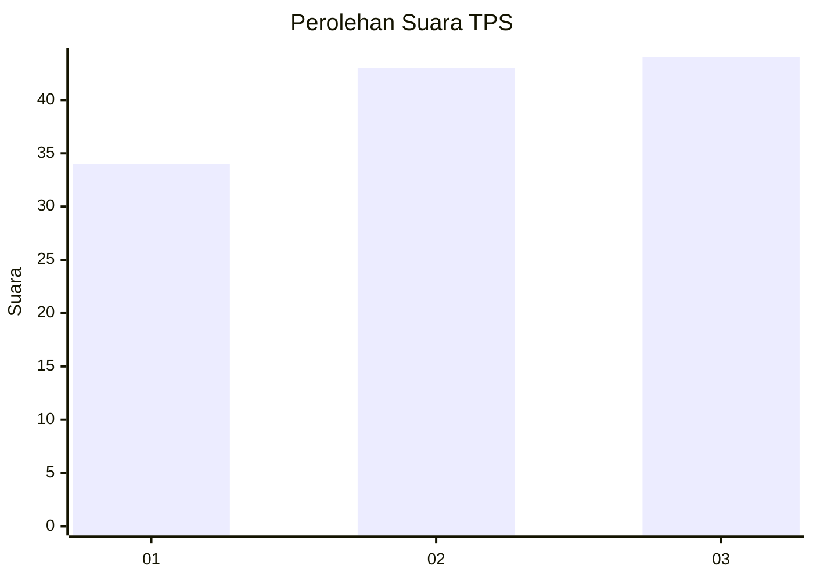
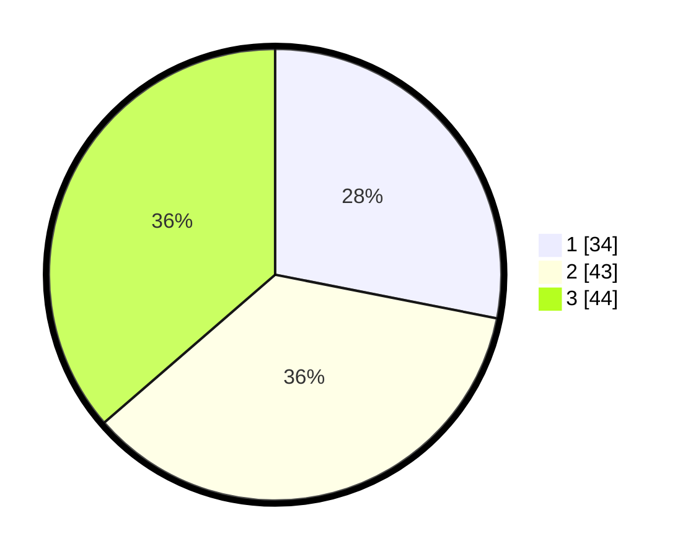

# Hasil

## Grafik

## Tabel

| No. | Nama Paslon    | Suara | Suara (raw) | Persentase |
|:--- |:-------------- | -----:| -----------:| ----------:|
| 1   | ANIES MUHAIMIN | 34    | [34][p-1]   | 28,10      |
| 2   | PRABOWO GIBRAN | 43    | [43][p-2]   | 35,54      |
| 3   | GANJAR MAHFUD  | 44    | [44][p-3]   | 36,36      |

[p-1]: https://github.com/gigit-pemilu/pemilu-2024/blob/main/pilpres/hitung-suara/sub/36-banten/sub/03-tangerang/sub/03-tigaraksa/sub/2012-sodong/sub/015-tps/sub/paslon-1.txt
[p-2]: https://github.com/gigit-pemilu/pemilu-2024/blob/main/pilpres/hitung-suara/sub/36-banten/sub/03-tangerang/sub/03-tigaraksa/sub/2012-sodong/sub/015-tps/sub/paslon-2.txt
[p-3]: https://github.com/gigit-pemilu/pemilu-2024/blob/main/pilpres/hitung-suara/sub/36-banten/sub/03-tangerang/sub/03-tigaraksa/sub/2012-sodong/sub/015-tps/sub/paslon-3.txt

## Foto C Plano

https://sirekap-obj-formc.kpu.go.id/9f2b/pemilu/ppwp/36/03/03/20/12/3603032012015-20240221-143349--547d8501-27eb-4580-9ea3-4fcc15a47c21.jpg

https://sirekap-obj-formc.kpu.go.id/9f2b/pemilu/ppwp/36/03/03/20/12/3603032012015-20240221-143421--edec9b0b-3598-4544-ab20-cdfafeef8930.jpg

https://sirekap-obj-formc.kpu.go.id/9f2b/pemilu/ppwp/36/03/03/20/12/3603032012015-20240221-143453--e1c5e2f5-d199-4958-826b-3618ad26dc80.jpg

## Metadata

| Key        | Value               |
| ---------- | ------------------- |
| Time Stamp | 2024-02-21 15:00:00 |

## DATA PEMILIH TETAP

Jumlah pemilih dalam DPT: **294**.
 * L: **449**.
 * P: **435**.

## DATA PENGGUNA HAK PILIH

Jumlah pengguna hak pilih dalam DPT: **433**.
 * L: **443**.
 * P: **484**.

Jumlah pengguna hak pilih dalam DPTb: **882**.
 * L: **884**.
 * P: **884**.

Jumlah pengguna hak pilih dalam DPK: **886**.
 * L: **803**.
 * P: **883**.

Jumlah pengguna hak pilih: **235**.
 * L: **237**.
 * P: **408**.

## JUMLAH SUARA SAH DAN TIDAK SAH

JUMLAH SELURUH SUARA SAH: **236**.

JUMLAH SUARA TIDAK SAH: **84**.

JUMLAH SELURUH SUARA SAH DAN SUARA TIDAK SAH: **235**.

