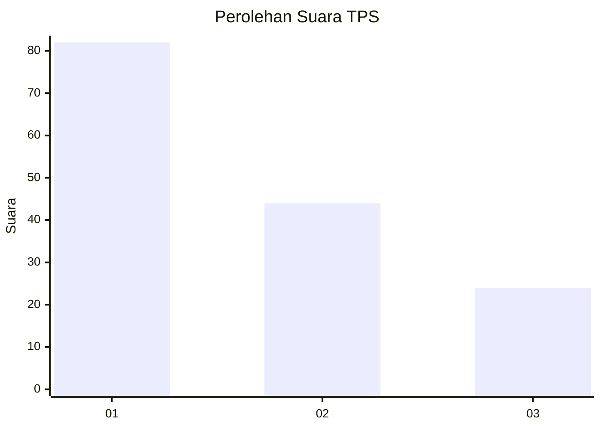
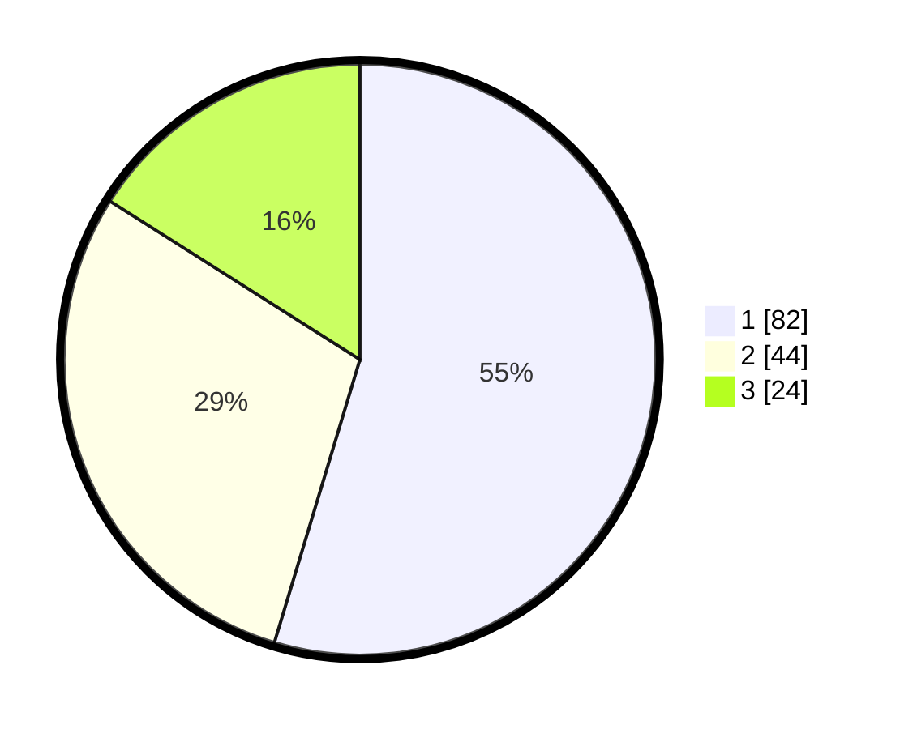

# Hasil

## Grafik

## Tabel

| No. | Nama Paslon    | Suara | Suara (raw) | Persentase |
|:--- |:-------------- | -----:| -----------:| ----------:|
| 1   | ANIES MUHAIMIN | 82    | [82][p-1]   | 54,67      |
| 2   | PRABOWO GIBRAN | 44    | [44][p-2]   | 29,33      |
| 3   | GANJAR MAHFUD  | 24    | [24][p-3]   | 16,00      |

[p-1]: https://github.com/gigit-pemilu/pemilu-2024-36-banten/blob/main/pilpres/hitung-suara/sub/36-banten/sub/03-tangerang/sub/03-tigaraksa/sub/2012-sodong/sub/021-tps/sub/paslon-1.txt
[p-2]: https://github.com/gigit-pemilu/pemilu-2024-36-banten/blob/main/pilpres/hitung-suara/sub/36-banten/sub/03-tangerang/sub/03-tigaraksa/sub/2012-sodong/sub/021-tps/sub/paslon-2.txt
[p-3]: https://github.com/gigit-pemilu/pemilu-2024-36-banten/blob/main/pilpres/hitung-suara/sub/36-banten/sub/03-tangerang/sub/03-tigaraksa/sub/2012-sodong/sub/021-tps/sub/paslon-3.txt

## Foto C Plano

https://sirekap-obj-formc.kpu.go.id/5568/pemilu/ppwp/36/03/03/20/12/3603032012021-20240223-232327--7ed37b9c-a763-4ae9-bae7-a2ace1897643.jpg

https://sirekap-obj-formc.kpu.go.id/5568/pemilu/ppwp/36/03/03/20/12/3603032012021-20240223-232355--d8554dc3-9d26-4851-b0f6-a49edee30dcc.jpg

https://sirekap-obj-formc.kpu.go.id/5568/pemilu/ppwp/36/03/03/20/12/3603032012021-20240223-232411--49c43edb-54cf-4490-9f14-b4a3a0ba0009.jpg

## Metadata

| Key        | Value               |
| ---------- | ------------------- |
| Time Stamp | 2024-02-24 22:31:28 |

## DATA PEMILIH TETAP

Jumlah pemilih dalam DPT: **235**.
 * L: **824**.
 * P: **523**.

## DATA PENGGUNA HAK PILIH

Jumlah pengguna hak pilih dalam DPT: **593**.
 * L: **850**.
 * P: **43**.

Jumlah pengguna hak pilih dalam DPTb: **255**.
 * L: **555**.
 * P: **355**.

Jumlah pengguna hak pilih dalam DPK: **0**.
 * L: **500**.
 * P: **800**.

Jumlah pengguna hak pilih: **836**.
 * L: **43**.
 * P: **99**.

## JUMLAH SUARA SAH DAN TIDAK SAH

JUMLAH SELURUH SUARA SAH: **888**.

JUMLAH SUARA TIDAK SAH: **288**.

JUMLAH SELURUH SUARA SAH DAN SUARA TIDAK SAH: **555**.

