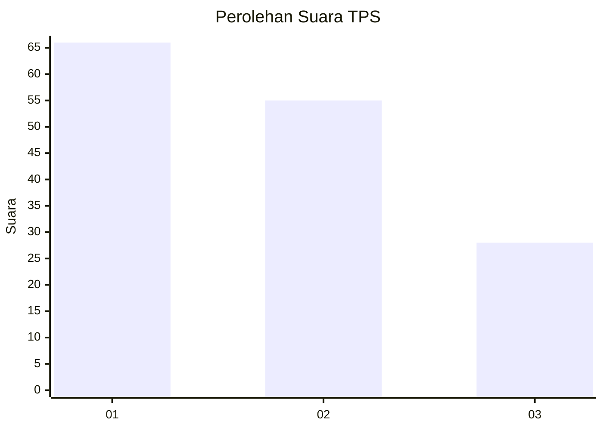
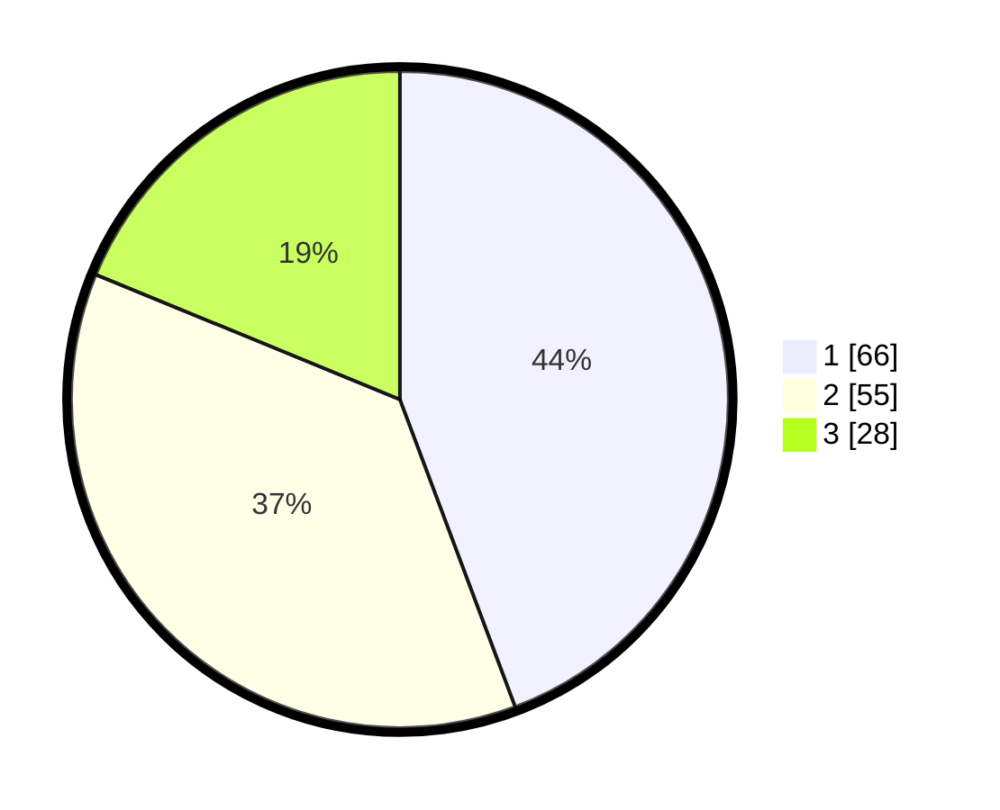

# Hasil

## Grafik

## Tabel

| No. | Nama Paslon    | Suara | Suara (raw) | Persentase |
|:--- |:-------------- | -----:| -----------:| ----------:|
| 1   | ANIES MUHAIMIN | 66    | [66][p-1]   | 44,30      |
| 2   | PRABOWO GIBRAN | 55    | [55][p-2]   | 36,91      |
| 3   | GANJAR MAHFUD  | 28    | [28][p-3]   | 18,79      |

[p-1]: https://github.com/gigit-pemilu/pemilu-2024/blob/main/pilpres/hitung-suara/sub/36-banten/sub/03-tangerang/sub/03-tigaraksa/sub/2012-sodong/sub/022-tps/sub/paslon-1.txt
[p-2]: https://github.com/gigit-pemilu/pemilu-2024/blob/main/pilpres/hitung-suara/sub/36-banten/sub/03-tangerang/sub/03-tigaraksa/sub/2012-sodong/sub/022-tps/sub/paslon-2.txt
[p-3]: https://github.com/gigit-pemilu/pemilu-2024/blob/main/pilpres/hitung-suara/sub/36-banten/sub/03-tangerang/sub/03-tigaraksa/sub/2012-sodong/sub/022-tps/sub/paslon-3.txt

## Foto C Plano

https://sirekap-obj-formc.kpu.go.id/f9d9/pemilu/ppwp/36/03/03/20/12/3603032012022-20240221-210146--1ab79efb-87a7-45ed-bf6a-94d83168b2bc.jpg

https://sirekap-obj-formc.kpu.go.id/f9d9/pemilu/ppwp/36/03/03/20/12/3603032012022-20240221-210302--be8d6b1c-5984-4496-abcd-65f7b58010f1.jpg

https://sirekap-obj-formc.kpu.go.id/f9d9/pemilu/ppwp/36/03/03/20/12/3603032012022-20240221-210239--13bdd123-4f4e-47e5-a5f0-82d8bca5034b.jpg

## Metadata

| Key        | Value               |
| ---------- | ------------------- |
| Time Stamp | 2024-02-21 22:00:00 |

## DATA PEMILIH TETAP

Jumlah pemilih dalam DPT: **235**.
 * L: **893**.
 * P: **343**.

## DATA PENGGUNA HAK PILIH

Jumlah pengguna hak pilih dalam DPT: **229**.
 * L: **117**.
 * P: **442**.

Jumlah pengguna hak pilih dalam DPTb: **289**.
 * L: **229**.
 * P: **24**.

Jumlah pengguna hak pilih dalam DPK: **223**.
 * L: **7**.
 * P: **22**.

Jumlah pengguna hak pilih: **280**.
 * L: **523**.
 * P: **333**.

## JUMLAH SUARA SAH DAN TIDAK SAH

JUMLAH SELURUH SUARA SAH: **233**.

JUMLAH SUARA TIDAK SAH: **883**.

JUMLAH SELURUH SUARA SAH DAN SUARA TIDAK SAH: **240**.

