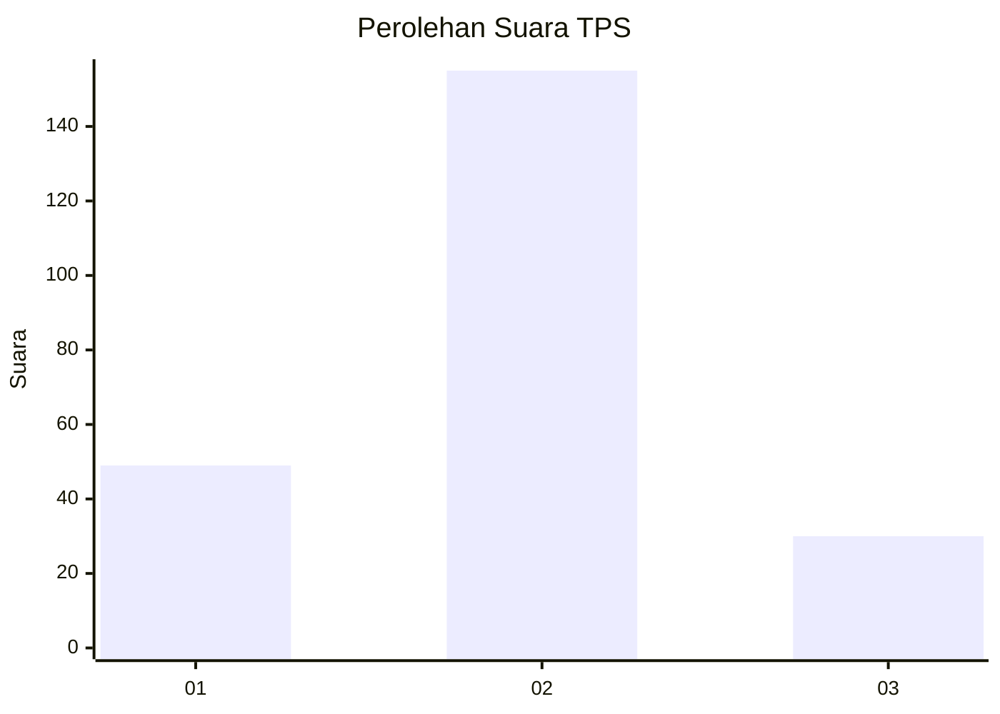
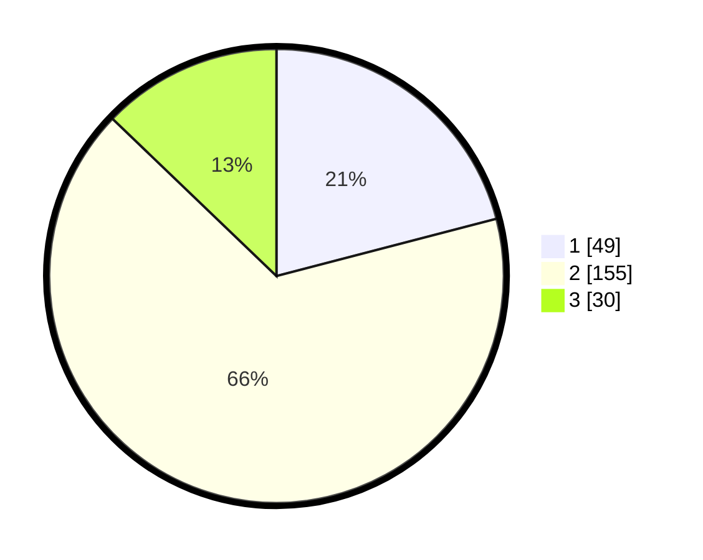

# Hasil

## Grafik

## Tabel

| No. | Nama Paslon    | Suara | Suara (raw) | Persentase |
|:--- |:-------------- | -----:| -----------:| ----------:|
| 1   | ANIES MUHAIMIN | 49    | [49][p-1]   | 20,94      |
| 2   | PRABOWO GIBRAN | 155   | [155][p-2]  | 66,24      |
| 3   | GANJAR MAHFUD  | 30    | [30][p-3]   | 12,82      |

[p-1]: https://github.com/gigit-pemilu/pemilu-2024/blob/main/pilpres/hitung-suara/sub/36-banten/sub/03-tangerang/sub/03-tigaraksa/sub/2012-sodong/sub/026-tps/sub/paslon-1.txt
[p-2]: https://github.com/gigit-pemilu/pemilu-2024/blob/main/pilpres/hitung-suara/sub/36-banten/sub/03-tangerang/sub/03-tigaraksa/sub/2012-sodong/sub/026-tps/sub/paslon-2.txt
[p-3]: https://github.com/gigit-pemilu/pemilu-2024/blob/main/pilpres/hitung-suara/sub/36-banten/sub/03-tangerang/sub/03-tigaraksa/sub/2012-sodong/sub/026-tps/sub/paslon-3.txt

## Foto C Plano

https://sirekap-obj-formc.kpu.go.id/0a7b/pemilu/ppwp/36/03/03/20/12/3603032012026-20240221-160515--651daba7-e7c7-481b-bbf8-c4ecb683377c.jpg

https://sirekap-obj-formc.kpu.go.id/0a7b/pemilu/ppwp/36/03/03/20/12/3603032012026-20240221-160342--58cf2c50-4217-4319-a4a9-14adaf191ab7.jpg

https://sirekap-obj-formc.kpu.go.id/0a7b/pemilu/ppwp/36/03/03/20/12/3603032012026-20240221-160536--6b63efe7-6f81-487d-ae9c-0470ed2774ff.jpg

## Metadata

| Key        | Value               |
| ---------- | ------------------- |
| Time Stamp | 2024-02-22 12:00:00 |

## DATA PEMILIH TETAP

Jumlah pemilih dalam DPT: **244**.
 * L: **698**.
 * P: **32**.

## DATA PENGGUNA HAK PILIH

Jumlah pengguna hak pilih dalam DPT: **286**.
 * L: **735**.
 * P: **550**.

Jumlah pengguna hak pilih dalam DPTb: **882**.
 * L: **884**.
 * P: **888**.

Jumlah pengguna hak pilih dalam DPK: **888**.
 * L: **848**.
 * P: **880**.

Jumlah pengguna hak pilih: **258**.
 * L: **435**.
 * P: **654**.

## JUMLAH SUARA SAH DAN TIDAK SAH

JUMLAH SELURUH SUARA SAH: **234**.

JUMLAH SUARA TIDAK SAH: **7**.

JUMLAH SELURUH SUARA SAH DAN SUARA TIDAK SAH: **241**.

