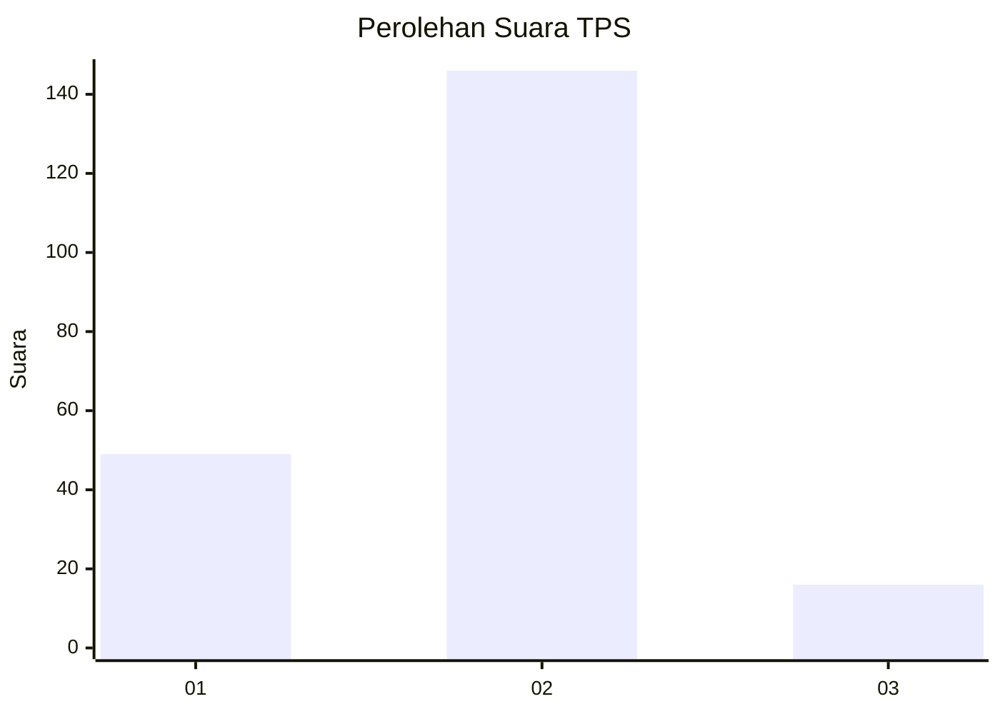
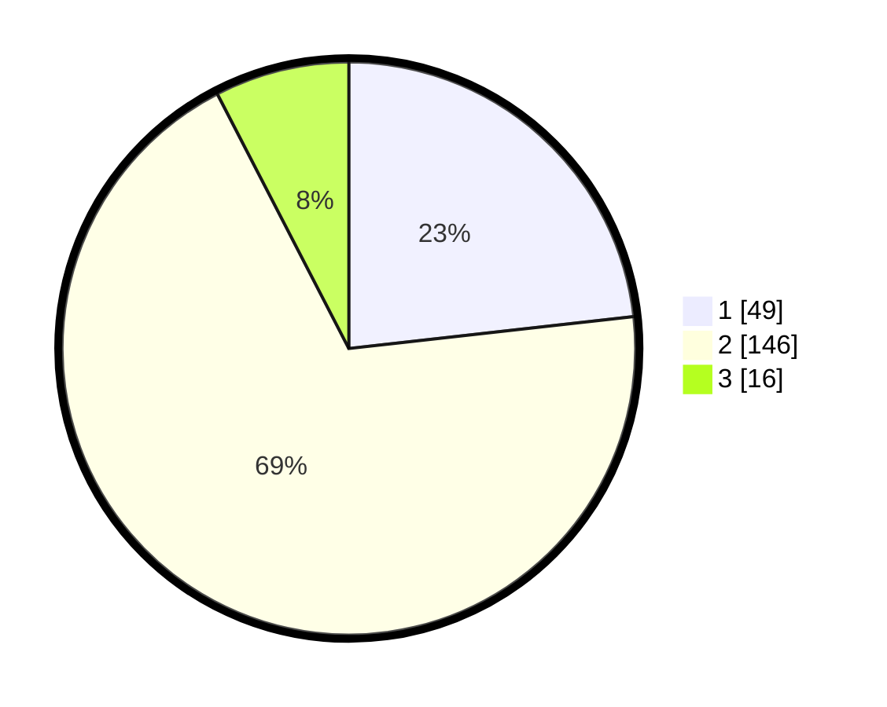

# Hasil

## Grafik

## Tabel

| No. | Nama Paslon    | Suara | Suara (raw) | Persentase |
|:--- |:-------------- | -----:| -----------:| ----------:|
| 1   | ANIES MUHAIMIN | 49    | [49][p-1]   | 23,22      |
| 2   | PRABOWO GIBRAN | 146   | [146][p-2]  | 69,19      |
| 3   | GANJAR MAHFUD  | 16    | [16][p-3]   | 7,58       |

[p-1]: https://github.com/gigit-pemilu/pemilu-2024/blob/main/pilpres/hitung-suara/sub/36-banten/sub/03-tangerang/sub/04-jambe/sub/2001-sukamanah/sub/001-tps/sub/paslon-1.txt
[p-2]: https://github.com/gigit-pemilu/pemilu-2024/blob/main/pilpres/hitung-suara/sub/36-banten/sub/03-tangerang/sub/04-jambe/sub/2001-sukamanah/sub/001-tps/sub/paslon-2.txt
[p-3]: https://github.com/gigit-pemilu/pemilu-2024/blob/main/pilpres/hitung-suara/sub/36-banten/sub/03-tangerang/sub/04-jambe/sub/2001-sukamanah/sub/001-tps/sub/paslon-3.txt

## Foto C Plano

https://sirekap-obj-formc.kpu.go.id/7be3/pemilu/ppwp/36/03/04/20/01/3603042001001-20240220-203452--9bd5dfa2-ba69-48c1-a77f-a31fed209d02.jpg

https://sirekap-obj-formc.kpu.go.id/7be3/pemilu/ppwp/36/03/04/20/01/3603042001001-20240220-203623--bace5c57-dbcc-4d09-b097-a7d2ff0450b2.jpg

https://sirekap-obj-formc.kpu.go.id/7be3/pemilu/ppwp/36/03/04/20/01/3603042001001-20240220-203752--d091a977-d807-42a7-9650-cc33f771d2bb.jpg

## Metadata

| Key        | Value               |
| ---------- | ------------------- |
| Time Stamp | 2024-02-22 08:00:00 |

