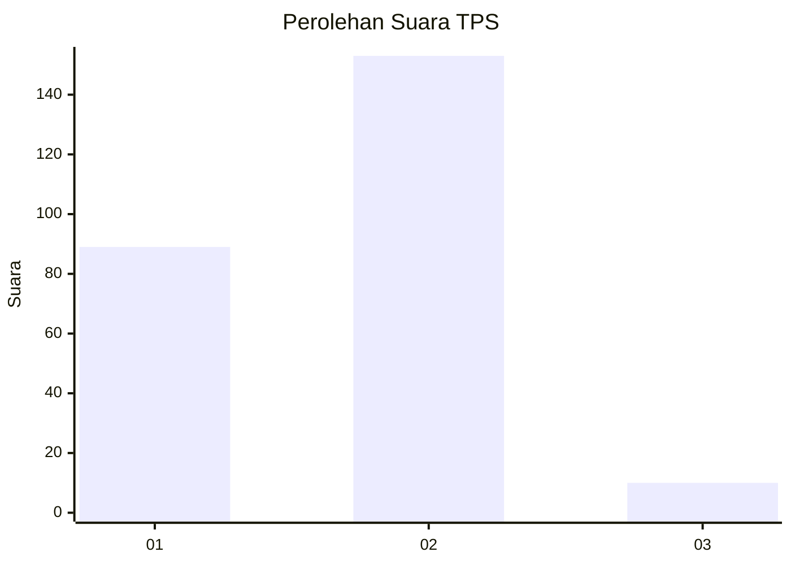
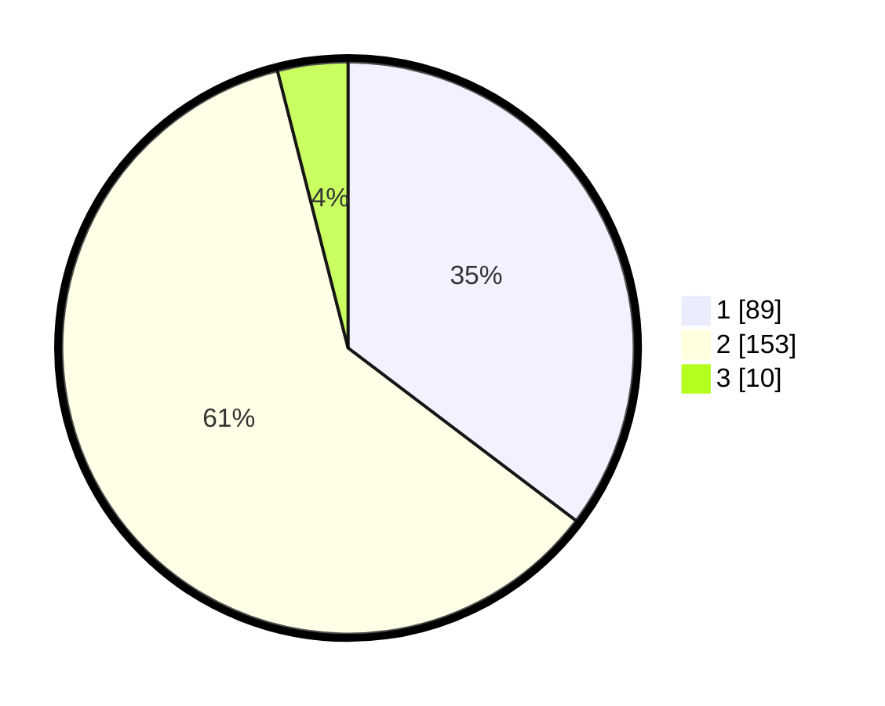

# Hasil

## Grafik

## Tabel

| No. | Nama Paslon    | Suara | Suara (raw) | Persentase |
|:--- |:-------------- | -----:| -----------:| ----------:|
| 1   | ANIES MUHAIMIN | 89    | [89][p-1]   | 35,32      |
| 2   | PRABOWO GIBRAN | 153   | [153][p-2]  | 60,71      |
| 3   | GANJAR MAHFUD  | 10    | [10][p-3]   | 3,97       |

[p-1]: https://github.com/gigit-pemilu/pemilu-2024-36-banten/blob/main/pilpres/hitung-suara/sub/36-banten/sub/03-tangerang/sub/04-jambe/sub/2001-sukamanah/sub/003-tps/sub/paslon-1.txt
[p-2]: https://github.com/gigit-pemilu/pemilu-2024-36-banten/blob/main/pilpres/hitung-suara/sub/36-banten/sub/03-tangerang/sub/04-jambe/sub/2001-sukamanah/sub/003-tps/sub/paslon-2.txt
[p-3]: https://github.com/gigit-pemilu/pemilu-2024-36-banten/blob/main/pilpres/hitung-suara/sub/36-banten/sub/03-tangerang/sub/04-jambe/sub/2001-sukamanah/sub/003-tps/sub/paslon-3.txt

## Foto C Plano

https://sirekap-obj-formc.kpu.go.id/bdf4/pemilu/ppwp/36/03/04/20/01/3603042001003-20240220-204334--97a0f6cc-2de5-4d70-b447-1f1734f1a0dd.jpg

https://sirekap-obj-formc.kpu.go.id/bdf4/pemilu/ppwp/36/03/04/20/01/3603042001003-20240220-204407--b55d5551-ad31-47d5-903a-95da95bbe110.jpg

https://sirekap-obj-formc.kpu.go.id/bdf4/pemilu/ppwp/36/03/04/20/01/3603042001003-20240220-204443--a38731ea-5f64-48fd-a3f4-7f471018fccd.jpg

## Metadata

| Key        | Value               |
| ---------- | ------------------- |
| Time Stamp | 2024-02-22 13:00:00 |

