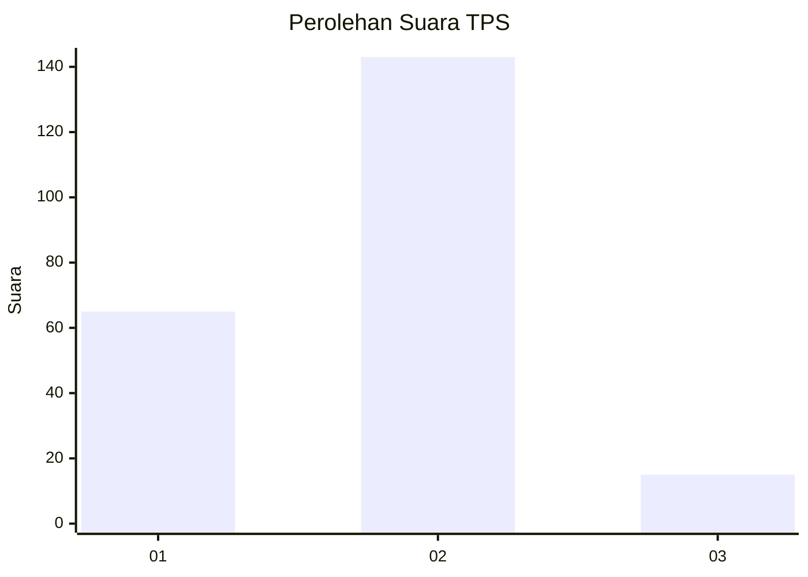
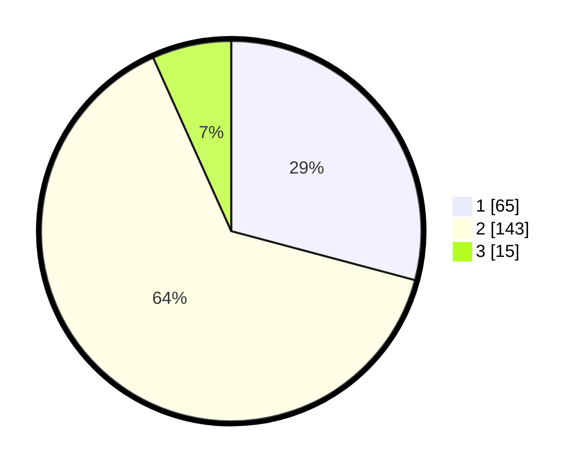

# Hasil

## Grafik

## Tabel

| No. | Nama Paslon    | Suara | Suara (raw) | Persentase |
|:--- |:-------------- | -----:| -----------:| ----------:|
| 1   | ANIES MUHAIMIN | 65    | [65][p-1]   | 29,15      |
| 2   | PRABOWO GIBRAN | 143   | [143][p-2]  | 64,13      |
| 3   | GANJAR MAHFUD  | 15    | [15][p-3]   | 6,73       |

[p-1]: https://github.com/gigit-pemilu/pemilu-2024-36-banten/blob/main/pilpres/hitung-suara/sub/36-banten/sub/03-tangerang/sub/04-jambe/sub/2001-sukamanah/sub/004-tps/sub/paslon-1.txt
[p-2]: https://github.com/gigit-pemilu/pemilu-2024-36-banten/blob/main/pilpres/hitung-suara/sub/36-banten/sub/03-tangerang/sub/04-jambe/sub/2001-sukamanah/sub/004-tps/sub/paslon-2.txt
[p-3]: https://github.com/gigit-pemilu/pemilu-2024-36-banten/blob/main/pilpres/hitung-suara/sub/36-banten/sub/03-tangerang/sub/04-jambe/sub/2001-sukamanah/sub/004-tps/sub/paslon-3.txt

## Foto C Plano

https://sirekap-obj-formc.kpu.go.id/004d/pemilu/ppwp/36/03/04/20/01/3603042001004-20240220-204702--b801c67b-0e61-4e23-8c8d-633279fea4f0.jpg

https://sirekap-obj-formc.kpu.go.id/004d/pemilu/ppwp/36/03/04/20/01/3603042001004-20240220-204739--7408770b-6fad-4c91-a787-496b73ebaea9.jpg

https://sirekap-obj-formc.kpu.go.id/004d/pemilu/ppwp/36/03/04/20/01/3603042001004-20240220-204838--572bdfda-e8c3-4fe4-b497-5a45abd1c37e.jpg

## Metadata

| Key        | Value               |
| ---------- | ------------------- |
| Time Stamp | 2024-02-24 22:31:28 |

