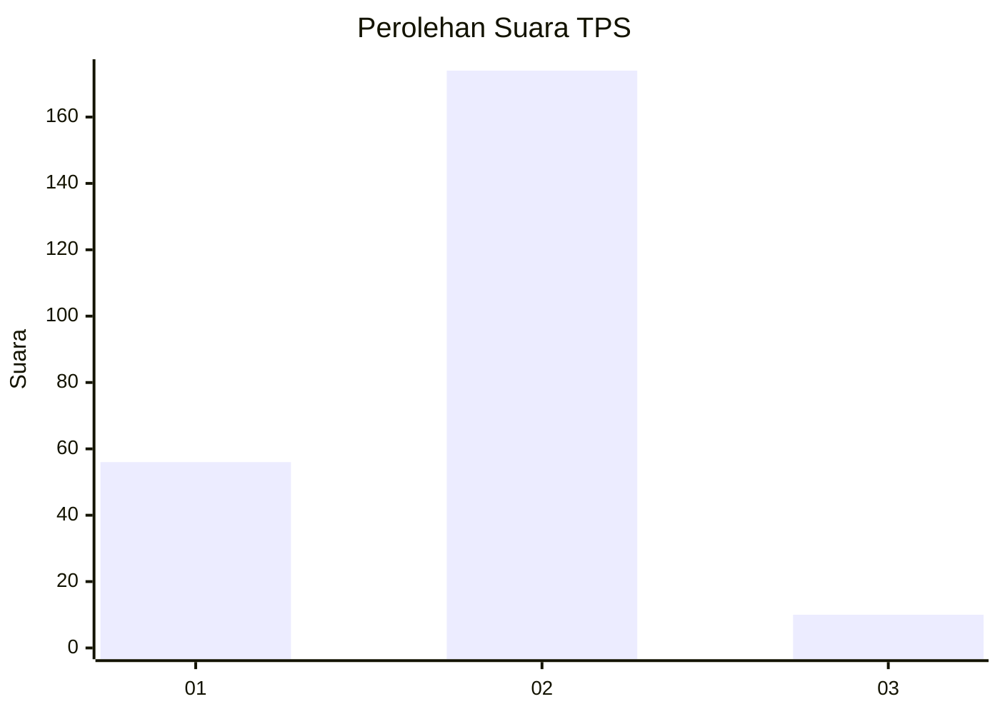
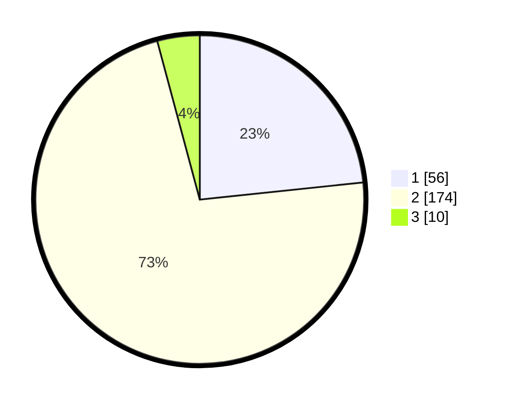

# Hasil

## Grafik

## Tabel

| No. | Nama Paslon    | Suara | Suara (raw) | Persentase |
|:--- |:-------------- | -----:| -----------:| ----------:|
| 1   | ANIES MUHAIMIN | 56    | [56][p-1]   | 23,33      |
| 2   | PRABOWO GIBRAN | 174   | [174][p-2]  | 72,50      |
| 3   | GANJAR MAHFUD  | 10    | [10][p-3]   | 4,17       |

[p-1]: https://github.com/gigit-pemilu/pemilu-2024/blob/main/pilpres/hitung-suara/sub/36-banten/sub/03-tangerang/sub/04-jambe/sub/2001-sukamanah/sub/005-tps/sub/paslon-1.txt
[p-2]: https://github.com/gigit-pemilu/pemilu-2024/blob/main/pilpres/hitung-suara/sub/36-banten/sub/03-tangerang/sub/04-jambe/sub/2001-sukamanah/sub/005-tps/sub/paslon-2.txt
[p-3]: https://github.com/gigit-pemilu/pemilu-2024/blob/main/pilpres/hitung-suara/sub/36-banten/sub/03-tangerang/sub/04-jambe/sub/2001-sukamanah/sub/005-tps/sub/paslon-3.txt

## Foto C Plano

https://sirekap-obj-formc.kpu.go.id/aaf7/pemilu/ppwp/36/03/04/20/01/3603042001005-20240220-204238--c24ccec9-037c-43f8-b483-36d5ae275baf.jpg

https://sirekap-obj-formc.kpu.go.id/aaf7/pemilu/ppwp/36/03/04/20/01/3603042001005-20240220-204420--06f3ee95-08b8-49db-ba03-ac55b9ea95f2.jpg

https://sirekap-obj-formc.kpu.go.id/aaf7/pemilu/ppwp/36/03/04/20/01/3603042001005-20240220-204613--194f0967-eada-4818-9d2d-b1b5f42af969.jpg

## Metadata

| Key        | Value               |
| ---------- | ------------------- |
| Time Stamp | 2024-02-24 22:31:28 |

