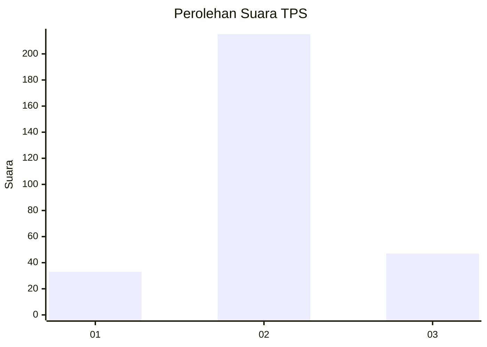
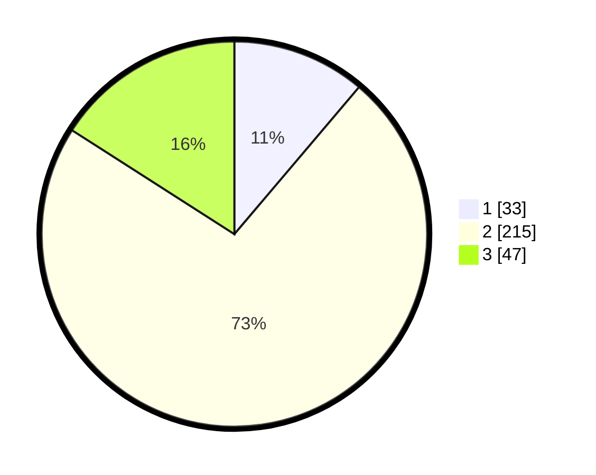

# Hasil

## Grafik

## Tabel

| No. | Nama Paslon    | Suara | Suara (raw) | Persentase |
|:--- |:-------------- | -----:| -----------:| ----------:|
| 1   | ANIES MUHAIMIN | 33    | [33][p-1]   | 11,19      |
| 2   | PRABOWO GIBRAN | 215   | [215][p-2]  | 72,88      |
| 3   | GANJAR MAHFUD  | 47    | [47][p-3]   | 15,93      |

[p-1]: https://github.com/gigit-pemilu/pemilu-2024/blob/main/pilpres/hitung-suara/sub/36-banten/sub/03-tangerang/sub/04-jambe/sub/2004-taban/sub/901-tps/sub/paslon-1.txt
[p-2]: https://github.com/gigit-pemilu/pemilu-2024/blob/main/pilpres/hitung-suara/sub/36-banten/sub/03-tangerang/sub/04-jambe/sub/2004-taban/sub/901-tps/sub/paslon-2.txt
[p-3]: https://github.com/gigit-pemilu/pemilu-2024/blob/main/pilpres/hitung-suara/sub/36-banten/sub/03-tangerang/sub/04-jambe/sub/2004-taban/sub/901-tps/sub/paslon-3.txt

## Foto C Plano

https://sirekap-obj-formc.kpu.go.id/c572/pemilu/ppwp/36/03/04/20/04/3603042004901-20240221-105750--fc0075c0-192d-48f4-a544-a916f9119925.jpg

https://sirekap-obj-formc.kpu.go.id/c572/pemilu/ppwp/36/03/04/20/04/3603042004901-20240221-105830--5c3f86b7-a044-4db2-86af-cb6fe3844bc5.jpg

https://sirekap-obj-formc.kpu.go.id/c572/pemilu/ppwp/36/03/04/20/04/3603042004901-20240221-105919--fa30720b-e102-486e-9a6b-0a6029bac22f.jpg

## Metadata

| Key        | Value               |
| ---------- | ------------------- |
| Time Stamp | 2024-02-24 22:31:28 |

