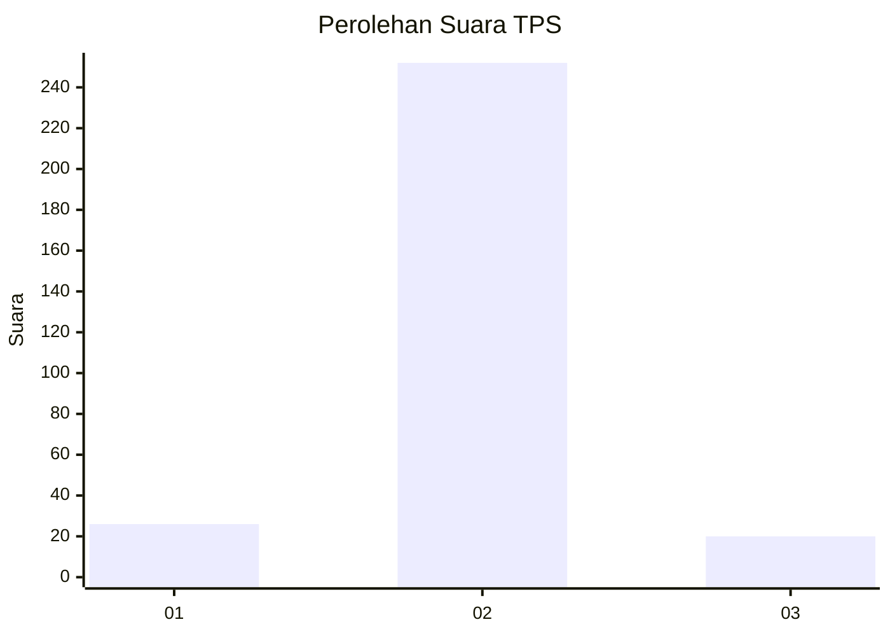
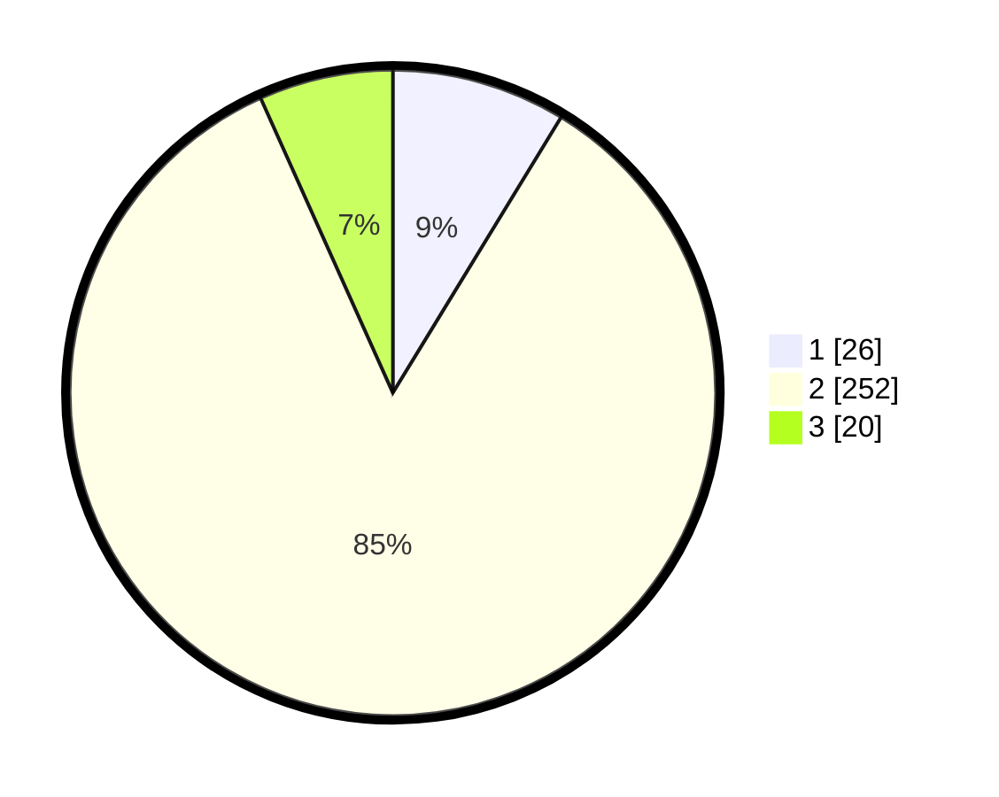

# Hasil

## Grafik

## Tabel

| No. | Nama Paslon    | Suara | Suara (raw) | Persentase |
|:--- |:-------------- | -----:| -----------:| ----------:|
| 1   | ANIES MUHAIMIN | 26    | [26][p-1]   | 8,72       |
| 2   | PRABOWO GIBRAN | 252   | [252][p-2]  | 84,56      |
| 3   | GANJAR MAHFUD  | 20    | [20][p-3]   | 6,71       |

[p-1]: https://github.com/gigit-pemilu/pemilu-2024/blob/main/pilpres/hitung-suara/sub/36-banten/sub/03-tangerang/sub/04-jambe/sub/2004-taban/sub/902-tps/sub/paslon-1.txt
[p-2]: https://github.com/gigit-pemilu/pemilu-2024/blob/main/pilpres/hitung-suara/sub/36-banten/sub/03-tangerang/sub/04-jambe/sub/2004-taban/sub/902-tps/sub/paslon-2.txt
[p-3]: https://github.com/gigit-pemilu/pemilu-2024/blob/main/pilpres/hitung-suara/sub/36-banten/sub/03-tangerang/sub/04-jambe/sub/2004-taban/sub/902-tps/sub/paslon-3.txt

## Foto C Plano

https://sirekap-obj-formc.kpu.go.id/269a/pemilu/ppwp/36/03/04/20/04/3603042004902-20240221-105927--83e0dec2-79c8-479a-8a39-622b86f08a37.jpg

https://sirekap-obj-formc.kpu.go.id/269a/pemilu/ppwp/36/03/04/20/04/3603042004902-20240221-104011--698d3992-0a10-4e36-bacd-388b8dd24b3b.jpg

https://sirekap-obj-formc.kpu.go.id/269a/pemilu/ppwp/36/03/04/20/04/3603042004902-20240221-104053--cdf24aa0-2a8b-4046-ba4e-a09ee633d2a9.jpg

## Metadata

| Key        | Value               |
| ---------- | ------------------- |
| Time Stamp | 2024-02-24 22:31:28 |

